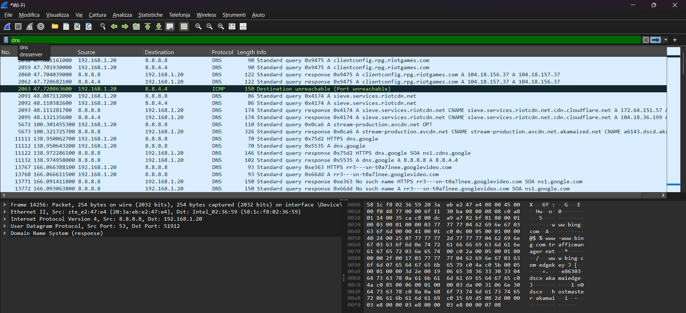
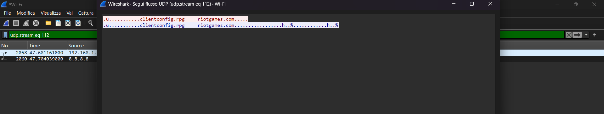
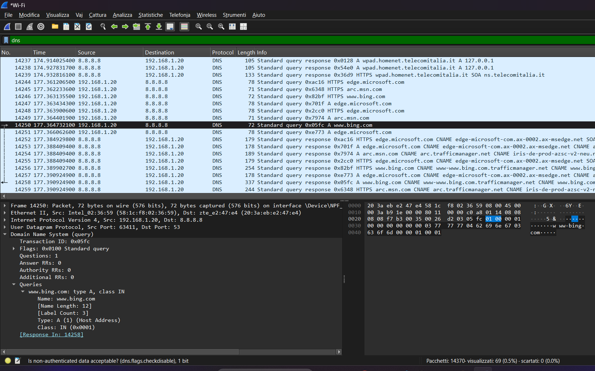
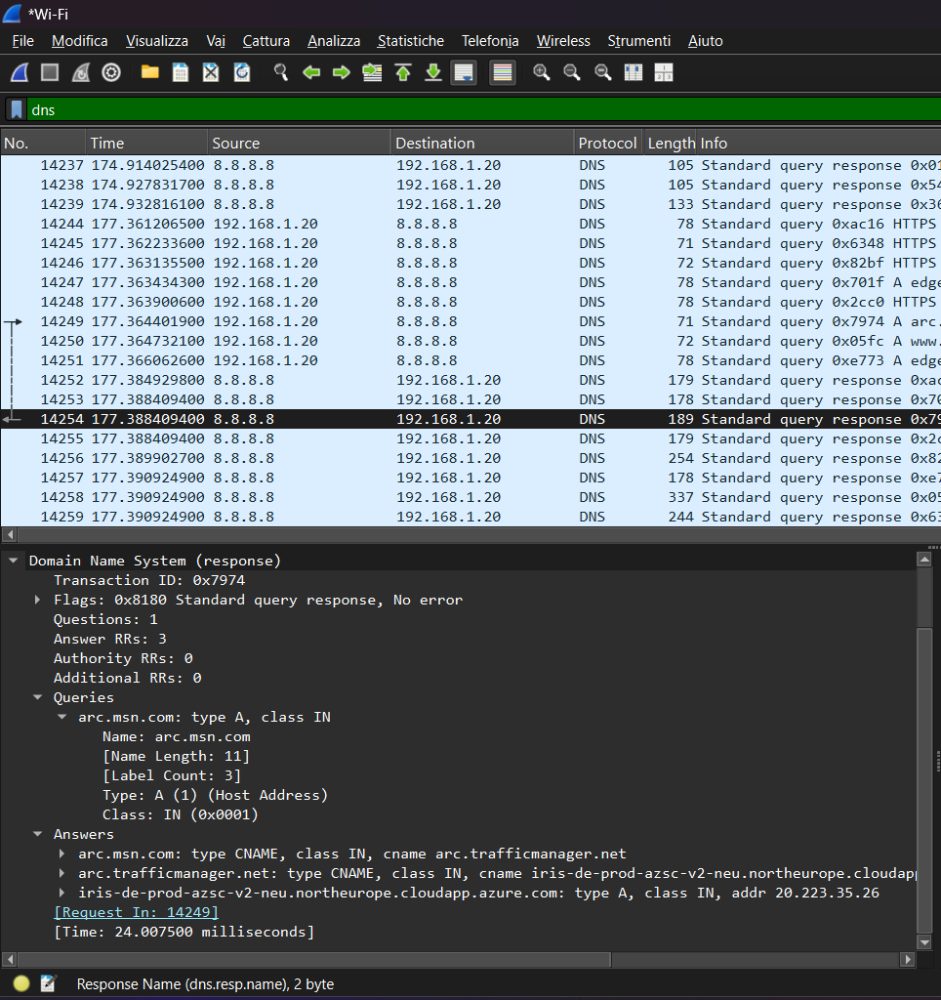
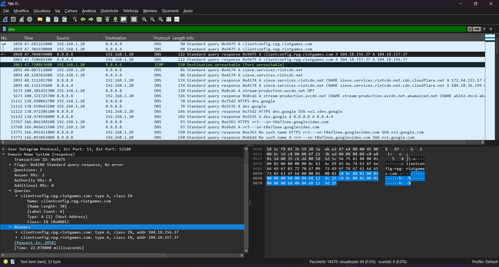

# DNS Traffic Analysis

## Objective
The goal of this lab is to analyze DNS traffic using Wireshark, understanding how domain names are resolved to IP addresses and what information is visible in DNS queries and responses.

## Tools
- Wireshark  
- Browser (Microsoft Edge)
  

## Methodology
1. Open Wireshark and capture packets on your **active network interface** (Wi-Fi or Ethernet).  
2. Generate DNS traffic using websites.
3. Apply the display filter `dns` to isolate DNS packets.
4. Analyze packets to identify query and response details, including:
    - Query name (domain requested)
    - Query type (A, AAAA, CNAME, etc.)
    - Response IP addresses
5. (Optional) Follow UDP stream to see the full exchange between client and DNS server.

## Analysis
### DNS Packet List
  
This screenshot shows all DNS packets captured in Wireshark, filtered using `dns`. You can see both DNS queries and responses.

### DNS Stream
  
This screenshot shows the full UDP stream for DNS communication. It illustrates the exchange between client and server.

### DNS Request Type A
  
This screenshot highlights a DNS query for an **A record** (IPv4 address), showing the domain requested in the “Queries” section.

### DNS Response Type CNAME
  
This screenshot shows a DNS response of type **CNAME**. Both the “Queries” and “Answer” sections are highlighted to illustrate the canonical name returned.

### DNS Response with IP
  
This screenshot shows a DNS response of type **A**, including the IP address returned. The “Queries” and “Answer” sections are highlighted for clarity.

## Findings
- DNS queries and responses are transmitted in plaintext.
- Query types vary (A, CNAME) depending on the request and server configuration.
- Response sections reveal the IP addresses associated with domain names.
- Compared to TLS/HTTPS traffic, DNS traffic is not encrypted, showing that anyone on the network can see domain resolutions.

## Conclusion
This lab demonstrates how DNS resolves domain names to IP addresses and highlights the visibility of these queries on the network. By analyzing DNS packets in Wireshark, we understand that while DNS is essential for internet communication, it exposes sensitive query information in plaintext, emphasizing the importance of secure DNS solutions like DNS over HTTPS (DoH) or DNS over TLS (DoT).