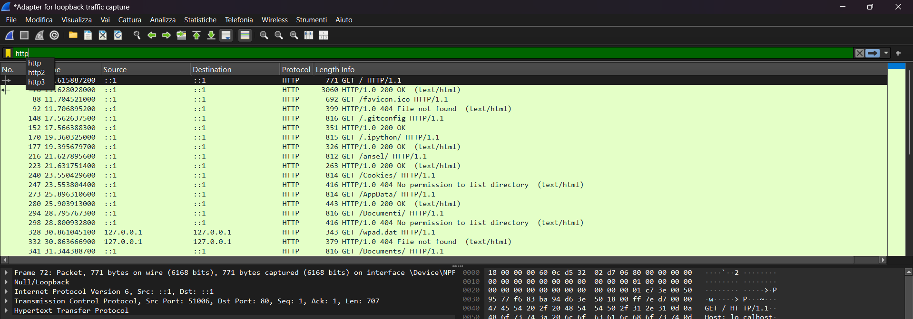
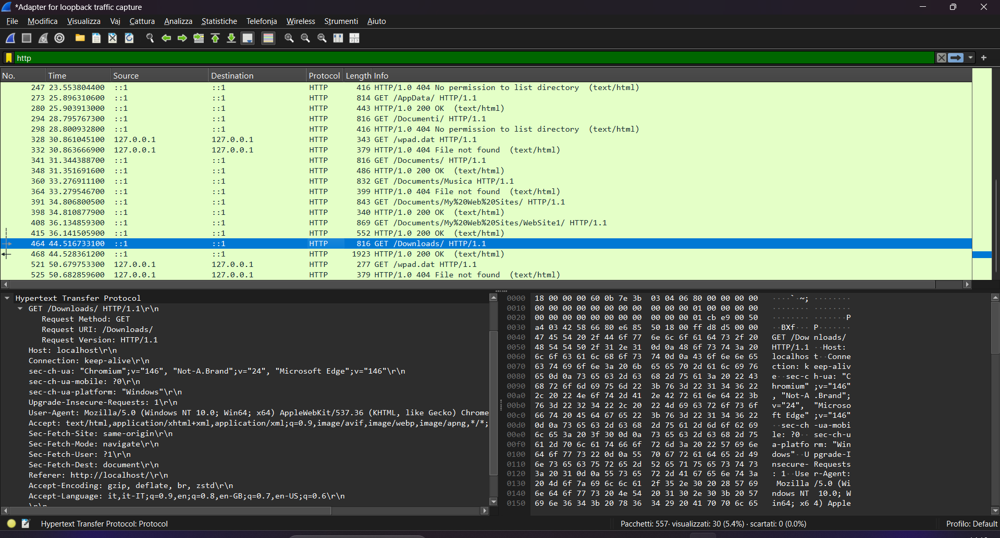
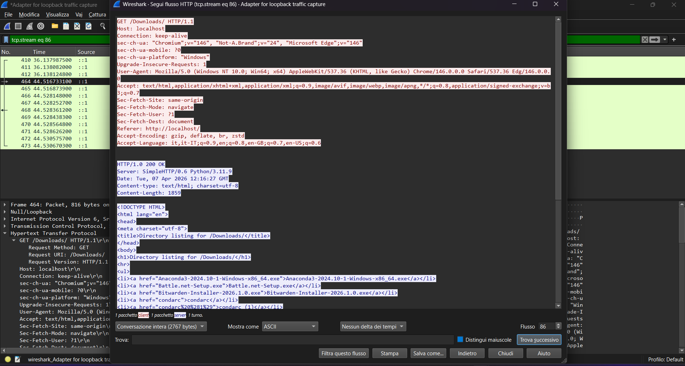

# HTTP Traffic Analysis

## Objective
The goal of this lab is to analyze unencrypted HTTP traffic using Wireshark, understanding how requests and responses are sent over the network and what information can be seen in plain text.

## Tools
- Wireshark
- Python 3 (for local HTTP server)

## Methodology
1. Start a local HTTP server using Python:
\\\bash
python3 -m http.server 80
\\\

2. Open Wireshark and capture packets on the loopback interface (lo / Npcap Loopback) to monitor traffic between the browser and the local server.
3. Apply the display filter "http" to isolate the HTTP traffic.
4. Select key packets and analyze details such as GET requests and headers.
5. Examine the full request and server response using Follow → HTTP Stream.

## Analysis
### Packet List
  
This screenshot shows all HTTP packets captured in Wireshark, filtered using `http`. You can see GET requests from the browser to the local server.

### GET Request Details
  
This screenshot highlights the HTTP GET request, including headers such as Host, User-Agent, and requested resource. It demonstrates that the traffic is unencrypted.

### HTTP Stream
  
This screenshot shows the complete HTTP request and server response in plain text using Wireshark's "Follow HTTP Stream" feature. It clearly illustrates the full exchange between client and server.

## Findings
- HTTP traffic is completely unencrypted.
- Headers and requested resources can be easily intercepted.
- Sensitive data should never be transmitted over HTTP.
- This demonstrates why HTTPS is essential for secure communication.

## Conclusion
This lab illustrates the risks of unencrypted HTTP traffic. By analyzing HTTP requests and responses in Wireshark, we can see that anyone on the network could intercept sensitive information. Always prefer HTTPS for secure data transmission.