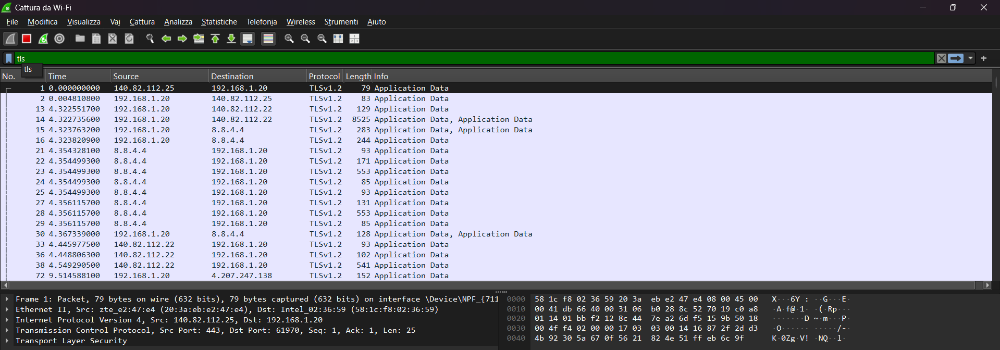
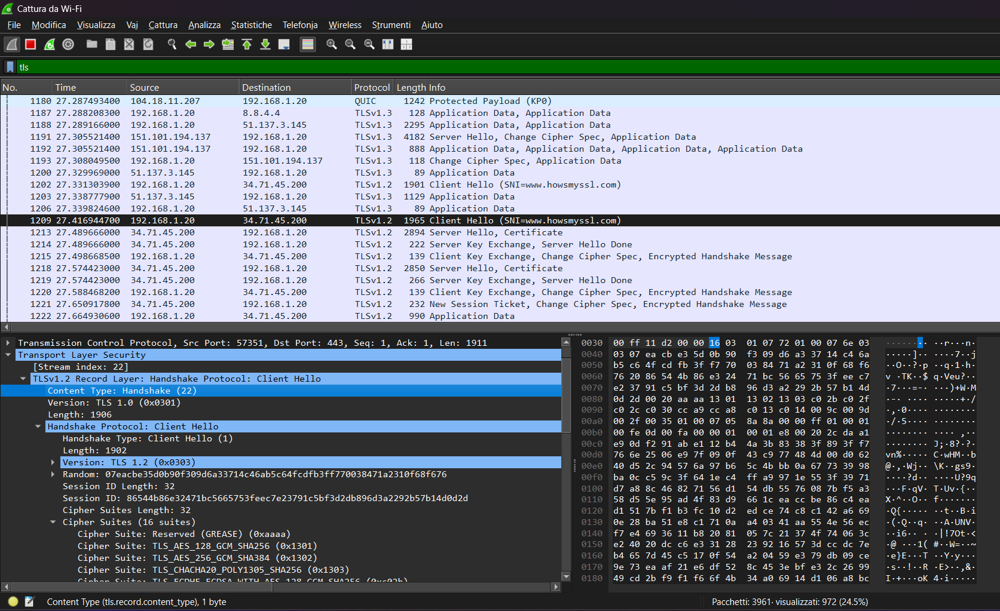
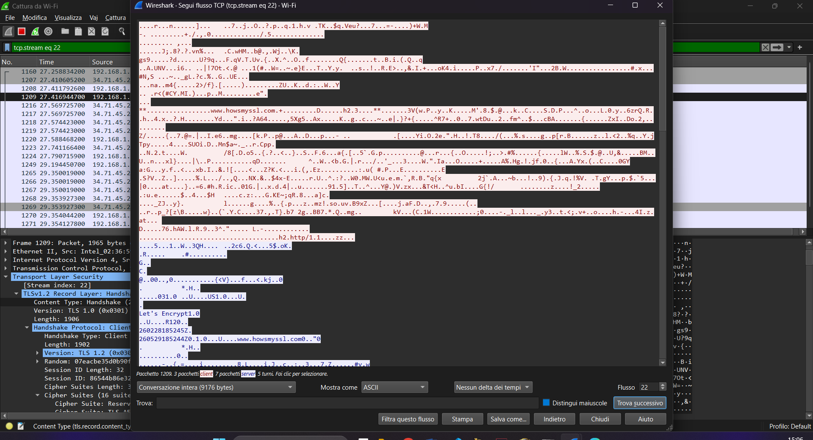

# TLS/HTTPS Traffic Analysis

## Objective
The goal of this lab is to analyze HTTPS/TLS traffic using Wireshark, understanding which information remains visible in encrypted traffic and how TLS protects data in transit.

## Tools
- Wireshark
- Browser (Microsoft Edge)

## Methodology
1. Open Wireshark and capture packets on your **active network interface** (Wi-Fi or Ethernet).  
2. Visit a reliable HTTPS website, e.g., `https://www.howsmyssl.com/`.  
3. Apply the Wireshark display filter `tls`.
4. Select key packets and analyze details such as TLS handshake, server hello, client hello, and cipher suite.
5. Examine the TCP stream to see that the HTTP content inside TLS is encrypted.

## Analysis
### TLS Packet List
  
This screenshot shows all TLS packets captured in Wireshark, filtered using `tls`. You can see handshake messages between client and server.

### TLS Handshake Details
  
This screenshot highlights a TLS handshake packet, showing the Client Hello, and the selected cipher suite.

### TLS Stream
  
This screenshot shows the TCP stream containing HTTPS traffic. The content is encrypted and cannot be read as plain text.

## Findings
- TLS encrypts HTTP content, making it unreadable to anyone capturing traffic.
- Some metadata, like handshake messages and cipher suite, remains visible.
- Server certificates are transmitted in cleartext, allowing verification of server identity.
- Compared to HTTP, sensitive information is now protected from eavesdropping.

## Conclusion
This lab demonstrates how TLS/HTTPS protects data in transit. By analyzing TLS packets in Wireshark, we can observe that while handshake metadata and certificates are visible, the actual content is securely encrypted. This highlights the importance of TLS for secure communication on the internet.