# Malicious HTTP Traffic Analysis

## Overview
This lab focuses on the analysis of a suspicious HTTP traffic capture using Wireshark.  
The goal is to identify signs of malicious activity, including payload delivery and Command & Control (C2) communication over unencrypted HTTP.

---

## Objectives
- Analyze HTTP traffic from a `.pcap` file
- Identify suspicious requests and responses
- Detect possible malware delivery
- Recognize C2 communication patterns
- Understand how attackers abuse HTTP

---

## Tools Used
- Kali Linux VM
- Wireshark
- Sample `.pcap` file

---

## Methodology
1. Open the `.pcap` file in Wireshark  
2. Apply the filter `http`
3. Identify unusual HTTP requests  
4. Inspect responses (status codes, headers, payloads)  
5. Use **Follow → HTTP Stream**  
6. Analyze POST request bodies  
7. Track communication patterns between hosts  

---

## Analysis
### Suspicious GET Request (Possible Malware Download)
A single GET request was observed:
- `GET /hjg766`
- Random, non-human readable URI  
- Server response:
  - `200 OK`
  - `Transfer-Encoding: chunked`
- Large response body (8000+ bytes)
- Payload not readable  

**Screenshot:**  
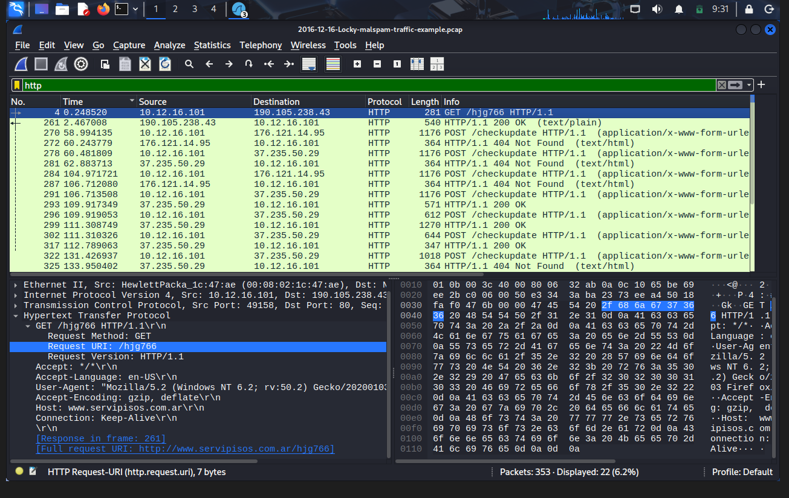

**Interpretation:**  
This likely represents a **malicious payload download**, possibly encoded or encrypted.

---

### Chunked Response
The server response included multiple:

- `Data chunk (XXXX bytes)`

**Screenshot:**  
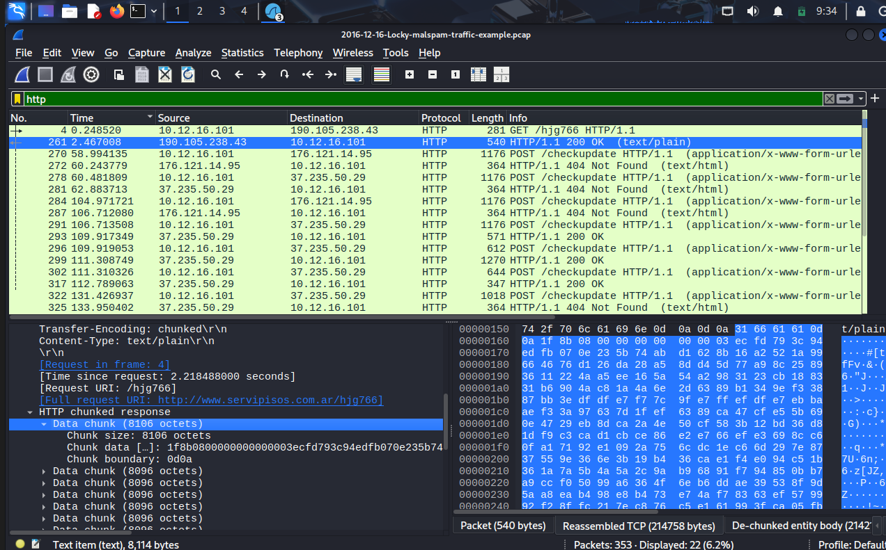

**Interpretation:**  
Chunked encoding may be used to:
- Transfer large payloads
- Obfuscate malicious content

---

### Suspicious Response Content
- Content-Type: `text/plain`
- Data not readable

**Screenshot:**  
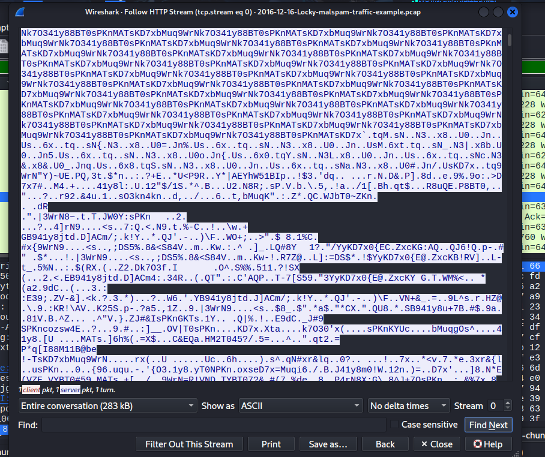

**Possible explanations:**
- Base64 encoded data  
- Encrypted binary  
- Packed executable  

---

### POST Request (Beaconing)
After the download, the client starts sending POST requests `POST /checkupdate Content-Type: application/x-www-form-urlencoded`

**Screenshot:**  
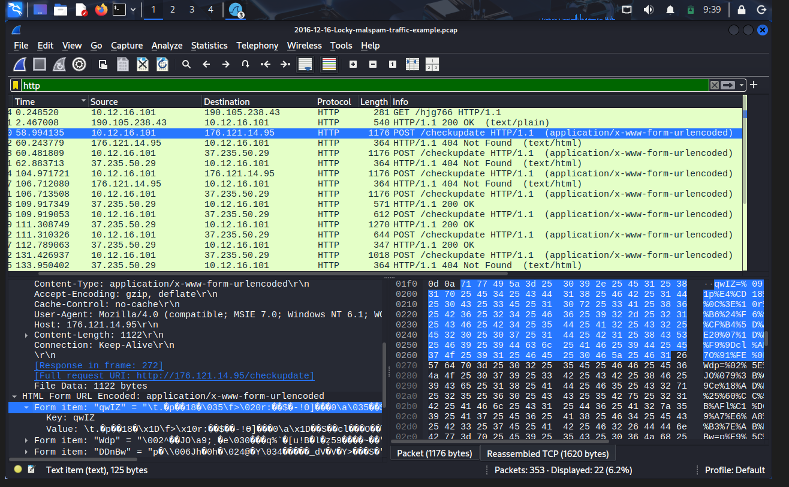

Observations:
- Multiple parameters
- Values appear obfuscated
- Similar structure across requests

**Interpretation:**  
This behavior is consistent with **malware beaconing**.

---

### Fallback Server
- POST requests sent
- Response: `404 Not Found`

**Screenshots:**  
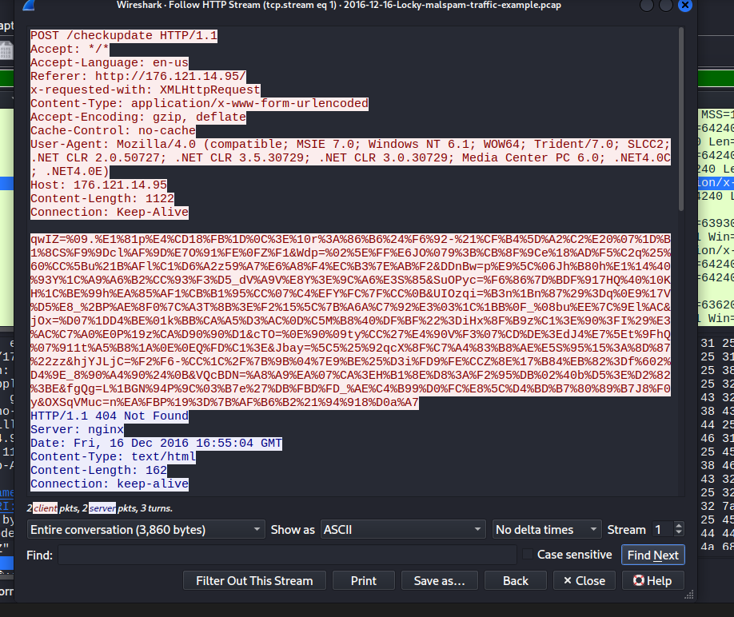  
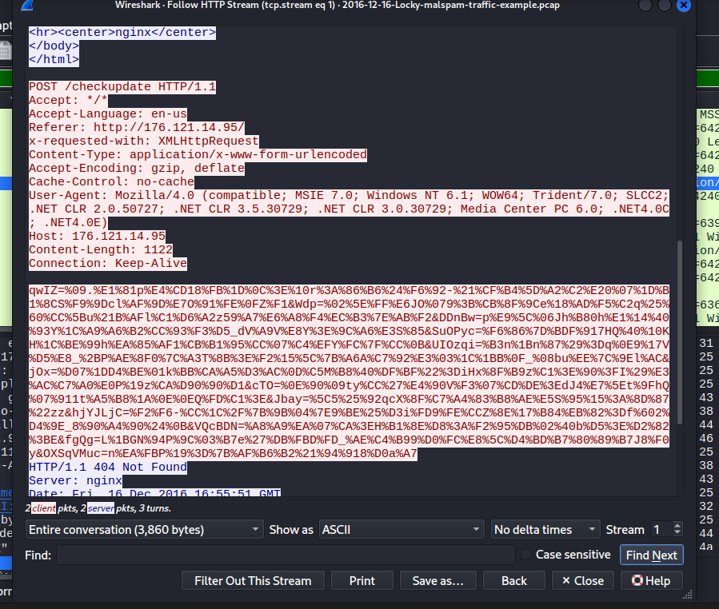

Likely an inactive or fallback C2 server.

---

### Active C2 Server
- First POST → `404`
- Second POST → `200 OK`
- Continuous communication established

**Screenshot:**  
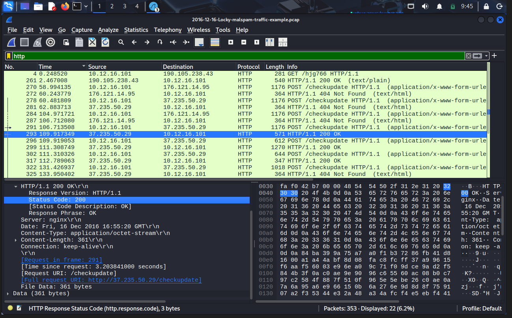

This is likely the **active Command & Control server**.

---

### C2 Communication Pattern
Observed pattern: `POST -> Response -> POST -> Response`
Server responses: `Content-Type: application/octet-stream`

**Screenshots:**  
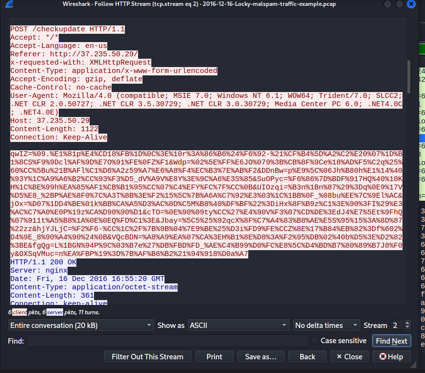  
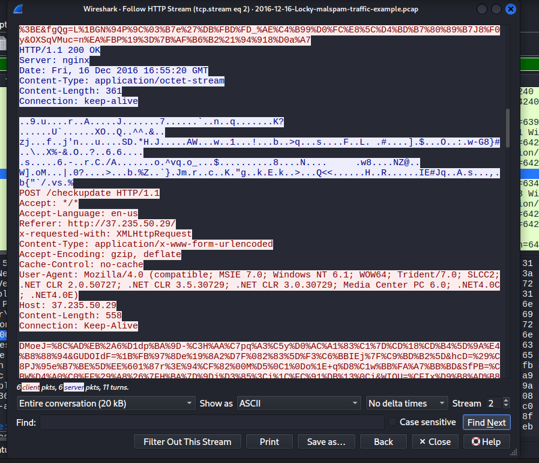  
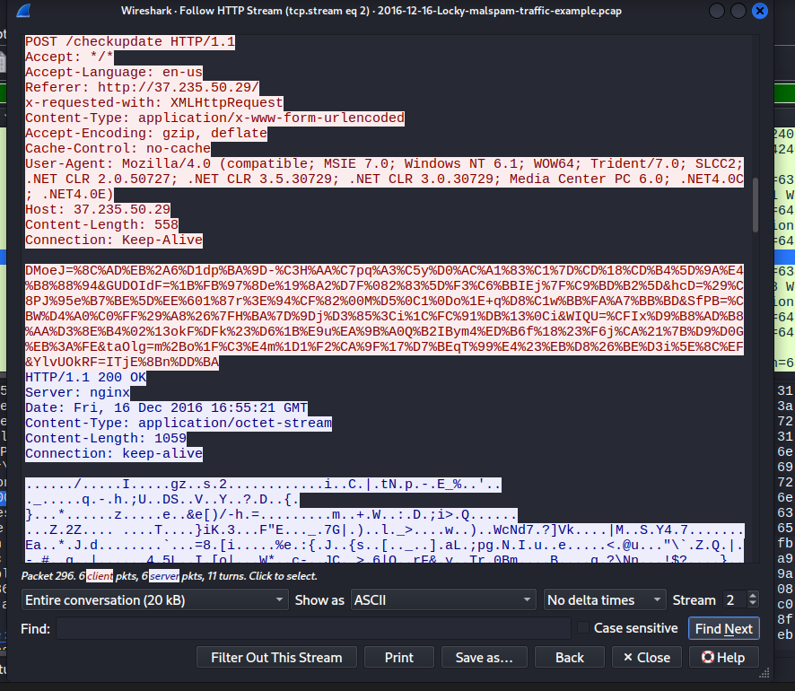

**Interpretation:**
- Server sends encrypted commands or payloads  
- Client executes and responds  

---

### Session Termination
- Final responses:
  - `404 Not Found`
- Connection closed with:
  - TCP `RST`

**Screenshot:**  
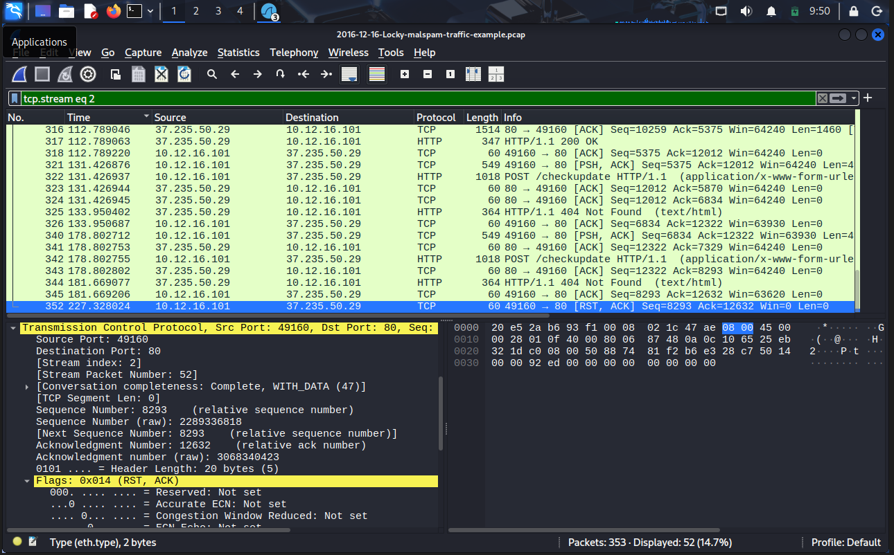

**Interpretation:**
- Abrupt end of communication  
- Possible server shutdown or task completion  

---

## Findings
- Suspicious payload downloaded via HTTP  
- Evidence of malware beaconing  
- Multiple C2 servers (fallback + active)  
- Encrypted data exchange over HTTP  
- Persistent communication pattern  
- Abrupt session termination  

---

## Conclusion
This lab demonstrates how HTTP can be abused for malicious purposes:

- Malware delivery via GET requests  
- Command & Control communication via POST  
- Encrypted data hidden inside normal HTTP traffic  

It highlights the importance of:
- Network traffic analysis  
- Detecting anomalies in HTTP  
- Using secure protocols (HTTPS)  

---

## Key Takeaways
- HTTP traffic is easily inspectable but still widely abused  
- Random URIs are often indicators of compromise  
- POST requests can hide malicious data  
- `application/octet-stream` often carries binary/encrypted content  
- Multiple servers indicate resilient malware design
