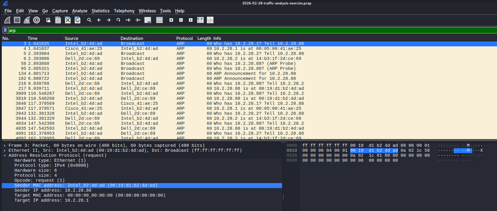
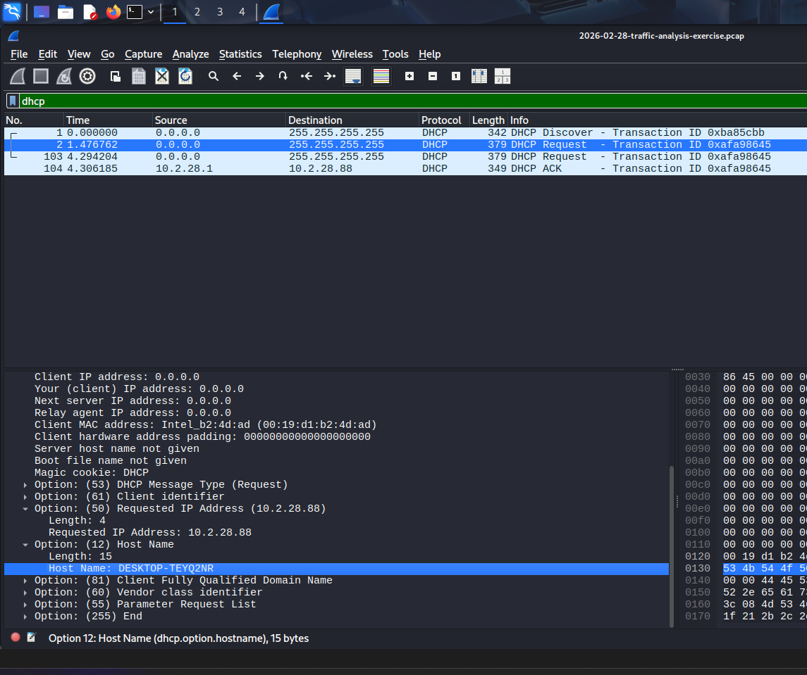
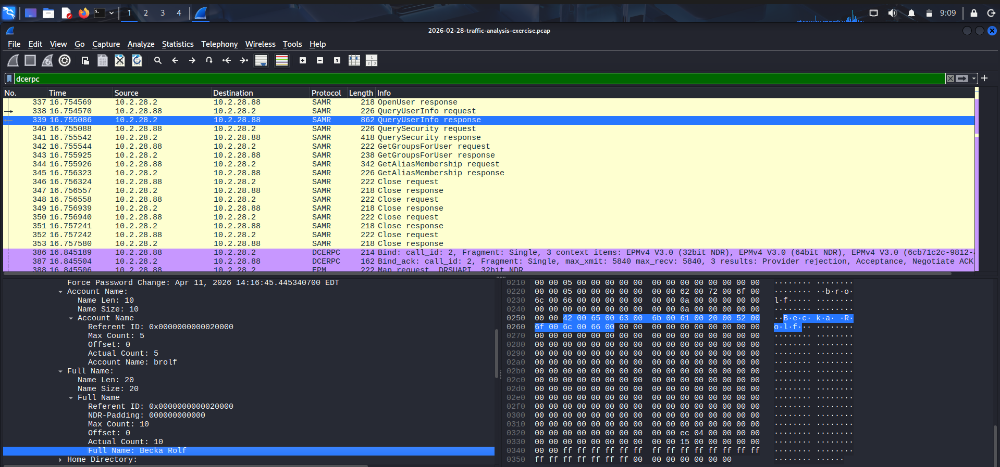
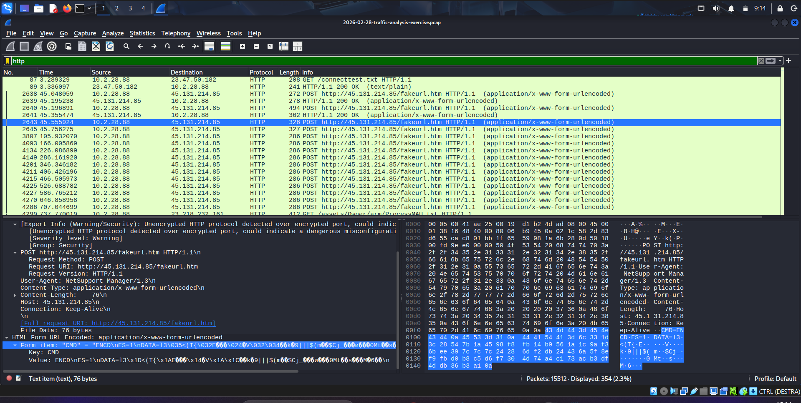
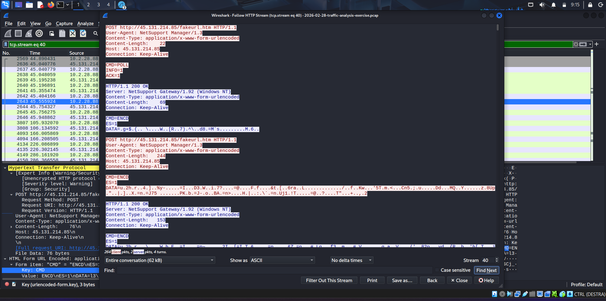

# Malicious HTTP Traffic Analysis – Incident Report

## Environment Overview
The analysis was conducted within the following network environment:

- **LAN Range:** 10.2.28.0/24  
- **Domain:** easyas123.tech  
- **Active Directory Domain Name:** EASYAS123  
- **Domain Controller:** 10.2.28.2 (EASYAS123-DC)  
- **Gateway:** 10.2.28.1  
- **Broadcast Address:** 10.2.28.255  

---

## Objective
The goal of this investigation is to identify indicators of compromise within HTTP network traffic and determine:

- The infected host
- The associated user
- The attacker infrastructure

---

## Tools Used
The following tools and resources were used during the analysis:

- **Kali Linux**  
  Used as a secure and isolated environment to safely analyze potentially malicious network traffic.

- **Wireshark**  
  Primary tool for packet analysis, used to inspect protocols, filter traffic, and reconstruct HTTP streams.

- **PCAP File (Public Dataset)**  
  A pre-captured network traffic file downloaded from an online source, used as the basis for the investigation.

---

## Methodology
The `.pcap` file was analyzed using Wireshark with the following techniques:

- Applied protocol filters (`http`, `arp`, `dhcp`, `dcerpc`)
- Inspected HTTP streams via **Follow → HTTP Stream**
- Correlated traffic across multiple protocols
- Identified anomalies in communication patterns
- Extracted host and user metadata from network services

---

## Findings

### Infected Host Identification

- **IP Address:** 10.2.28.88  
  - Identified through HTTP traffic analysis  

- **MAC Address:** 00:19:d1:b2:4d:ad (Intel_b2:4d:ad)  
  - Identified via ARP traffic  

- **Hostname:** DESKTOP-TEYQ2NR  
  - Retrieved from DHCP responses  

#### Evidence
  

---

### User Identification

- **User Account Name:** brolf  
- **Full Name:** Becka Rolf  

- Extracted using **DCE/RPC (SAMR)** protocol analysis  

#### Evidence

---

### Attacker Identification

- **Malicious IP Address:** 45.131.214.85  

- Identified through:
  - HTTP traffic filtering  
  - HTTP stream inspection showing encrypted/obfuscated data  

#### Evidence

---

### Malicious Activity Evidence

#### Encrypted HTTP Communication
- HTTP streams contained unreadable or encoded data  
- Indicates possible command execution or data exfiltration  

#### Evidence

---

## Analysis Summary
The infected client (**10.2.28.88**) communicates with an external malicious IP (**45.131.214.85**) over HTTP.  

Observed behavior includes:

- Suspicious payload delivery via POST requests  
- Encrypted or obfuscated data exchange  

User attribution confirms the compromised machine belongs to:

- **User:** brolf  
- **Full Name:** Becka Rolf  

---

## Conclusion
This investigation confirms that:

- A Windows host within the internal network is infected  
- The host is actively communicating with a malicious external server   
- The attacker infrastructure is hosted at **45.131.214.85**  

This case demonstrates how attackers exploit HTTP to:

- Deliver malicious payloads  
- Maintain persistence via beaconing  
- Exchange encrypted commands and data  

---

## Key Takeaways

- Correlating multiple protocols (HTTP, ARP, DHCP, DCE/RPC) is essential  
- HTTP remains a widely abused protocol for malware communication  
- Network metadata can reveal host and user identity  

---