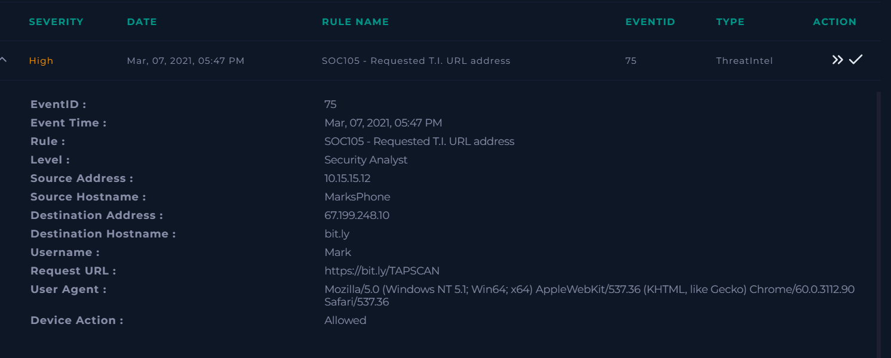
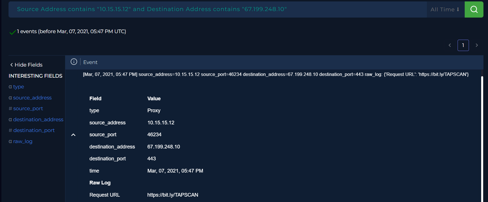
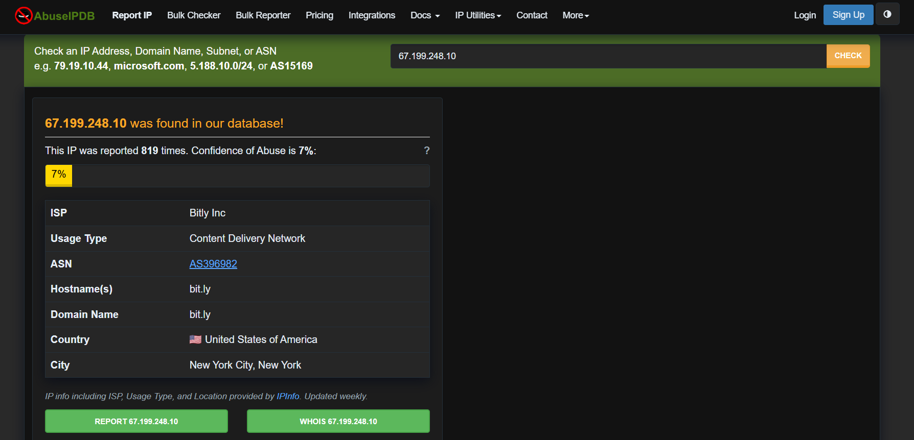
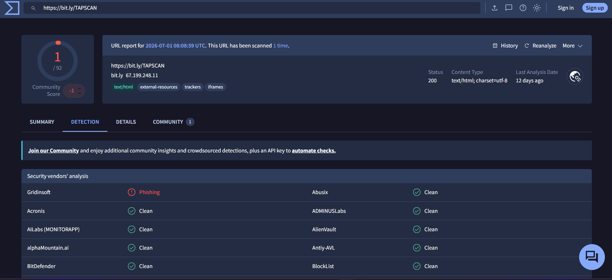
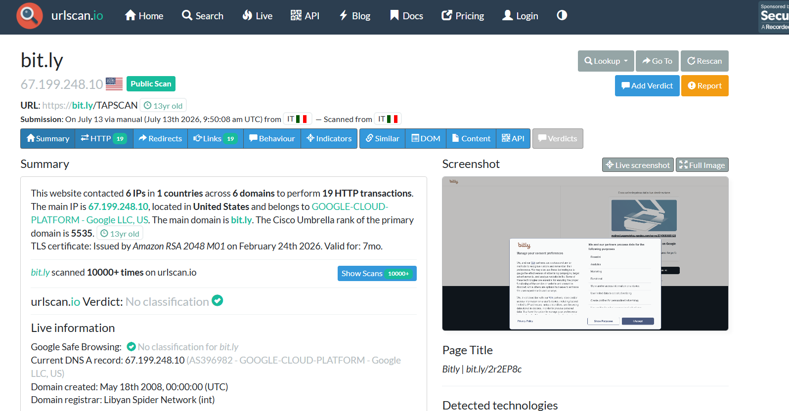
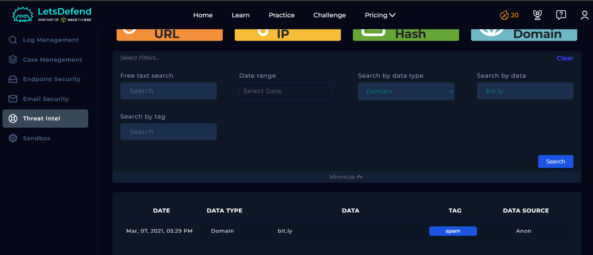
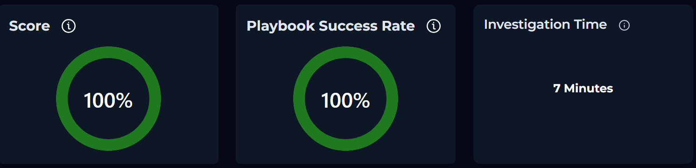

# SOC105 - Requested T.I. URL Address

## Overview

This investigation analyzes a **Requested T.I. URL Address** alert generated after a user accessed a shortened URL hosted on **bit.ly**.
The objective of the investigation was to determine whether the requested URL, its associated domain, and destination IP address were malicious or represented a legitimate web request.

---

## Information Gathering

| Field | Value |
|-------|-------|
| **Event Time** | Mar 07, 2021, 05:47 PM |
| **Username** | Mark |
| **Hostname** | MarksPhone |
| **Source IP Address** | 10.15.15.12 |
| **Source Port** | 46234 |
| **Destination Hostname** | bit.ly |
| **Destination IP Address** | 67.199.248.10 |
| **Destination Port** | 443 |
| **Requested URL** | `https://bit.ly/TAPSCAN` |
| **User-Agent** | Mozilla/5.0 (Windows NT 5.1; Win64; x64) AppleWebKit/537.36 (KHTML, like Gecko) Chrome/60.0.3112.90 Safari/537.36 |
| **Device Action** | Allowed |

---

## Analysis

### 5W Analysis

**When:** Mar 07, 2021, 05:47 PM.

**Who:** User **Mark** on host **MarksPhone** (`10.15.15.12`).

**What:** Access to a shortened URL (`https://bit.ly/TAPSCAN`) that triggered a Threat Intelligence alert.

**Where:** An outbound HTTPS connection (TCP/443) from **MarksPhone** to **bit.ly** (`67.199.248.10`).

**Why:** The requested URL matched a Threat Intelligence rule and required validation to determine whether it was associated with malicious activity.

### Investigation

The investigation began by reviewing the alert details and the associated network logs.
The logs confirmed that the user **Mark** accessed the shortened URL `https://bit.ly/TAPSCAN` over HTTPS, establishing an outbound connection to **bit.ly** (`67.199.248.10`).

As part of the threat intelligence validation process, the destination IP address (**67.199.248.10**) was analyzed using **AbuseIPDB**.
The lookup returned no reports or indicators suggesting malicious activity associated with the IP address.

The requested URL (`https://bit.ly/TAPSCAN`) was then analyzed using **VirusTotal** and **URLScan.io**.
Neither platform identified the URL as malicious or associated it with phishing, malware distribution, or other suspicious behavior.

Finally, the **bit.ly** domain was reviewed through the organization's **Threat Intelligence** platform (LetsDefend).
The domain reputation was classified as legitimate, and no indicators of compromise were identified.

Based on the evidence collected from multiple independent threat intelligence sources, the destination IP address, shortened URL, and domain were all determined to be benign.

---

## Artifacts

### Source

- **Username:** Mark
- **Hostname:** MarksPhone
- **IP Address:** 10.15.15.12

### Destination

- **Hostname:** bit.ly
- **IP Address:** 67.199.248.10

### Observed URL

- `https://bit.ly/TAPSCAN`

---

## Takeaways

- The alert was generated because a Threat Intelligence rule matched the requested URL.
- The destination IP address had no malicious reputation.
- The requested URL was not flagged by VirusTotal or URLScan.io.
- The **bit.ly** domain was classified as legitimate by the Threat Intelligence platform.
- No indicators of phishing, malware, or other malicious activity were identified.
- The network connection was consistent with legitimate HTTPS traffic.

---

## Conclusion

The investigation determined that the alert was a **False Positive**.
Threat intelligence validation performed through **AbuseIPDB**, **VirusTotal**, **URLScan.io**, and the organization's Threat Intelligence platform confirmed that the destination IP address, shortened URL, and domain were legitimate and showed no evidence of malicious activity.
Based on the available evidence, **no escalation or further response was required**.

