# SOC114 - Malicious Attachment Detected - Phishing Alert

## Overview

This investigation analyzes a phishing email containing a malicious attachment that successfully reached the victim's mailbox. By correlating email logs, network traffic, endpoint telemetry, and threat intelligence sources, the malicious activity was confirmed, the compromised endpoint was contained, and the incident was escalated for further response.

---

# Information Gathering

| Field | Value |
|-------|-------|
| **Date** | Jan 31, 2021, 03:48 PM |
| **SMTP Address** | 49.234.43.39 |
| **Source Email** | accounting@cmail.carleton.ca |
| **Destination Email** | richard@letsdefend.io |
| **Source IP Address** | 49.234.43.39 |
| **Destination IP Address** | 172.16.20.3 |
| **Destination Hostname** | Exchange Server |
| **Attachment MD5** | c9ad9506bcccfaa987ff9fc11b91698d |
| **Final Destination Host IP** | 172.16.17.45 |
| **Final Destination Hostname** | RichardPRD |

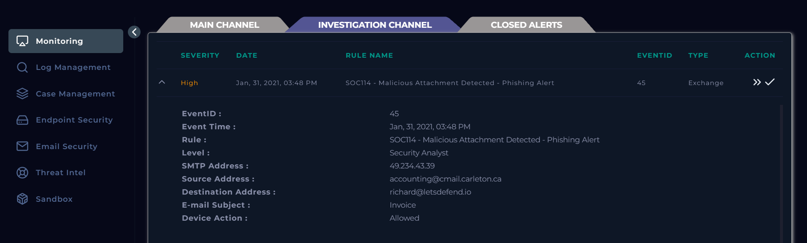

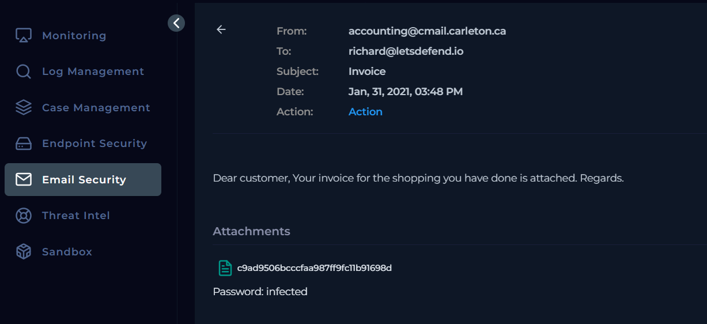

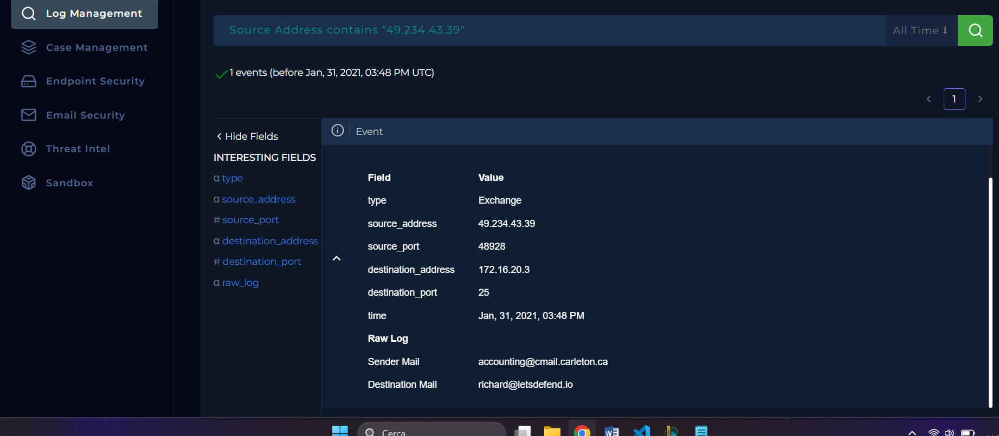

---

# Analysis Report

## 5W Summary

**When:** Jan 31, 2021, 03:48 PM

**Who:** SMTP Address **49.234.43.39** using the email account **accounting@cmail.carleton.ca**

**Where:** Destination IP Address **172.16.20.3** (Exchange Server)

**What:** A suspicious email containing a malicious attachment was sent from **49.234.43.39** (`accounting@cmail.carleton.ca`) to the organization's Exchange Server.

**Why:** The attachment was identified as malicious, indicating a phishing attempt intended to compromise the recipient's workstation.

---

After collecting the initial information, I analyzed the attachment using **VirusTotal** and **Hybrid Analysis**. Both platforms confirmed that the file was malicious.
I then investigated the sender's IP address using VirusTotal, which also confirmed that it had been associated with malicious activity.

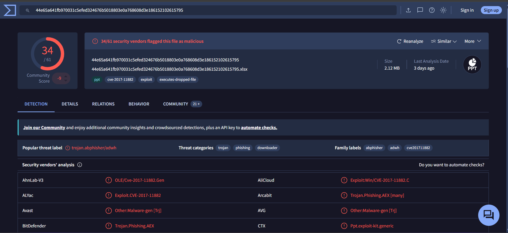

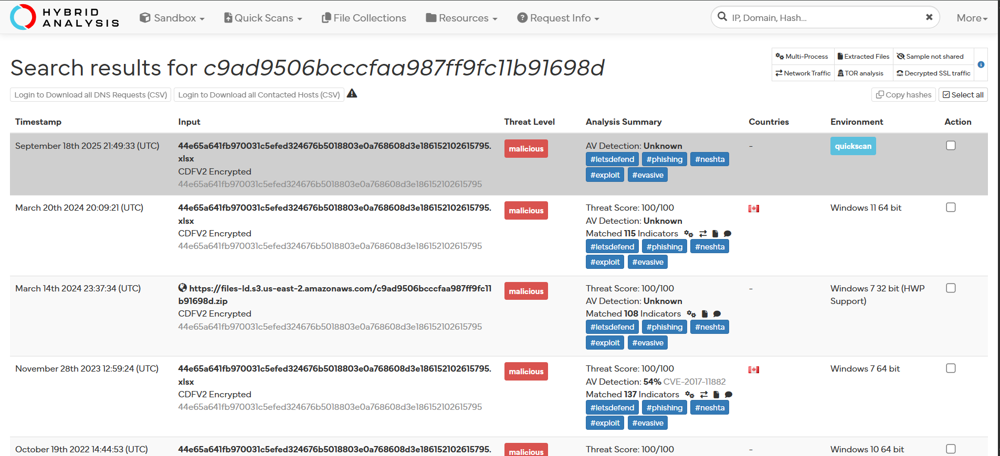

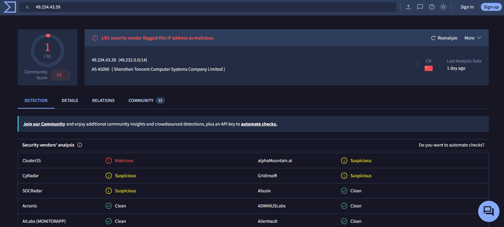

The alert indicated **Device Action: Allowed**, meaning the phishing email had been successfully delivered to the victim. This suggested that the attachment may have been opened.
I then reviewed the network logs and discovered a suspicious HTTP GET request to: `http://andaluciabeach[.]net/image/network[.]exe`
which resolved to the destination IP address: `5.135.143.133`
To confirm whether the malicious attachment had actually been executed, I investigated the endpoint through the **Endpoint Security** console.
The following evidence was identified:

- Browser activity showing access to the malicious URL:
  - `http://andaluciabeach[.]net/image/network[.]exe`
- Outbound network traffic to:
  - `5.135.143.133`
- Execution of the following processes:
  - `notepad.exe`
  - `EXCEL.EXE`
  - `EQNEDT32.EXE`

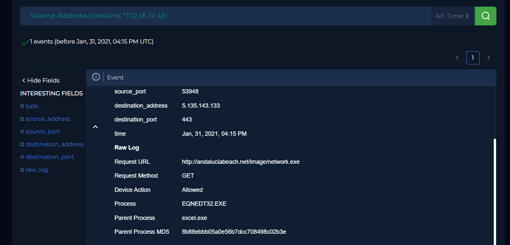

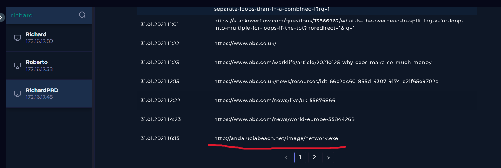

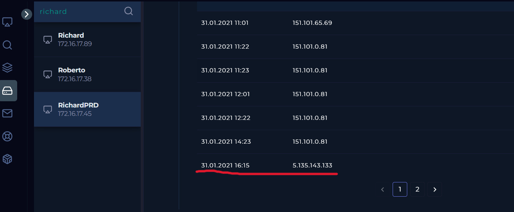

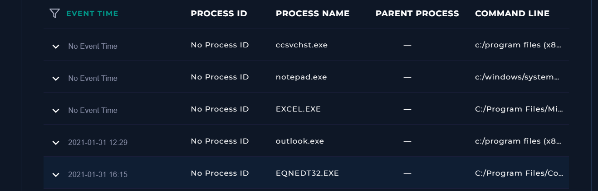

Finally, I compared the endpoint findings with the **Behavior** section of VirusTotal.
The following indicators matched perfectly:

- Contacted URL:
  - `http://andaluciabeach[.]net/image/network[.]exe`
- Destination IP:
  - `5.135.143.133`
- Executed processes:
  - `notepad.exe`
  - `EXCEL.EXE`
  - `EQNEDT32.EXE`

This correlation confirmed that the malicious attachment had been executed on the victim's workstation.

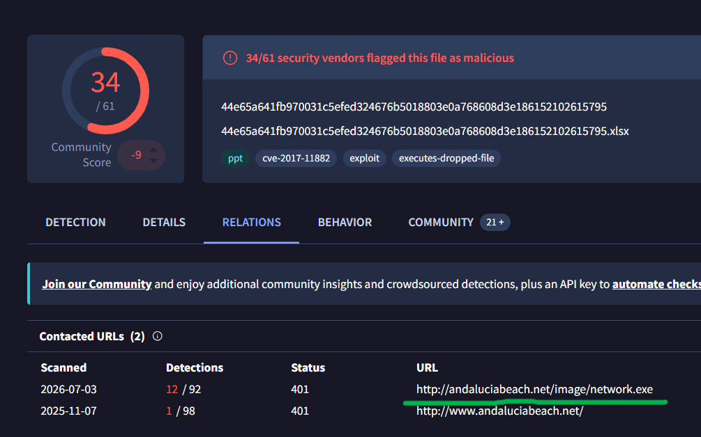

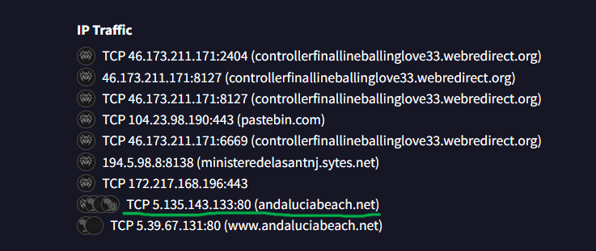

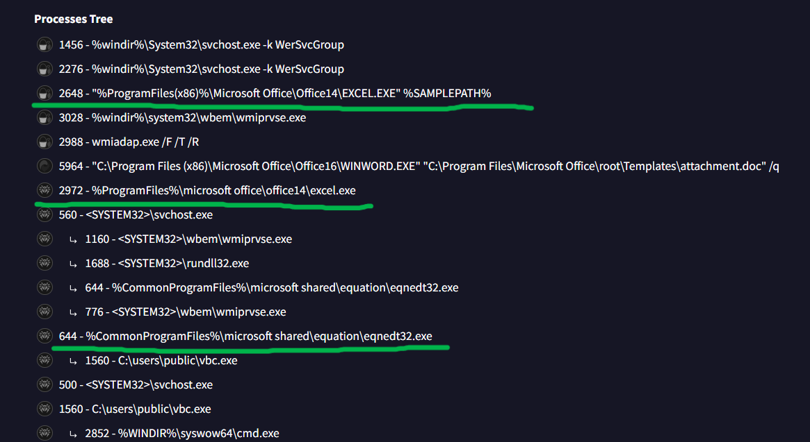

Based on the collected evidence, I performed the following response actions:

- Deleted the phishing email.
- Placed the infected host into **Containment**.
- Escalated the incident for further investigation.

---

# Artifacts

| Artifact | Value |
|----------|-------|
| **Source IP Address** | 49.234.43.39 |
| **Sender Email** | accounting@cmail.carleton.ca |
| **Destination Server IP Address** | 172.16.20.3 |
| **Final Destination Host IP Address** | 172.16.17.45 |
| **Attachment MD5** | c9ad9506bcccfaa987ff9fc11b91698d |
| **C2 IP Address** | 5.135.143.133 |
| **Malicious URL** | `http://andaluciabeach.net/image/network.exe` |
| **Parent Process MD5** | 8b88ebbb05a0e56b7dcc708498c02b3e |
| **Process MD5** | bfe93f50474fdb27d70c47326c8b6051 |

---

# Takeaways

- Verified the malicious attachment using multiple threat intelligence platforms.
- Confirmed the sender IP was malicious through VirusTotal.
- Correlated email, network, endpoint, and threat intelligence evidence.
- Identified the malware download URL and its C2 infrastructure.
- Confirmed malware execution through endpoint telemetry.
- Contained the compromised endpoint to prevent further communication.
- Escalated the incident following the incident response process.

---

# Conclusion

The investigation confirmed that a phishing email containing a malicious attachment successfully reached the victim and that the attachment was executed.
Evidence collected from network logs, endpoint telemetry, and VirusTotal behavior analysis consistently matched the malware's known activity, confirming the compromise.
The phishing email was removed, the infected endpoint was isolated, and the incident was escalated for further investigation and remediation.

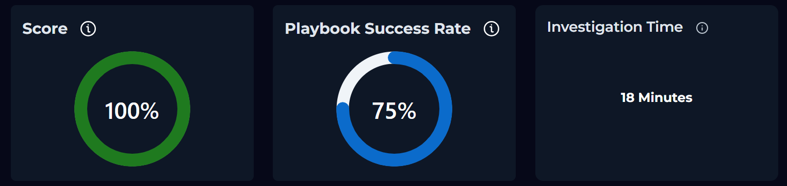

---

> **Note**
>
> I did not achieve a **100% Playbook Success Rate** because I accidentally selected **"Not Opened"** during the playbook, even though the subsequent investigation confirmed that the victim had opened the phishing email. This only affected the automated playbook score and did not impact the quality or outcome of the investigation.