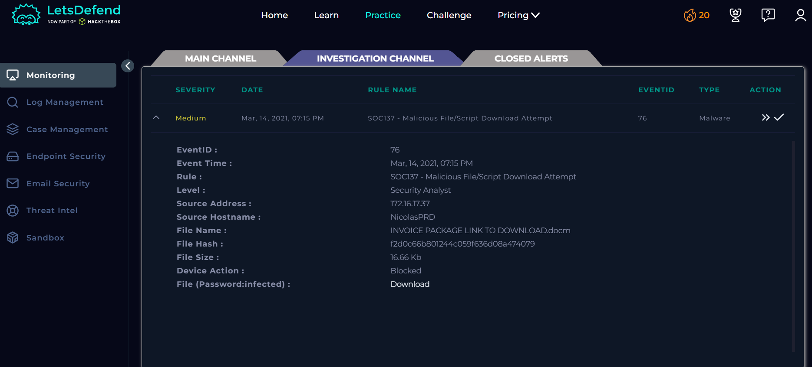
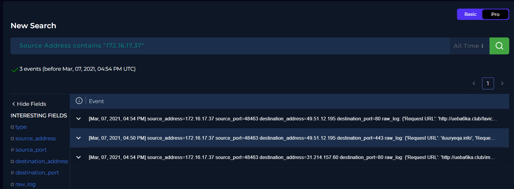
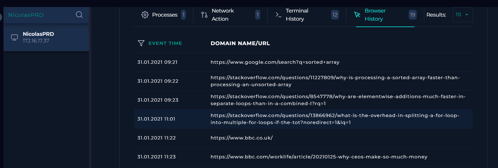
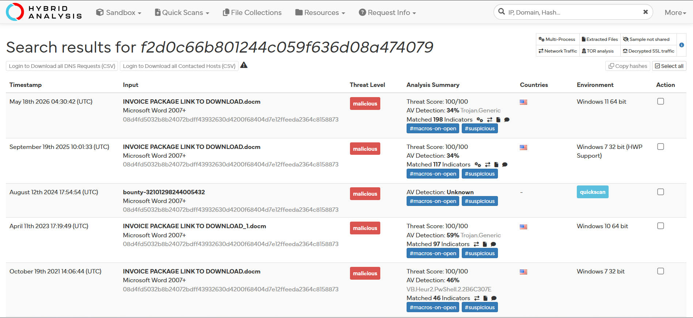
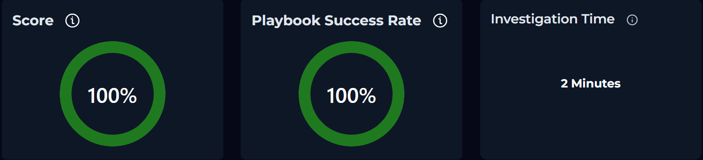

# SOC137 - Malicious File/Script Download Attempt

## Overview

This investigation analyzes a **Malicious File/Script Download Attempt** alert generated after a user attempted to download a malicious Microsoft Word macro-enabled document.
The objective of the investigation was to determine whether the malicious file was successfully downloaded or executed, assess the impact on the endpoint, and verify whether additional response actions were required.

---

## Information Gathering

| Field | Value |
|-------|-------|
| **Event Time** | Mar 14, 2021, 07:15 PM |
| **Hostname** | NicolasPRD |
| **Source IP Address** | 172.16.17.37 |
| **File Name** | `INVOICE PACKAGE LINK TO DOWNLOAD.docm` |
| **MD5 Hash** | `f2d0c66b801244c059f636d08a474079` |
| **File Size** | 16.66 KB |
| **Device Action** | Blocked |

---

## Analysis

### 5W Analysis

**When:** Mar 14, 2021, 07:15 PM.

**Who:** Host **NicolasPRD** (`172.16.17.37`).

**What:** An attempt to download the malicious file `INVOICE PACKAGE LINK TO DOWNLOAD.docm`, identified by the MD5 hash `f2d0c66b801244c059f636d08a474079`.

**Where:** The activity originated from the endpoint **NicolasPRD** (`172.16.17.37`).

**Why:** The security solution detected that the requested file matched known malicious indicators and blocked the download before it could reach the endpoint.

### Investigation

The investigation began by reviewing the alert details, which indicated that the endpoint **NicolasPRD** attempted to download a Microsoft Word macro-enabled document identified as malicious. The endpoint protection platform reported the **Device Action** as **Blocked**, indicating that the download was prevented.
The associated endpoint and log management records were then reviewed to verify whether the file had been downloaded or executed. No suspicious processes, persistence mechanisms, or other indicators of compromise were observed on the host following the blocked event.

The browser history was also examined to confirm the attempted download and correlate the user's activity with the security alert.

To validate the reputation of the file, the MD5 hash (`f2d0c66b801244c059f636d08a474079`) was analyzed using **Hybrid Analysis**. The platform confirmed that the file was malicious and associated with known malicious behavior.

Based on the collected evidence, the download attempt was successfully blocked before the file could be delivered to the endpoint. Furthermore, no suspicious activity was identified within the endpoint security or log management platforms, indicating that the host was not compromised.

---

## Artifacts

### Source

- **Hostname:** NicolasPRD
- **IP Address:** 172.16.17.37

### Malicious File

- **File Name:** `INVOICE PACKAGE LINK TO DOWNLOAD.docm`
- **MD5 Hash:** `f2d0c66b801244c059f636d08a474079`

---

## Takeaways

- The alert correctly identified an attempted download of a known malicious file.
- Endpoint protection successfully blocked the download before the file reached the host.
- Hybrid Analysis confirmed the malicious reputation of the file.
- Endpoint Security and Log Management showed no evidence of execution or post-compromise activity.
- No indicators of compromise were identified on the affected endpoint.
- No containment or remediation actions were required.

---

## Conclusion

The investigation determined that the alert was a **True Positive** because the requested file was confirmed to be malicious. However, the endpoint protection platform successfully **blocked** the download, preventing the file from being delivered or executed.
Additional verification through **Endpoint Security**, **Log Management**, and **Hybrid Analysis** found no evidence of compromise or malicious activity on the endpoint. Based on the available evidence, **no containment or escalation was required**.

