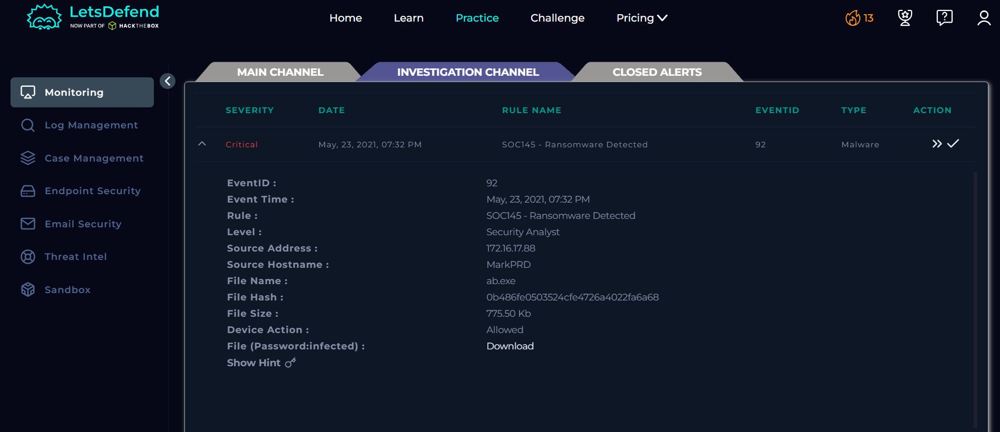
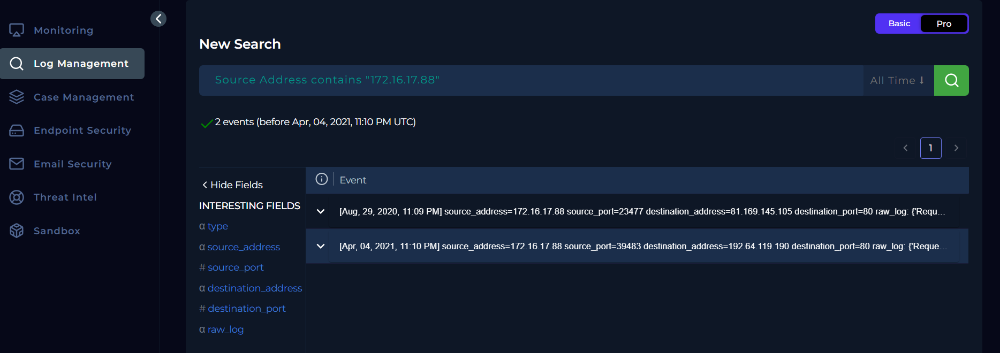
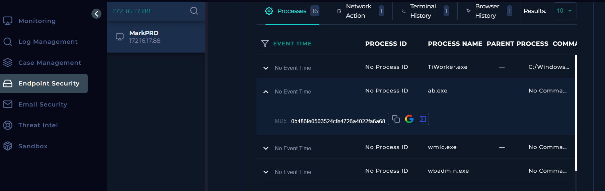
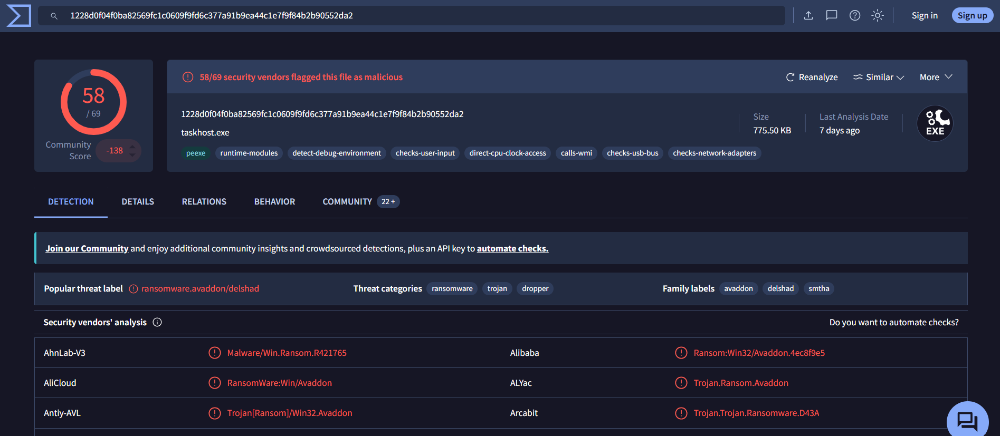
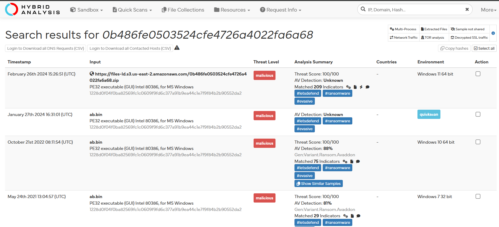
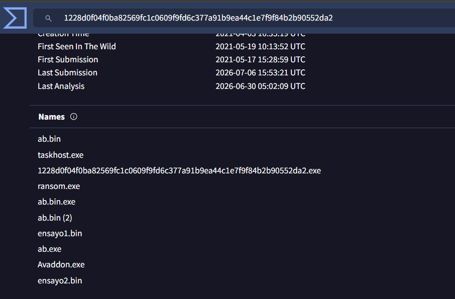

# SOC145 - Ransomware Detected

## Overview

This lab focuses on the investigation of a ransomware detection alert generated by the endpoint security solution. The objective was to validate the alert, analyze the affected endpoint, confirm whether the detected file was malicious, and perform the appropriate containment actions to prevent further impact.

---

## Information gathering

**Event Time:** May, 23, 2021, 07:32 PM

**Source Address:** 172.16.17.88

**Source Hostname:** MarkPRD

**File Name:** ab.exe

**File Hash:** 0b486fe0503524cfe4726a4022fa6a68

**Device Action:** Allowed

---

## Analysis

**When:** May, 23, 2021, 07:32 PM

**What:** Ransomware Detected.

**Who:** Host named **MarkPRD** with IP address **172.16.17.88**.

**Where:** Host with IP address **172.16.17.88** and hostname **MarkPRD**.

**Why:** Possible download and execution of a ransomware malware named **ab.exe** with MD5 hash **0b486fe0503524cfe4726a4022fa6a68**.

### Additional notes

As shown in the **Device Action** field, the suspicious file was neither quarantined nor removed. I verified the executable on **VirusTotal** and **Hybrid Analysis**, and both platforms confirmed that **ab.exe** (MD5: **0b486fe0503524cfe4726a4022fa6a68**) is ransomware.

Next, I reviewed the infected host's network logs but did not identify any suspicious outbound traffic.

I then searched for the victim's IP address in the Endpoint Security console and found a running process with the same filename and matching MD5 hash as the malware.

Based on these findings, I isolated the infected host to prevent further impact and escalated the incident for further investigation.

---

## Artifacts

- **Source Address:** 172.16.17.88
- **File Hash:** 0b486fe0503524cfe4726a4022fa6a68

---

## Screenshots

### Network Logs

### Suspicious Process

### VirusTotal Result

### Hybrid Analysis Results

### Malware Names

---

## Takeaways

- Always verify malware detections that are marked as **Allowed**, as the threat may still be active on the endpoint.
- Validate suspicious files using multiple threat intelligence sources.
- Correlate endpoint telemetry with threat intelligence to confirm active malware execution.
- Review network activity to assess possible communication with external infrastructure.
- Isolate compromised systems immediately to prevent ransomware propagation.
- Escalate confirmed ransomware incidents for further investigation and remediation.

---

## Conclusion

The investigation confirmed that **ab.exe** (MD5: **0b486fe0503524cfe4726a4022fa6a68**) was a ransomware sample actively running on the endpoint **MarkPRD**. Although no suspicious outbound network traffic was observed, the malware was validated through multiple threat intelligence sources and endpoint telemetry. The affected host was successfully isolated to contain the threat, and the incident was escalated for further investigation and remediation.

