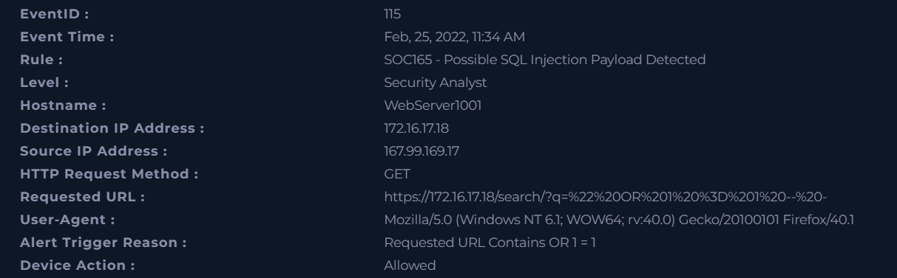
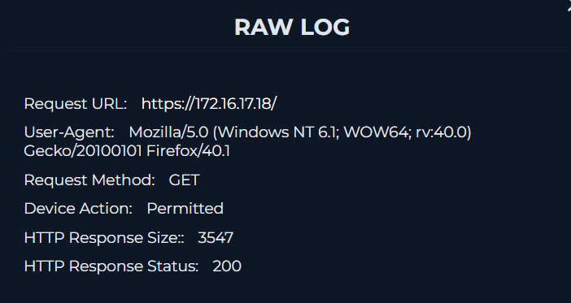
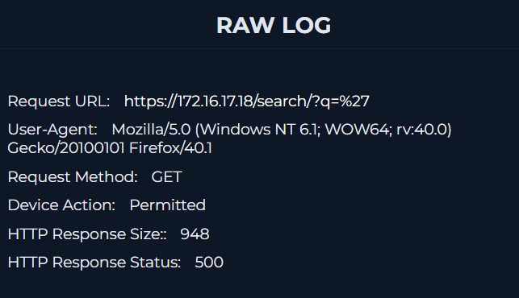
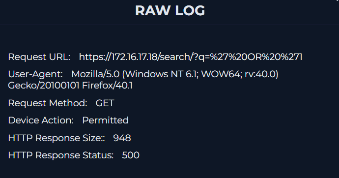
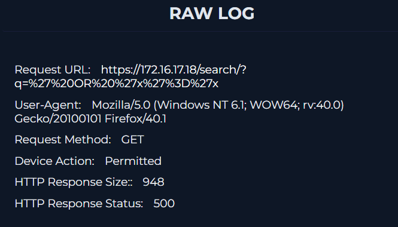
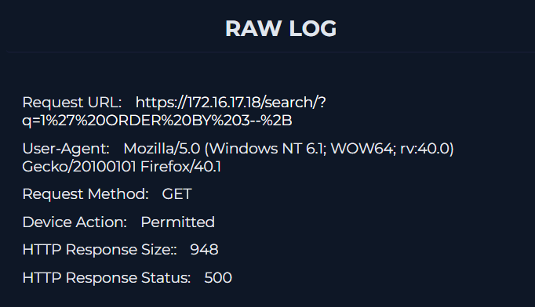
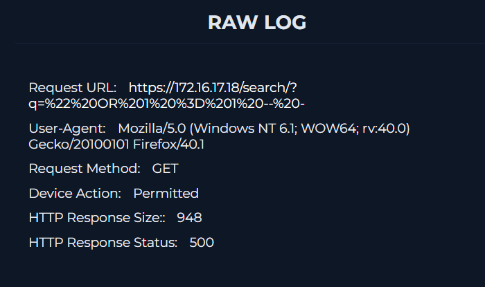
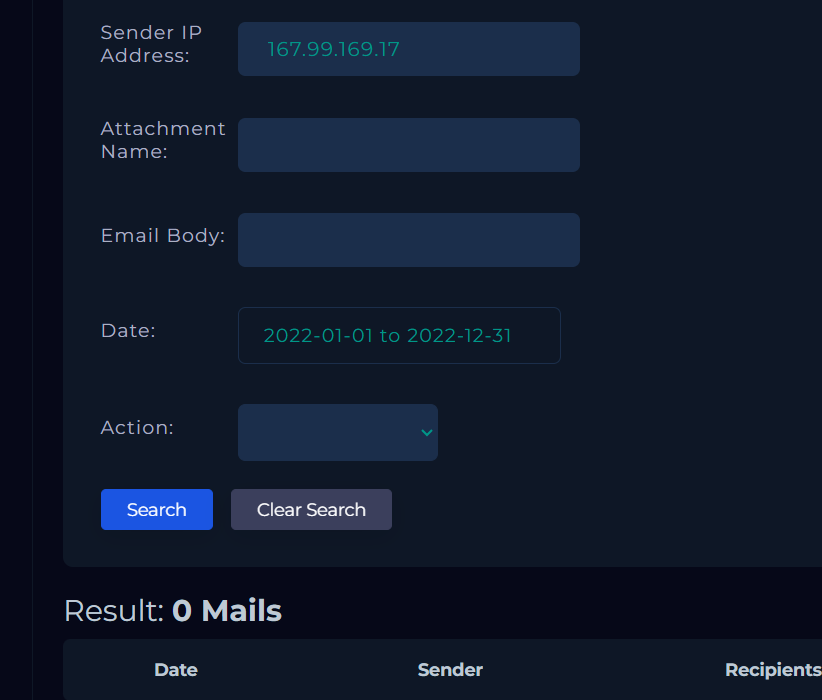
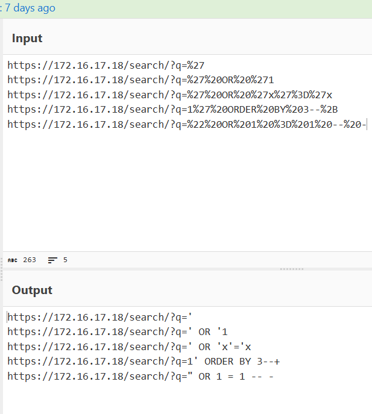
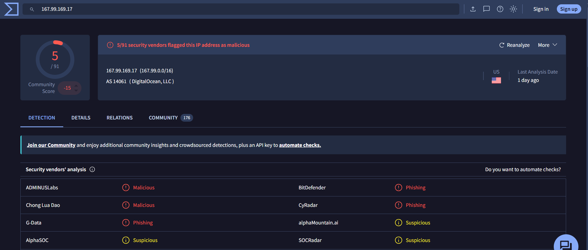

# SOC165 - Possible SQL Injection Payload Detected

## Overview

This investigation analyzes a **Possible SQL Injection Payload Detected** alert generated after multiple HTTP GET requests containing common SQL Injection payloads targeting the web application's search functionality.
The objective of the investigation was to validate the alert, determine whether the activity was part of an authorized security assessment or a malicious attack, and assess whether the SQL Injection attempts were successful.

---

## Information Gathering

| Field | Value |
|-------|-------|
| **Event Time** | Feb 25, 2022, 11:34 AM |
| **Hostname** | WebServer1001 |
| **Source IP Address** | 167.99.169.17 |
| **Source Port** | 48675 |
| **Destination IP Address** | 172.16.17.18 |
| **Destination Port** | 443 |
| **HTTP Request Method** | GET |
| **Requested URL** | `https://172.16.17.18/search/?q=%22%20OR%201%20%3D%201%20--%20-` |
| **User-Agent** | Mozilla/5.0 (Windows NT 6.1; WOW64; rv:40.0) Gecko/20100101 Firefox/40.1 |
| **Alert Trigger Reason** | Requested URL Contains `OR 1 = 1` |
| **Device Action** | Allowed |

---

## Analysis

### 5W Analysis

**When:** Feb 25, 2022, 11:34 AM.

**Who:** An external host with IP address **167.99.169.17**.

**What:** A possible SQL Injection attack targeting the web application's search functionality.

**Where:** The activity targeted **WebServer1001** (`172.16.17.18`) through the `/search/` endpoint over HTTPS (TCP/443).

**Why:** The alert was triggered because the requested URL contained the classic SQL Injection payload `OR 1 = 1`, commonly used to test for SQL Injection vulnerabilities.

### Investigation

The investigation began by reviewing the network logs associated with the alert.

Multiple HTTP GET requests targeting the following endpoint were identified:`https://172.16.17.18/search/?q=`
Each request contained a different value for the `q` parameter, corresponding to well-known SQL Injection payloads.

To determine whether the activity was authorized, the **Email Security** portal was reviewed for any notifications related to scheduled penetration testing or other planned security assessments.
No emails or evidence supporting legitimate testing activities were found.

The captured URLs were then decoded using **CyberChef**.
The decoded values confirmed that they were common SQL Injection payloads used during the reconnaissance phase of SQL Injection attacks, including:

- `'`
- `' OR '1`
- `' OR 'x'='x`
- `1' ORDER BY 3--+`
- `" OR 1 = 1 -- -`

As part of the threat intelligence process, the source IP address (**167.99.169.17**) was checked using **VirusTotal**.
The reputation lookup classified the IP address as malicious, supporting the assessment that the activity originated from an external threat actor rather than a legitimate security assessment.

Finally, the HTTP responses returned by the web server were analyzed.
Each SQL Injection attempt resulted in an **HTTP 500 Internal Server Error**, with all responses having a similar response size.
No evidence of successful SQL query execution, unauthorized data access, or application compromise was observed. Based on the available evidence, the SQL Injection attempts were unsuccessful.

---

## Artifacts

### Source

- **IP Address:** 167.99.169.17

### Destination

- **Hostname:** WebServer1001
- **IP Address:** 172.16.17.18

### Observed URLs

- `https://172.16.17.18/search/?q=%27`
- `https://172.16.17.18/search/?q=%27%20OR%20%271`
- `https://172.16.17.18/search/?q=%27%20OR%20%27x%27%3D%27x`
- `https://172.16.17.18/search/?q=1%27%20ORDER%20BY%203--%2B`
- `https://172.16.17.18/search/?q=%22%20OR%201%20%3D%201%20--%20-`

---

## Takeaways

- Multiple SQL Injection payloads targeted the web application's search endpoint.
- The payloads correspond to common SQL Injection testing techniques.
- No evidence of authorized penetration testing or scheduled security assessments was found.
- The source IP address has a malicious reputation.
- Every request resulted in an HTTP 500 response with a similar response size.
- No evidence of successful SQL Injection or data exposure was identified.

---

## Conclusion

The investigation confirmed that the alert was a **True Positive**, as multiple SQL Injection payloads were sent from a malicious external IP address targeting the application's search endpoint.
Despite the malicious activity, all requests resulted in HTTP 500 Internal Server Error responses with consistent response sizes, indicating that the attack was unsuccessful and no evidence of backend database interaction or data disclosure was identified.
Based on the collected evidence, no indicators of compromise were observed and **no escalation was required**.

