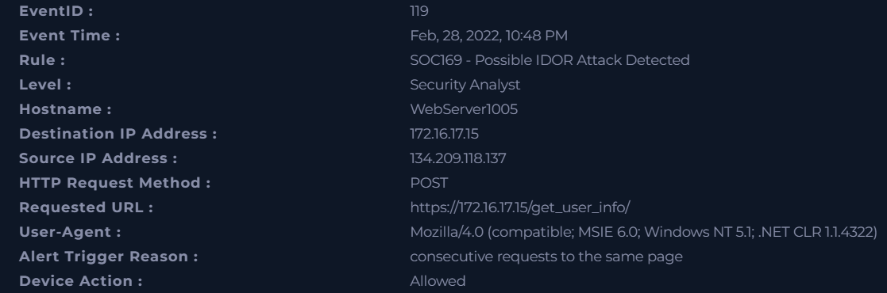
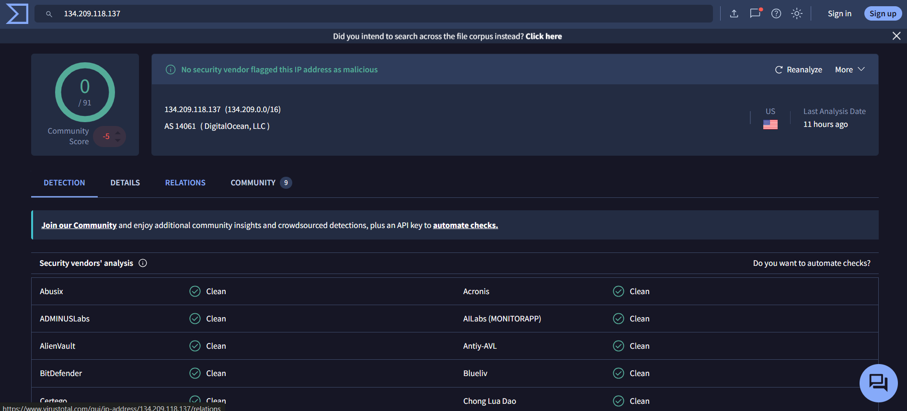
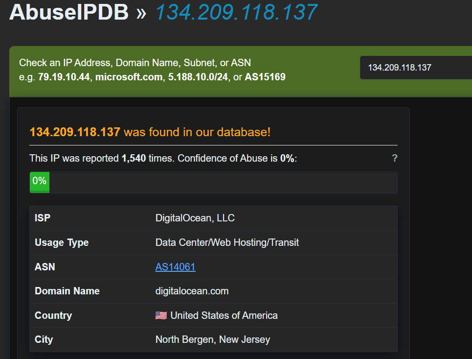
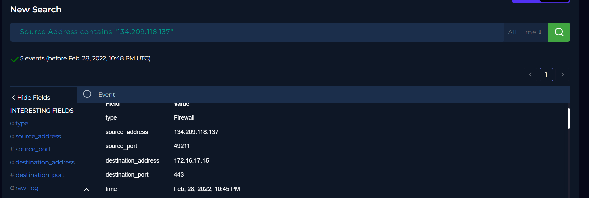
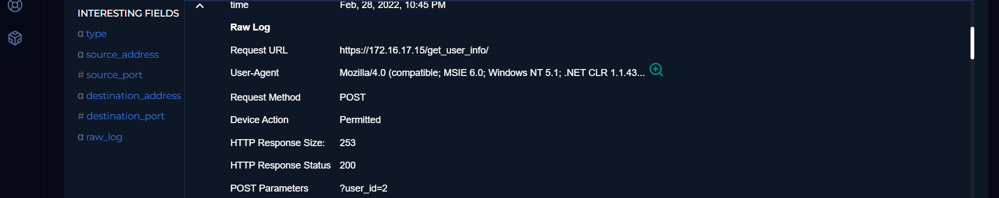
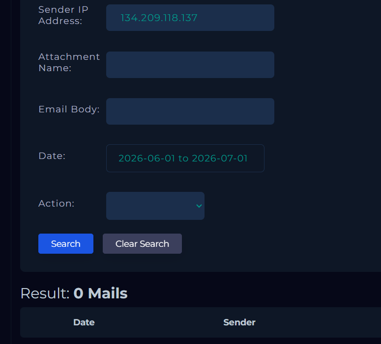
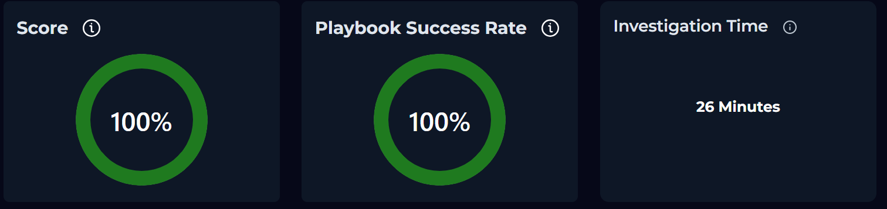

# SOC169 - Possible IDOR Attack Detected

## Overview:

---

A suspected **IDOR (Insecure Direct Object Reference) attack** was detected against the web application hosted on **WebServer1005 (172.16.17.15)**.

Multiple HTTP POST requests from **134.209.118.137** targeted the `/get_user_info/` endpoint by modifying the `user_id` parameter. The activity suggests an attempt to access unauthorized user information.

The requests returned **HTTP 200 OK** responses, indicating possible successful access to protected resources. Further investigation is required to confirm the impact and identify affected data.

---

## Information gathering:

**Time:** Feb, 28, 2022, 10:45 PM - Feb, 28, 2022, 10:48 PM  
**Hostname:** WebServer1005  
**Source IP Address:** 134.209.118.137  
**Destination IP Address:** 172.16.17.15  
**Source Port:** 49211  
**Destination Port:** 443  
**HTTP Request Method:** POST  
**Requested URL:** https://172.16.17.15/get_user_info/  
**User-Agent:** Mozilla/4.0 (compatible; MSIE 6.0; Windows NT 5.1; .NET CLR 1.1.4322)  
**Device Action:** Allowed  

---

## Analysis:

### When:
Feb, 28, 2022, 10:45 PM - Feb, 28, 2022, 10:48 PM

### Who:
Host with IP address **134.209.118.137**

### What:
Possible IDOR attack

### Where:
Hostname **WebServer1005** with IP address **172.16.17.15** and URL: `https://172.16.17.15/get_user_info/?user_id=`

### Why:
Consecutive HTTP POST requests to the same page that indicate a possible IDOR Attack.

### Additional Notes:

Analysis of the source IP address through VirusTotal and AbuseIPDB shows that the attack originated from a cloud server hosted by DigitalOcean, which may have been used to obscure the attacker's real identity or location.
Network log analysis in the **Log Management** section revealed multiple HTTP POST requests from IP address **134.209.118.137** targeting: `https://172.16.17.15/get_user_info/?user_id=` with different values of the `user_id` parameter ranging from **1 to 5**.
This activity indicates a potential **IDOR vulnerability exploitation attempt**.
The attack appears to have been successful, as all requests returned an **HTTP 200 OK** response with different response sizes, suggesting that the attacker was able to access the requested resources.
The **Endpoint Security** review did not identify any suspicious activity on the affected host.
Additionally, **Email Security** logs were checked to determine whether the activity was related to an authorized penetration test, but no evidence was found.

**The incident requires escalation for further investigation.**

---

## Artifacts:

**Source IP Address:** 134.209.118.137  

**Destination IP Address:** 172.16.17.15  

**URL address:** `https://172.16.17.15/get_user_info/?user_id=`

---

### Alert Details

### VirusTotal Analysis

### AbuseIPDB Analysis

### Network Logs

### Mail Security Check

## Takeaways:

- The incident highlights the risk of improperly implemented access controls within web applications.
- The attacker was able to manipulate the `user_id` parameter and potentially retrieve unauthorized user information, indicating a possible IDOR vulnerability.
- Successful HTTP 200 responses suggest that the application may not have properly validated user authorization before returning requested data.
- External cloud infrastructure, such as DigitalOcean servers, can be abused by attackers to mask their true origin.
- Continuous monitoring of web application logs and anomaly detection rules are essential to identify similar exploitation attempts.
- Access control mechanisms should be reviewed and strengthened to prevent unauthorized object access.
- Additional vulnerability assessment and code review should be performed on the affected endpoint.

---

## Conclusion

The investigation identified a potential **IDOR attack attempt** against the **WebServer1005** application through repeated POST requests targeting the `/get_user_info/` endpoint.
The attacker, originating from **134.209.118.137**, attempted to enumerate user identifiers by modifying the `user_id` parameter. The successful HTTP responses indicate that unauthorized access to user information may have occurred.
Although no additional malicious activity was detected on the affected host, the possibility of data exposure cannot be excluded.
The incident should be escalated for further analysis, including:

- Reviewing application authorization controls.
- Determining the scope of potentially exposed data.
- Investigating affected user accounts.
- Implementing remediation measures to prevent future IDOR exploitation.

The recommended action is to patch the identified vulnerability, improve access validation mechanisms, and continue monitoring for related malicious activity.

