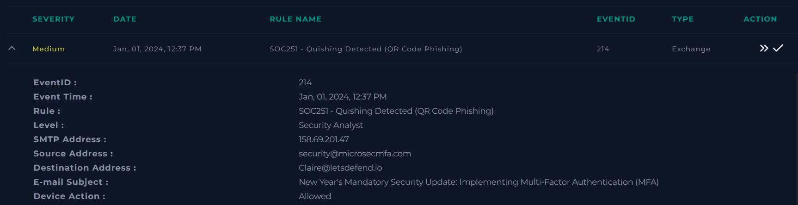
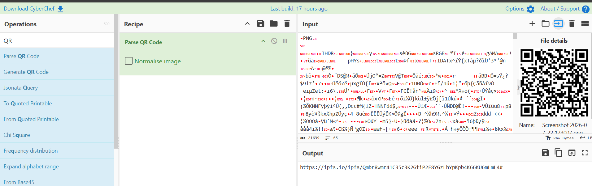
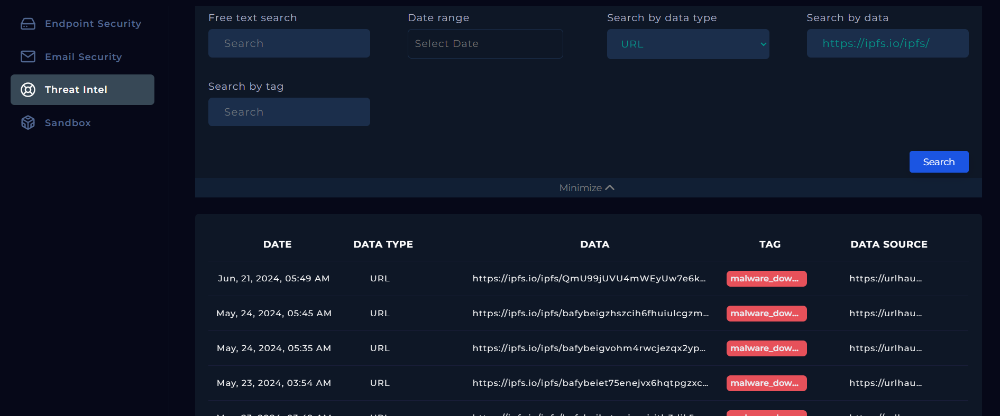
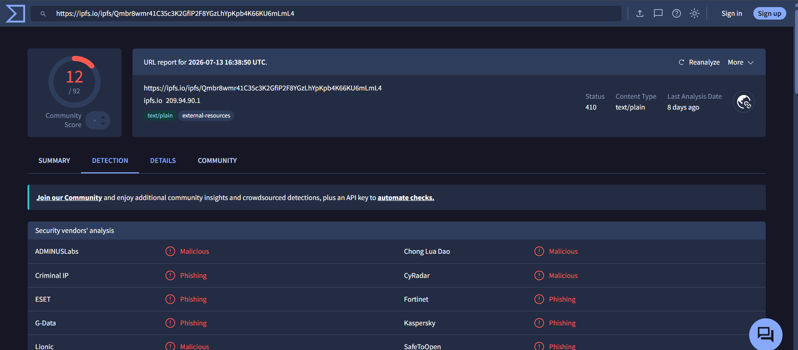
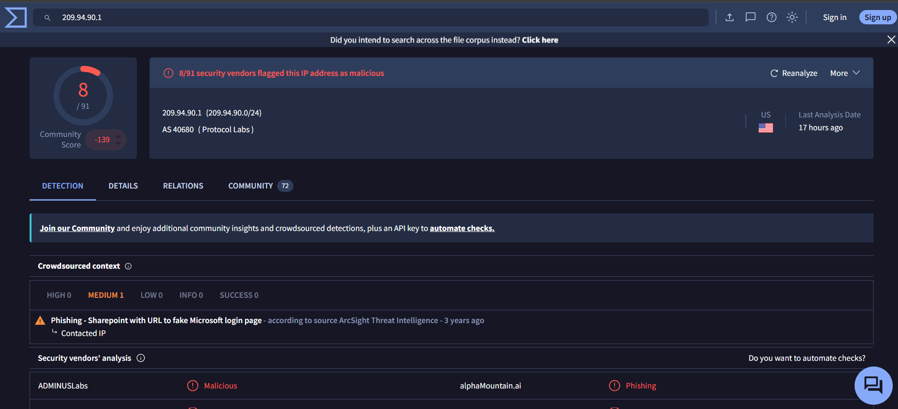
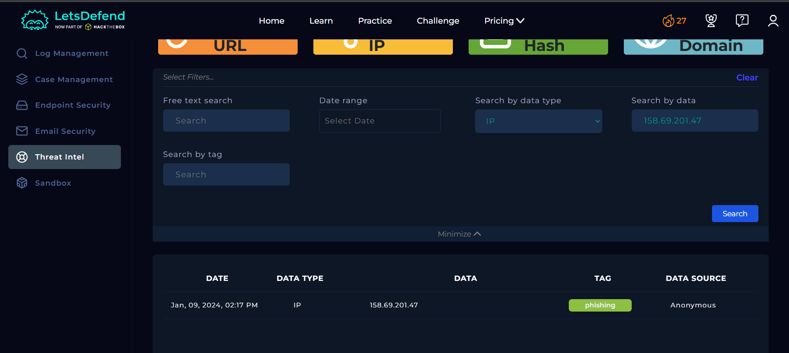
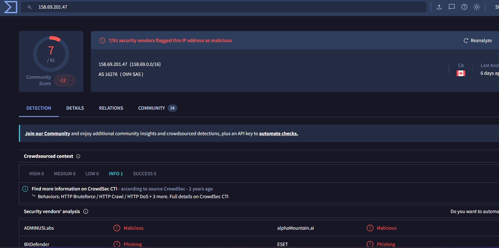
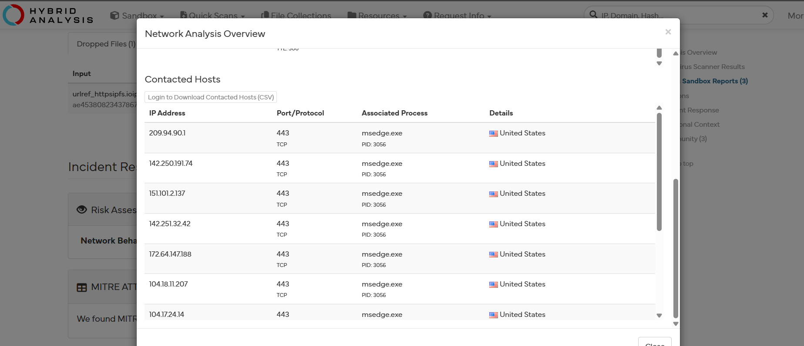
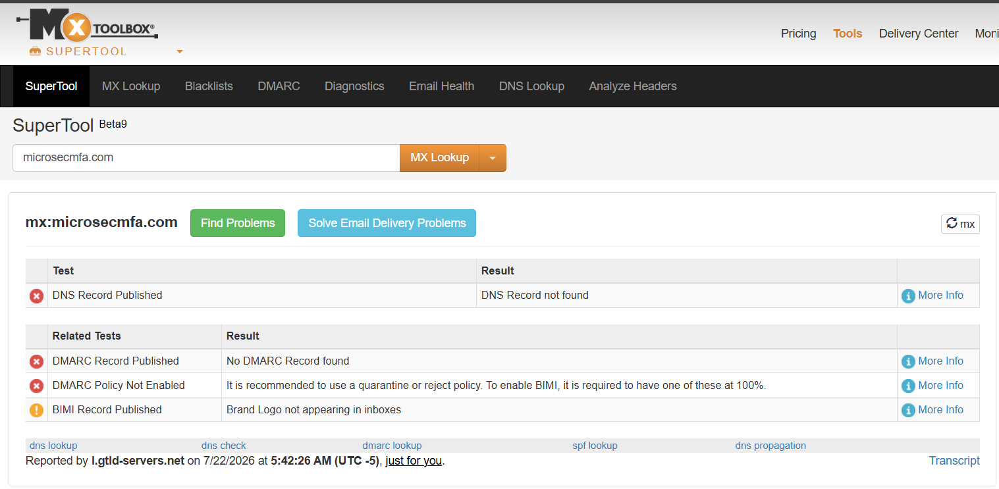
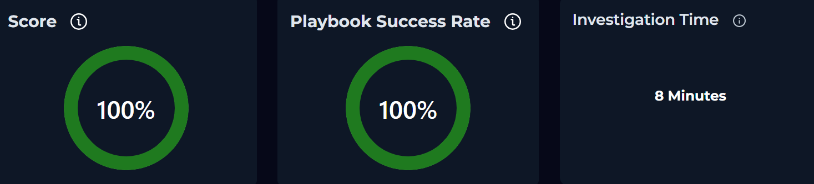

# SOC251 - Quishing Detected (QR Code Phishing)

## Overview

This investigation analyzes a **QR Code Phishing (Quishing)** alert triggered by a phishing email impersonating an internal security notification. The email attempted to convince the recipient to scan a malicious QR code under the pretext of implementing a mandatory Multi-Factor Authentication (MFA) update. The objective of the investigation was to determine whether the QR code redirected to malicious infrastructure and whether the recipient's endpoint showed signs of compromise.

---

## Information Gathering

| Field | Value |
|-------|-------|
| **Event Time** | Jan 01, 2024, 12:37 PM |
| **Rule** | SOC251 - Quishing Detected (QR Code Phishing) |
| **SMTP Address** | 158.69.201.47 |
| **Sender Email** | security@microsecmfa.com |
| **Recipient Email** | Claire@letsdefend.io |
| **Destination IP Address** | 172.16.17.181 |
| **Email Subject** | New Year's Mandatory Security Update: Implementing Multi-Factor Authentication (MFA) |
| **Device Action** | Allowed |
| **Trigger Reason** | Suspicious email containing a QR code leading to a phishing website |

---

## Analysis

### 5W Analysis

**When:** Jan 01, 2024, 12:37 PM.

**Who:** Source email address **security@microsecmfa.com** with SMTP address **158.69.201.47** targeting the user **Claire** on host **Claire** (`172.16.17.181`).

**What:** A phishing email containing a malicious QR code designed to redirect the victim to a credential harvesting website.

**Where:** The phishing email was delivered to **Claire@letsdefend.io** from the SMTP server **158.69.201.47**. The targeted endpoint was **Claire** (`172.16.17.181`).

**Why:** The attacker leveraged a fake mandatory MFA implementation notice to create urgency and trick the recipient into scanning the QR code, ultimately redirecting them to a phishing page intended to steal credentials.

### Investigation

The investigation began by reviewing the suspicious email through the **Email Security** section of the LetsDefend platform.
The email contained a QR code instead of a traditional phishing hyperlink, a technique commonly known as **Quishing**. To safely analyze the destination, a screenshot of the QR code was taken and the embedded URL was extracted using **CyberChef**.

The extracted URL was then analyzed using the **Threat Intelligence** section of LetsDefend.
Although the exact URL was not present in the Threat Intelligence database, the investigation revealed multiple malicious URLs hosted under the same **ipfs.io/ipfs/** path. This suggested that the IPFS gateway was being abused to host phishing content.

To validate these findings, the URL was submitted to **VirusTotal**.
VirusTotal classified the URL as **phishing**, confirming its malicious nature. For completeness, the IP address associated with **ipfs.io** was also analyzed and showed indicators consistent with malicious activity.

The SMTP IP address (**158.69.201.47**) was subsequently investigated using both the LetsDefend **Threat Intelligence** module and **VirusTotal**.
Both platforms identified the SMTP server as malicious and associated it with phishing campaigns, strengthening the evidence that the email originated from attacker-controlled infrastructure.

To identify any additional attacker infrastructure, the extracted URL was analyzed using **Hybrid Analysis**.
The sandbox analysis revealed the external domains and IP addresses contacted by the phishing page. These indicators were collected to determine whether any corresponding network activity could be observed on the victim endpoint.

The investigation then continued by reviewing both the **Log Management** and **Endpoint Security** sections within LetsDefend.
No network connections matching the contacted infrastructure were found, and no suspicious processes or endpoint activity indicated that the QR code had been scanned or that the phishing page had been accessed from the victim host.
Finally, the sender domain (**microsecmfa.com**) was analyzed using **MXToolbox**.
The analysis revealed that the domain lacked important email security configurations, including valid **DNS**, **DMARC**, and **BIMI** records, further supporting the conclusion that it was created for malicious purposes rather than legitimate email communications.

Based on the collected evidence, the following Indicators of Compromise (IoCs) were identified:

- Phishing email containing a malicious QR code.
- Malicious phishing URL hosted through the IPFS gateway.
- Malicious SMTP IP address (**158.69.201.47**).
- Sender domain lacking proper email authentication records.
- QR code designed to redirect users to a credential harvesting website.

No evidence of successful user interaction or endpoint compromise was identified during the investigation.
The alert was classified as a **True Positive** because the phishing email was confirmed to be malicious. The phishing email was removed from the user's mailbox, and the affected endpoint was placed into **Containment** as a precautionary measure.

---

## Artifacts

### Source

- **Sender Email:** `security@microsecmfa.com`
- **SMTP IP Address:** `158.69.201.47`

### Destination

- **Recipient Email:** `Claire@letsdefend.io`
- **Destination IP Address:** `172.16.17.181`

### Indicators of Compromise (IOCs)

- **Malicious URL:** `https://ipfs.io/ipfs/Qmbr8wmr41C35c3K2GfiP2F8YGzLhYpKpb4K66KU6mLmL4#`
- **Sender Domain:** `microsecmfa.com`

---

## Takeaways

- The alert was generated due to a phishing email containing a malicious QR code.
- The attacker impersonated an internal security notification to increase credibility and urgency.
- CyberChef was used to safely extract the URL embedded within the QR code.
- Threat Intelligence and VirusTotal confirmed the malicious nature of both the phishing URL and the SMTP IP address.
- Hybrid Analysis identified additional infrastructure contacted by the phishing page.
- No evidence of malicious network activity or endpoint compromise was identified.
- The phishing email was removed, and the endpoint was placed into Containment as a precaution.
- Since no endpoint compromise was observed, escalation was not considered necessary.

---

## Conclusion

The investigation confirmed that the alert was a **True Positive**.
The phishing email contained a malicious QR code that redirected users to a phishing website hosted through the IPFS gateway. Multiple intelligence sources, including LetsDefend Threat Intelligence, VirusTotal, Hybrid Analysis, and MXToolbox, confirmed the malicious nature of the sender infrastructure and phishing URL.
Although the email successfully reached the recipient, no evidence indicated that the QR code was scanned or that the endpoint communicated with the attacker infrastructure. As a result, no signs of compromise were identified on the victim host.
The phishing email was deleted, the endpoint was placed into **Containment** as a precautionary measure, and the incident was successfully closed.

