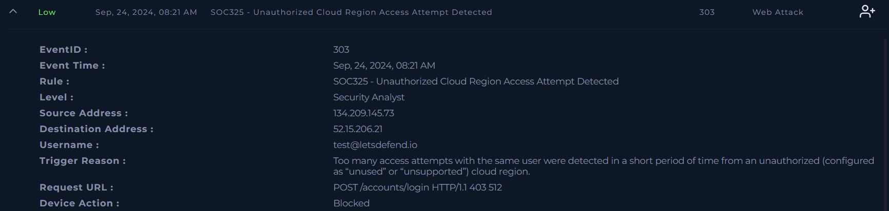
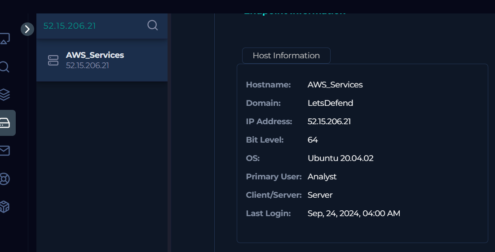
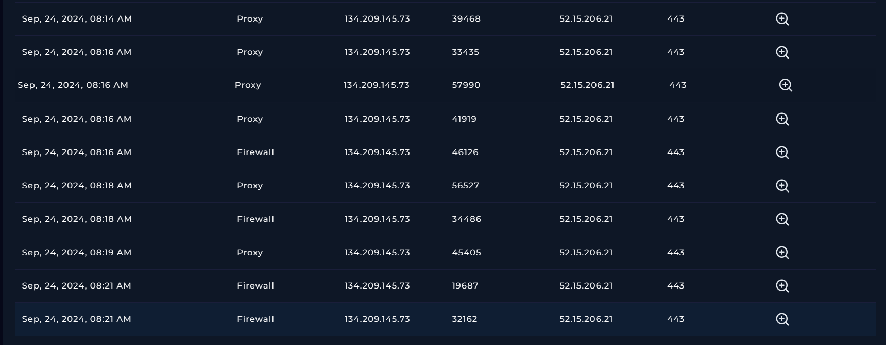
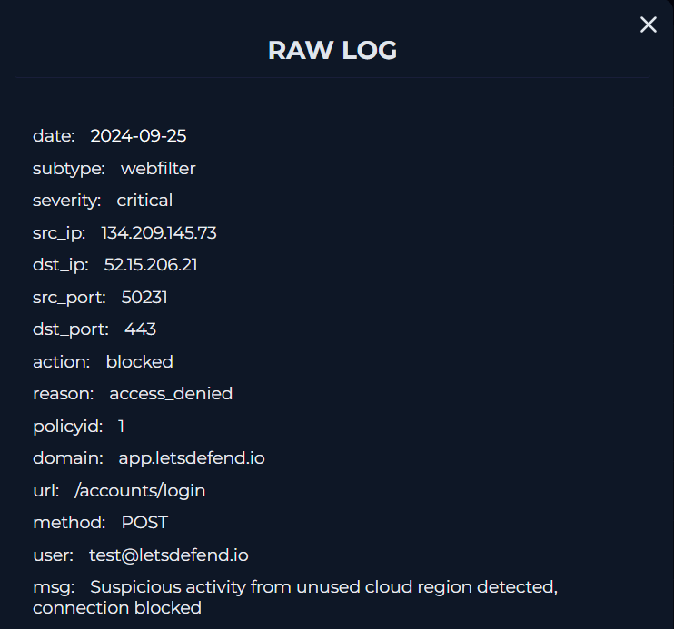
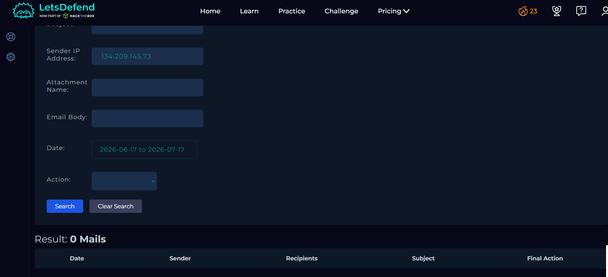
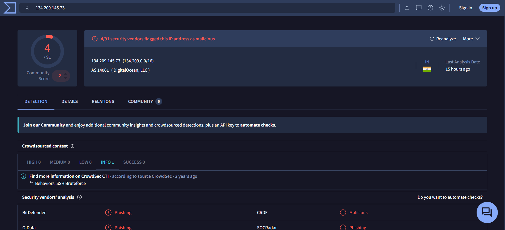
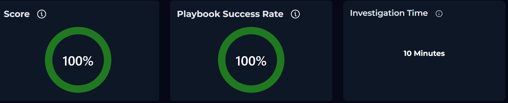

# SOC325 - Unauthorized Cloud Region Access Attempt Detected

## Overview

This investigation analyzes an **Unauthorized Cloud Region Access Attempt Detected** alert generated after multiple authentication attempts were made against the organization's web application from an unauthorized cloud region.
The objective of the investigation was to determine whether the activity represented a legitimate login attempt or a brute-force attack targeting the user account.

---

## Information Gathering

| Field | Value |
|-------|-------|
| **Event Time** | Sep 24, 2024, 08:21 AM |
| **Username** | test@letsdefend.io |
| **Hostname** | AWS_Services |
| **Source IP Address** | 134.209.145.73 |
| **Source Port** | 50231 |
| **Destination IP Address** | 52.15.206.21 |
| **Destination Port** | 443 |
| **Request URL** | `POST https://app.letsdefend.io/accounts/login` |
| **Operating System** | Ubuntu 20.04.02 |
| **Trigger Reason** | Multiple login attempts from an unauthorized cloud region in a short period of time |
| **Device Action** | Blocked |

---

## Analysis

### 5W Analysis

**When:** Between Sep 24, 2024, 07:25 AM and 08:21 AM.

**Who:** Source IP address **134.209.145.73** attempted to authenticate using the account **test@letsdefend.io**.

**What:** Multiple HTTP POST requests were sent to the application's login endpoint, triggering an **Unauthorized Cloud Region Access Attempt** alert.

**Where:** An inbound HTTPS connection targeting the server **AWS_Services** (`52.15.206.21`).

**Why:** A high number of authentication attempts originating from an unauthorized cloud region strongly indicated a potential brute-force attack.

### Investigation

The investigation began by reviewing the alert details together with the proxy and firewall logs.
The logs showed numerous HTTP POST requests originating from **134.209.145.73** and targeting the login endpoint:`https://app.letsdefend.io/accounts/login`
All requests attempted to authenticate using the account **test@letsdefend.io** within a very short period of time. The repeated login attempts are consistent with brute-force behavior. Log analysis also confirmed that **none of the authentication attempts were successful**.

As part of the investigation, the **Email Security** platform was reviewed to determine whether any authorized penetration testing or security assessment had been scheduled during the same timeframe. No evidence of planned security testing was found.

The source IP address (**134.209.145.73**) was then analyzed using **VirusTotal**.
Although only a limited number of security vendors classified the IP address as malicious, additional threat intelligence provided valuable context. CrowdSec identified the IP's behavior as **SSH Brute-force**, and the VirusTotal Community section contained multiple reports from the same year describing repeated SSH brute-force activity originating from this address.
These external findings are consistent with the observed authentication attempts against the organization's login portal.

Based on the collected evidence, the alert was determined to be a genuine brute-force attempt. Since all login attempts were blocked and no authentication was successful, no compromise of the target account or server was identified.

---

## Artifacts

### Source

- **IP Address:** 134.209.145.73

### Target

- **Hostname:** AWS_Services
- **IP Address:** 52.15.206.21

### Target Account

- **Username:** test@letsdefend.io

### Observed Request

- `POST https://app.letsdefend.io/accounts/login`

---

## Takeaways

- Multiple authentication attempts originated from an unauthorized cloud region.
- The repeated HTTP POST requests were consistent with brute-force activity.
- All authentication attempts failed, and no unauthorized access was achieved.
- No authorized penetration testing was scheduled during the timeframe of the alert.
- Threat intelligence from VirusTotal and CrowdSec associated the source IP with previous SSH brute-force activity.
- The defensive controls successfully blocked the attack, preventing account compromise.

---

## Conclusion

The investigation determined that the alert was a **True Positive**.
Analysis of the proxy logs, firewall logs, and external threat intelligence confirmed that the source IP address was conducting a brute-force attack against the application's login endpoint. However, all authentication attempts were unsuccessful, and the security controls effectively blocked the activity.
Because there was no evidence of a successful compromise or lateral movement, **no host containment or escalation was required**.

