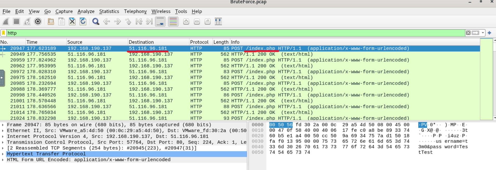
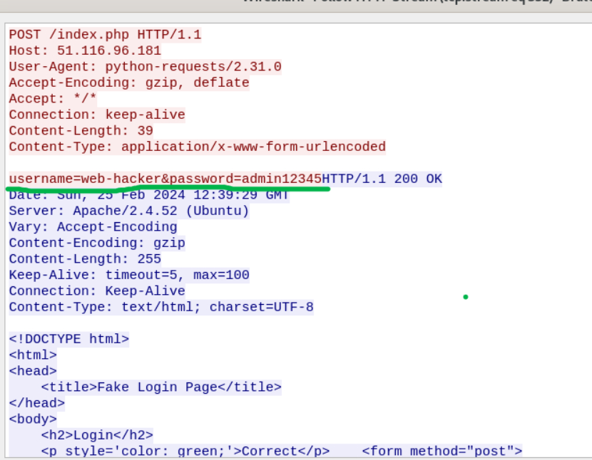
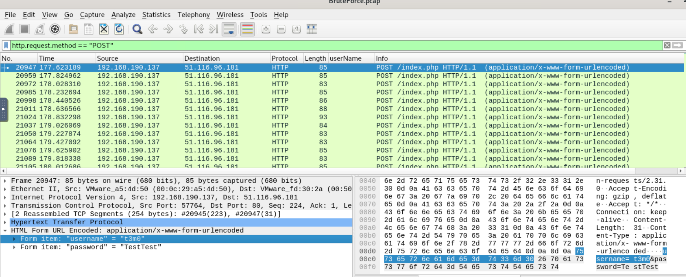
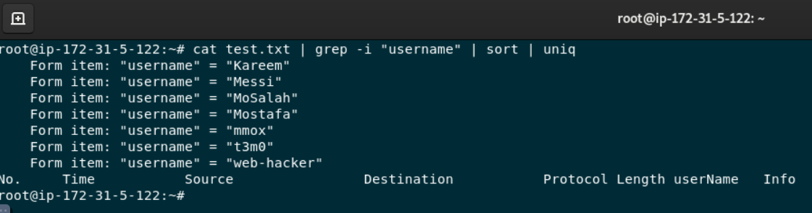
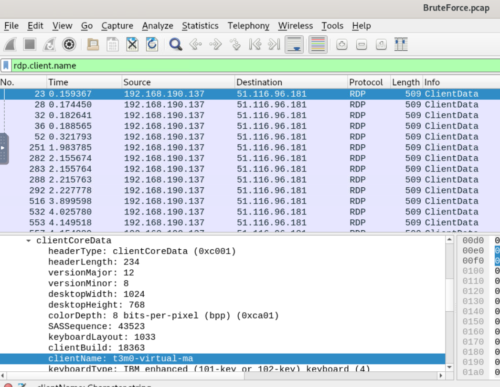
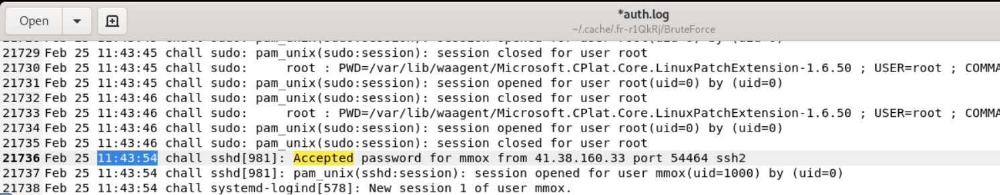
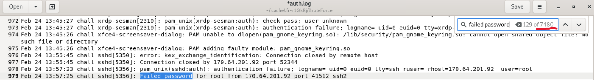
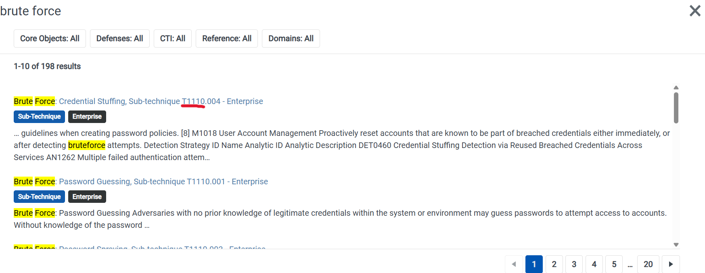

# Brute Force Attacks - LetsDefend Challenge

## Overview

A web server has been compromised, and the goal of this challenge is to investigate the attack by analyzing the provided evidence.
The challenge includes two files:

- `capture.pcap` – Network traffic capture
- `auth.log` – Authentication log

Using these artifacts, I identified the attacker's activities, reconstructed the attack, and answered the investigation questions.

---

## Investigation

### Q: What is the IP address of the server targeted by the attacker's brute-force attack?

**Answer:** `51.116.96.181`

To answer this question, I analyzed the `.pcap` file using **Wireshark**. By filtering the traffic for the **HTTP** protocol, I observed a large number of `POST` requests all directed to the same IP address.

### Q: Which directory was targeted by the attacker's brute-force attempt?

**Answer:** `index.php`

Using the same HTTP analysis in Wireshark, I noticed that every `POST` request targeted the same endpoint, revealing the directory used during the brute-force attack.

### Q: Identify the correct username and password combination used for login.

**Answer:** `web-hacker:admin12345`

I inspected the **Length** field of the HTTP `POST` requests and noticed that one request had a different size than the others. By following its HTTP stream, I recovered the credentials that resulted in a successful login.

### Q: How many user accounts did the attacker attempt to compromise via RDP brute-force?

**Answer:** `7`

First, I filtered the traffic using: `http.request.method == "POST"`
Then, I searched for the form field containing the username parameter. After exporting the packets as plain text from Wireshark, I used the following command to extract the unique usernames: `cat file.txt | grep -i "username" | sort | uniq`
Counting the unique usernames revealed that the attacker attempted to compromise **7** different accounts.

### Q: What is the `clientName` of the attacker's machine?

**Answer:** `t3m0-virtual-ma`

I explored the available **RDP** protocol fields in Wireshark until I found the `rdp.client.name` field, which contained the attacker's machine name.

### Q: When did the user last successfully log in via SSH, and who was it?

**Answer:** `mmox : 11:43:54`

To answer this question, I analyzed the provided `auth.log` file and searched for successful SSH authentication events by filtering for the keyword: `Accepted`
The last successful login was performed by user **mmox** at **11:43:54**.

### Q: How many unsuccessful SSH connection attempts were made by the attacker?

**Answer:** `7480`

Using the same `auth.log` file, I searched for failed SSH authentication attempts using the string: `Failed password`
Counting these entries resulted in **7,480** unsuccessful login attempts.

### Q: What MITRE ATT&CK technique was used to gain access?

**Answer:** `T1110 - Brute Force`

I searched the **MITRE ATT&CK** framework for the term **Brute Force**, which maps to technique **T1110**.

---

# Takeaways

This challenge demonstrated how network traffic analysis and system log investigation complement each other during an incident response investigation.
Some of the key skills practiced include:

- HTTP traffic analysis with Wireshark
- Identifying successful brute-force login attempts
- Extracting credentials from captured network traffic
- Investigating RDP-related information
- Analyzing SSH authentication logs
- Using Linux command-line tools (`grep`, `sort`, `uniq`) to process log data
- Mapping attacker behavior to the MITRE ATT&CK framework

---

# Conclusion

This LetsDefend challenge provided a practical introduction to investigating brute-force attacks using both network captures and authentication logs.
By combining evidence from the `.pcap` file and the `auth.log`, I was able to reconstruct the attack timeline, identify the compromised credentials, determine the attacker's methods, and map the activity to the appropriate MITRE ATT&CK technique.
Overall, the challenge reinforced the importance of correlating multiple data sources during a forensic investigation and improved my familiarity with Wireshark, Linux log analysis, and incident response methodologies.