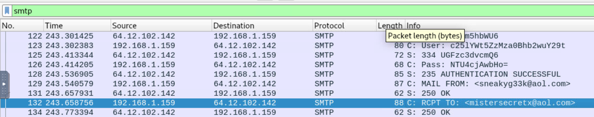
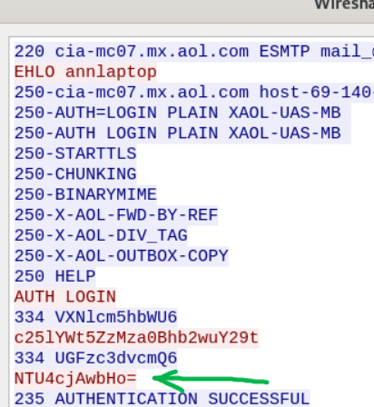
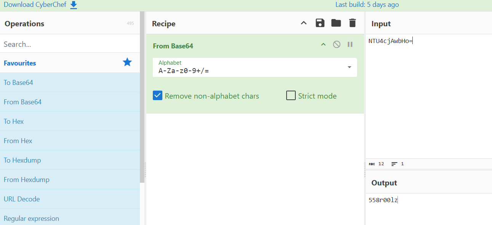
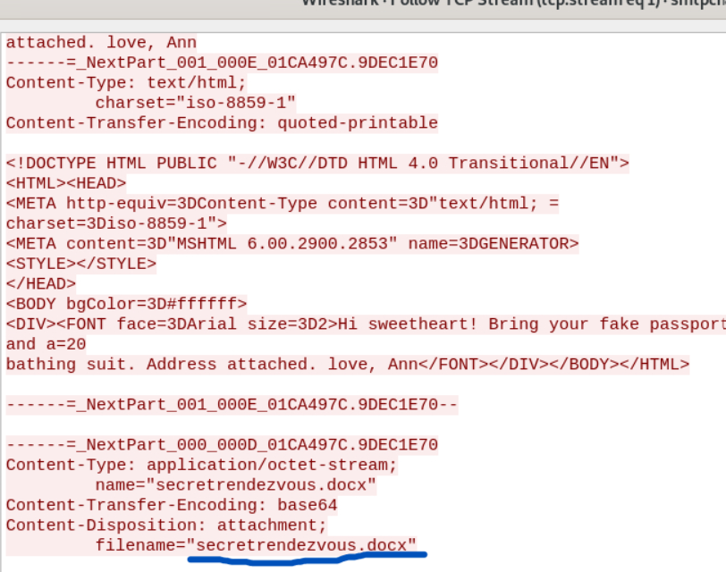
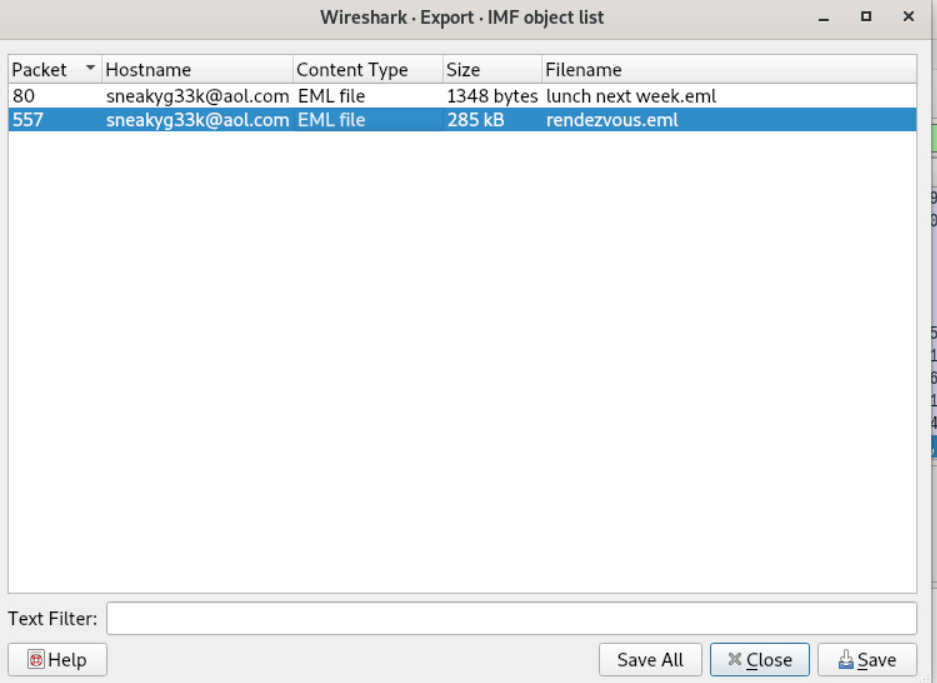
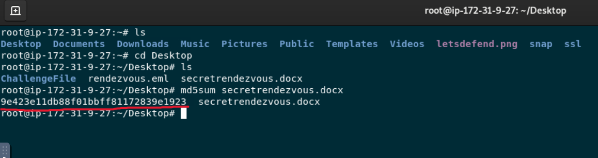
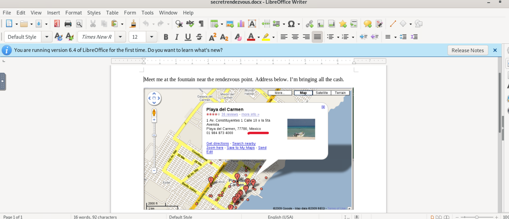

# LetsDefend Challenge - Disclose the Agent

## Overview

This challenge involved analyzing a network capture file (`.pcap`) to identify an agent who was leaking sensitive information.
The objective was to investigate the SMTP traffic contained in the capture and extract information exchanged through emails, including credentials, attachments, and hidden details.
The analysis was performed using **Wireshark**, focusing mainly on SMTP traffic and TCP streams.

---

## Questions & Answers

### Q: What is the email address of Ann's secret boyfriend?

**Answer:** `mistersecretx@aol.com`

To find this information, I filtered the packets by the SMTP protocol in Wireshark and analyzed the email conversations exchanged between the involved parties.
By inspecting the SMTP packets, I was able to identify the email address of Ann's secret boyfriend.

---

### Q: What is Ann's email password?

**Answer:** `558r00lz`

I followed the TCP stream containing the SMTP communication to analyze the exchanged packets.
During the authentication phase, I found Ann's password encoded in Base64. I decoded the value using CyberChef and obtained the plaintext password.

---

### Q: What is the name of the file that Ann sent to her secret lover?

**Answer:** `secretrendezvous.docx`

Continuing the analysis of the TCP stream, I found the email content and the attached file sent by Ann.
The attachment name was visible inside the email structure.

---

### Q: What is the MD5 value of the attachment Ann sent?

**Answer:** `9e423e11db88f01bbff81172839e1923`

The email content was encoded in Base64 and contained the complete email message structure.
Instead of manually extracting the encoded content, I used Wireshark's **Export IMF Objects** functionality to extract the email message and retrieve the attachment.
After downloading the attachment, I calculated its MD5 hash to obtain the required value.

---

### Q: In what country will Ann meet with her secret lover?

**Answer:** `Mexico`

After extracting the email and downloading the attachment, I checked the file hash using VirusTotal and Hybrid Analysis to verify whether the file was malicious.
Once the file was confirmed to be safe, I opened the document and found the final clue revealing the meeting location.

---

## Takeaways

- Learned how to analyze SMTP traffic inside a PCAP file using Wireshark.
- Practiced filtering network traffic and following TCP streams to reconstruct communications.
- Understood how credentials can be exposed when transmitted using weak authentication mechanisms.
- Learned how to extract email attachments directly from network captures.
- Practiced calculating file hashes and using threat intelligence platforms to validate suspicious files.
- Improved understanding of email protocols and forensic investigation techniques.

---

## Conclusion

This challenge demonstrated how network traffic analysis can reveal sensitive information when communications are not properly secured.
By analyzing SMTP packets, following TCP streams, decoding Base64 credentials, and extracting email attachments, it was possible to reconstruct the entire communication flow and identify the leaked information.
This investigation highlights the importance of secure communication protocols, proper authentication methods, and continuous monitoring of network traffic to prevent data exposure.