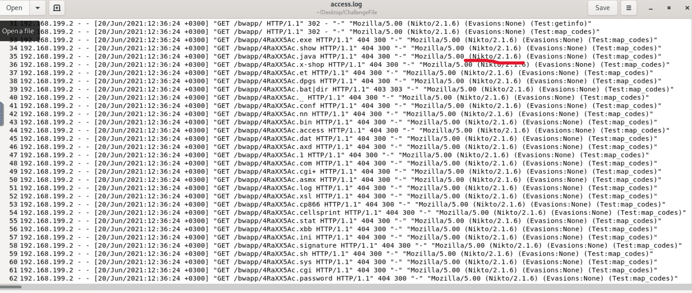
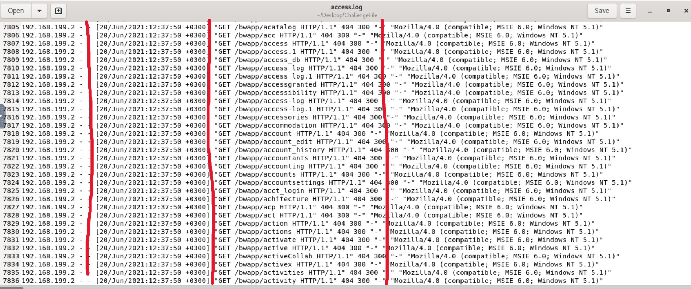
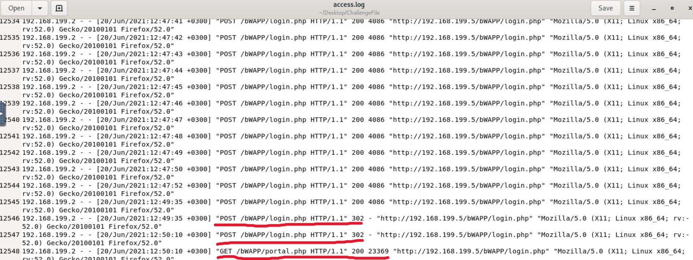
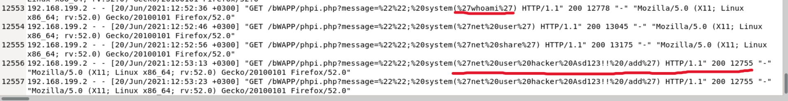

# Investigate Web Attack

## Overview

This challenge focuses on investigating a web attack by analyzing an Apache `access.log` file. The objective is to reconstruct the attacker's activity, identify each stage of the attack, and determine whether the intrusion was successful.
During the investigation, the attacker’s actions were traced from the initial reconnaissance phase through directory enumeration, credential brute forcing, code injection, and finally the establishment of persistence on the compromised system.

## Q: Which automated scan tool did attacker use for web reconnaissance?  
**A: nikto**

In the image above, we can clearly identify the automated tool (**Nikto**) used by the attacker during the reconnaissance phase to discover potential vulnerabilities in the web application.

---

## Q: After web reconnaissance activity, which technique did attacker use for directory listing discovery?  
**A: directory brute force**

In the image above, we can observe directory enumeration performed through brute force against the web application.

A high number of `GET` requests can be seen occurring within the same second, indicating the use of an automated tool to discover hidden directories and files.

---

## Q: What is the third attack type after directory listing discovery?  
**A: brute force**

---

## Q: Is the third attack successful?  
**A: yes**

In the image above, the attacker performs a brute-force attack against the login page.

From the logs, we can observe:

- A high number of `POST` requests sent to `/login.php`
- Requests spaced about 1 second apart, indicating automation
- All initial responses return HTTP 200 with identical response sizes, indicating failed login attempts
- Two HTTP 302 responses at the end, indicating successful authentication
- A subsequent `GET` request confirming successful access with a different response size

This confirms that the brute-force attack was successful.

---

## Q: What is the name of fourth attack?  
**A: code injection**

---

## Q: What is the first payload for 4th attack?  
**A: whoami**

---

## Q: Is there any persistency clue for the victim machine in the log file? If yes, what is the related payload?  
**A: %27net%20user%20hacker%20asd123!!%20/add%27**

In the images above, we can observe command execution used for basic system discovery followed by an attempt to create a new user to establish persistence.

The decoded command is:

`net user hacker asd123!! /add`

This indicates that the attacker created a new local user account to maintain persistence on the compromised system.

---

## MITRE ATT&CK Mapping

- Reconnaissance
    - T1595 – Active Scanning
- Discovery
    - T1083 – File and Directory Discovery
- Credential Access
    - T1110 – Brute Force
- Execution
    - T1059 – Command and Scripting Interpreter
- Persistence
    - T1136 – Create Account

---

## Takeaways

- Detection of automated reconnaissance using Nikto
- Identification of directory brute-force activity through high-frequency `GET` requests
- Recognition of successful credential brute-force attack via HTTP status analysis
- Evidence of code injection leading to system command execution
- Persistence achieved through creation of a new local user account