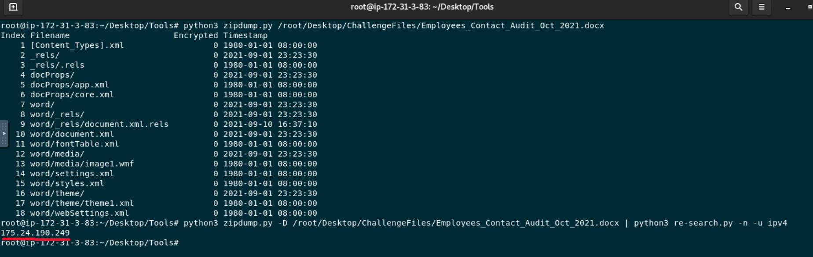
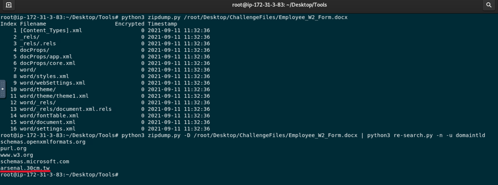
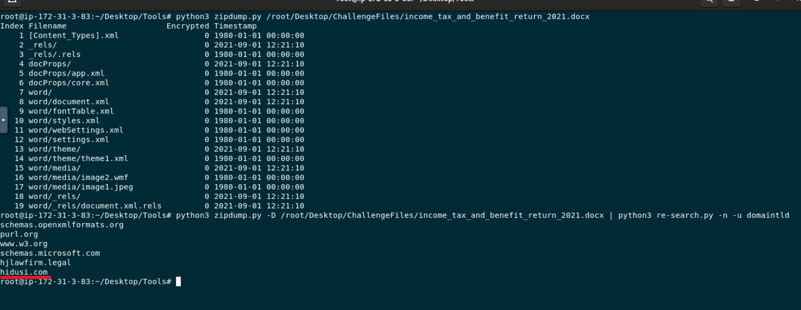
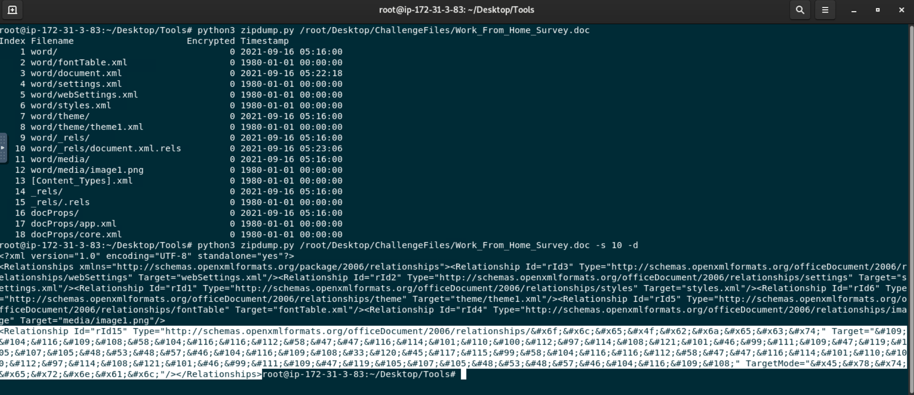
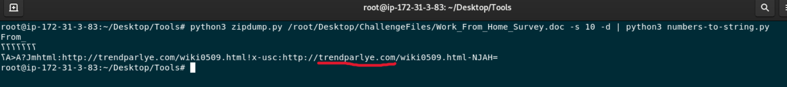
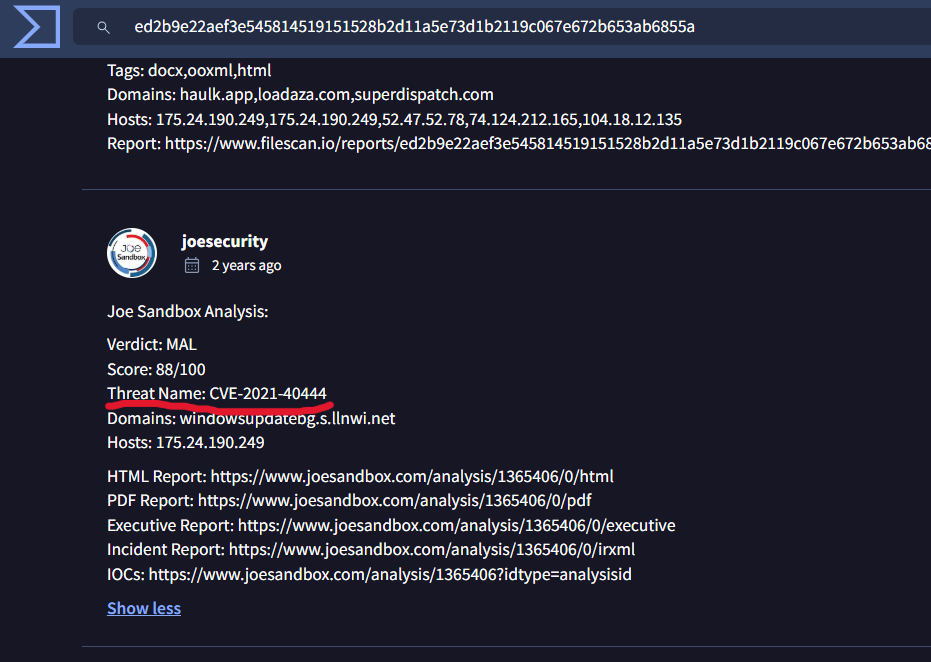

# MSHTML - LetsDefend Challenge

## Overview

This repository contains my solution to the **MSHTML** challenge from **LetsDefend**.

The goal of the challenge was to analyze several malicious Microsoft Office documents, extract Indicators of Compromise (IOCs), and identify the vulnerability exploited by the malware.

---

## Tools Used

- `zipdump.py`
- `re-search.py`
- `numbers-to-string.py`
- VirusTotal

---

# Challenge Walkthrough

## Question 1

**File:** `Employees_Contact_Audit_Oct_2021.docx`

**Question:** What is the malicious IP address in the document?

**Answer**
`175.24.190.249`

### Analysis

I first inspected the Office document with `zipdump.py` to examine its internal structure. Then, I extracted the document streams and searched for IPv4 addresses using `re-search.py`, which revealed the malicious IP.

---

## Question 2

**File:** `Employee_W2_Form.docx`

**Question:** What is the malicious domain in the document?

**Answer**
`arsenal.30cm.tw`

### Analysis

After extracting the document streams with `zipdump.py`, I searched for domain names using `re-search.py`. The analysis identified the malicious domain embedded in the document.

---

## Question 3

**File:** `income_tax_and_benefit_return_2021.docx`

**Question:** What is the malicious domain in the document?

**Answer**
`hidusi.com`

### Analysis

Using the same approach as before, I extracted the document streams and searched for domain names. This revealed another malicious domain associated with the document.

---

## Question 4

**File:** `Work_From_Home_Survey.doc`

**Question:** What is the malicious domain in the document?

**Answer**
`trendparlye.com`

### Analysis

Unlike the previous files, the malicious domain was stored as an encoded sequence of numbers. I extracted the appropriate stream with `zipdump.py` and decoded it using `numbers-to-string.py`, revealing the hidden domain.

---

## Question 5

**Question:** Which vulnerability was exploited by these malicious documents?

**Answer**
`CVE-2021-40444`

### Analysis

I generated the SHA-256 hash of the malicious document from the Linux terminal and searched it on VirusTotal.

In the **Community** section, reports from malware researchers and sandbox vendors identified the exploit as **CVE-2021-40444**, allowing me to determine the vulnerability used in the attack.

---

# Skills Demonstrated

- Static malware analysis
- Microsoft Office document analysis
- IOC extraction (IPs and domains)
- Detection of obfuscated data
- Malware artifact decoding
- Threat intelligence using VirusTotal
- Identification of exploited CVEs

---

# What I Learned

Through this challenge I learned how to:

- Analyze malicious Microsoft Office documents without opening them.
- Extract embedded objects and document streams.
- Identify malicious IP addresses and domains.
- Decode obfuscated strings hidden inside Office files.
- Use Didier Stevens' Suite for malware analysis.
- Use VirusTotal to enrich malware analysis.
- Identify the vulnerability exploited by a malware sample.

---