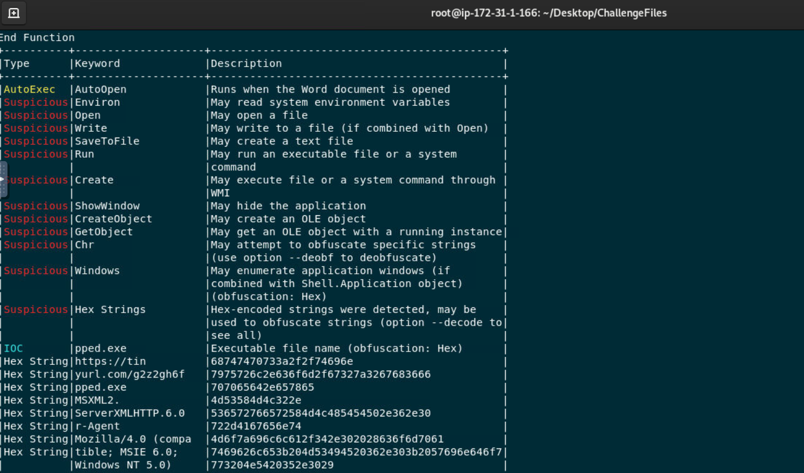
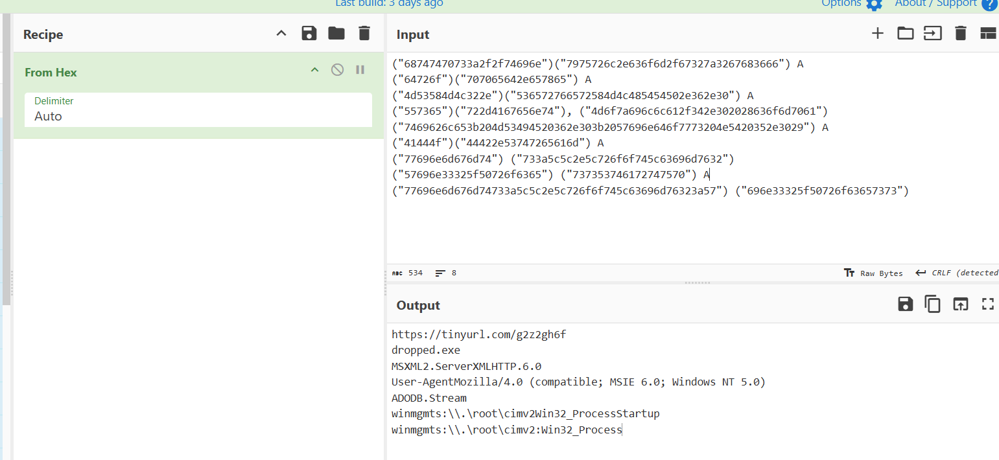

# Malicious VBA - LetsDefend Challenge

## Overview

One of the employees received a suspicious document attached to an invoice email. The file was suspected to contain a malicious VBA macro capable of executing unwanted actions on the victim's machine.

The objective of this challenge was to analyze the malicious VBA macro, extract the suspicious strings, decode them using CyberChef, and identify the techniques and objects used by the attacker.

After extracting the VBA code with `olevba`, several encoded strings were identified. By decoding these values with CyberChef, it was possible to reveal the malware behavior, including the payload download location, the execution method, and the objects abused by the attacker.

---

## Tools used

- **olevba**  
  Used to extract and analyze the VBA macro contained inside the suspicious document. This allowed the identification of malicious functions, encoded strings, and execution flow.

- **CyberChef**  
  Used to decode and transform the extracted suspicious strings into readable information, revealing important indicators such as URLs, filenames, and commands.

---

## Analysis

The VBA macro contained obfuscated strings designed to hide the malicious activity from simple inspection.

After decoding the extracted data, the macro behavior became clear:

1. The document connects to an external server controlled by the attacker.
2. It downloads a malicious executable payload.
3. The payload is written to disk using a file stream object.
4. The executable is launched through Windows Management Instrumentation (WMI).

The analysis revealed multiple objects commonly abused in VBA malware campaigns.

---

## Questions & Answers

### The document initiates the download of a payload after execution. What website is hosting it?

The macro connects to the following URL to download the payload:

`https://tinyurl.com/g2z2gh6f`

The attacker used a URL shortener to hide the final destination of the malicious file.

---

### What is the filename of the payload (include the extension)?

The downloaded payload is saved as:

`dropped.exe`

---

### What method is it using to establish an HTTP connection between files on the malicious web server?

The macro uses:

`MSXML2.ServerXMLHTTP`

This object is commonly used in VBA malware to create HTTP requests and communicate with remote servers.

---

### What user-agent string is it using?

The HTTP request uses the following User-Agent:

`Mozilla/4.0 (compatible; MSIE 6.0; Windows NT 5.0)`

This value is used to imitate a legitimate browser request and may help the malicious traffic appear less suspicious.

---

### What object does the attacker use to be able to read or write text and binary files?

The attacker uses:

`adodb.stream`

This object allows the macro to handle file operations, such as writing the downloaded payload to the local system.

---

### What is the object the attacker uses for WMI execution?

The macro uses:

`winmgmts:\.\root\cimv2:Win32_Process`

This WMI object allows the attacker to create processes and execute the downloaded payload. It can also help the malware execute in a less obvious way.

---

## Screenshots

### olevba extraction

### CyberChef decoding

---

## Takeaways

- Malicious VBA macros are a common initial access technique used in phishing campaigns.
- Attackers often obfuscate strings inside macros to hide URLs, filenames, and commands.
- `olevba` is a useful tool for extracting and analyzing VBA macro code.
- CyberChef helps decode and understand suspicious encoded data.
- Objects such as `MSXML2.ServerXMLHTTP`, `ADODB.Stream`, and WMI classes are frequently abused to download, save, and execute malicious payloads.
- Understanding these behaviors helps analysts identify suspicious Office documents and investigate malware delivery techniques.