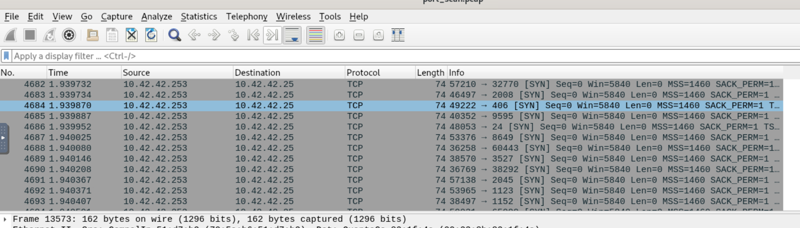
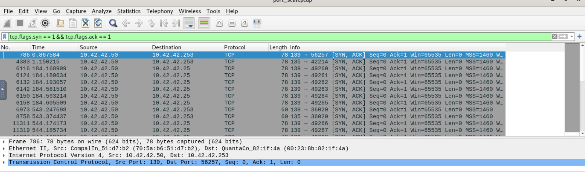
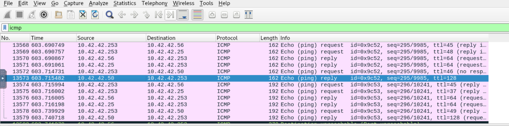
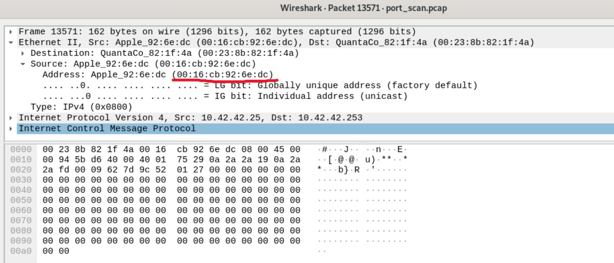

# Port Scan Activity - LetsDefend Challenge

## Overview

This challenge focuses on the analysis of a `.pcap` file using **Wireshark** in order to identify port scan activity and gather information about the systems discovered during the scan.
By inspecting the captured traffic, it is possible to identify suspicious TCP SYN requests, determine the scanning host, discover the target systems, and extract additional information such as the operating system type and MAC address.

---

## Questions & Answers

### Q: What is the IP address scanning the environment?

**A:** `10.42.42.253`

By analyzing the traffic capture in Wireshark, several TCP packets with the **SYN flag** set can be observed. These packets originate from the same source IP address and target multiple destination ports on a single host.
This behavior is a typical indicator of a **TCP port scan**, where an attacker attempts to identify open services running on a target machine.

---

### Q: What is the IP address found as a result of the scan?

**A:** `10.42.42.50`

To identify the system responding to the scan, I filtered the packets using the following Wireshark display filter: `tcp.flags.syn == 1 && tcp.flags.ack == 1`
This filter allows the analysis of TCP SYN/ACK responses, which indicate that a target host is replying to the scanning activity and potentially has open ports available.
The responses revealed that the scanned system was: `10.42.42.50`

---

### Q: What is the IP address of the detected Windows system?

**A:** `10.42.42.50`

To identify the operating system of the discovered host, I analyzed the **TTL (Time To Live)** value from ICMP packets.
TTL values can provide a useful indication of the operating system:

- Windows systems commonly use a default TTL value of **128**
- Linux-based systems commonly use a default TTL value of **64**

The captured ICMP traffic showed a TTL value consistent with a Windows host, allowing the identification of: `10.42.42.50`

---

### Q: What is the MAC address of the Apple system it finds?

**A:** `00:16:cb:92:6e:dc`

To answer this question, I analyzed the ICMP packet with a TTL value of **64**, which indicated a possible Linux/macOS-based system.
By inspecting the **Ethernet II** section of the packet details in Wireshark, I was able to retrieve the MAC address associated with the Apple system: `00:16:cb:92:6e:dc`

---

# Takeaways

- A TCP SYN scan can be identified by observing multiple SYN packets sent from the same source to different destination ports.
- Wireshark filters are extremely useful for isolating specific types of traffic and understanding network behavior.
- SYN/ACK responses help identify hosts that are actively responding to scan activity.
- TTL values can provide useful hints about the operating system running on a device.
- Ethernet frame analysis allows the extraction of hardware-level information such as MAC addresses.

---

# Conclusion

The analysis of the provided `.pcap` file allowed the identification of a port scanning activity performed by the host: `10.42.42.253`
The scan discovered the target system: `10.42.42.50`
Further analysis revealed that this host was running Windows, while another discovered Apple system was identified through its MAC address: `00:16:cb:92:6e:dc`
This challenge demonstrates the importance of packet analysis in network security investigations and highlights how tools like Wireshark can be used to detect reconnaissance activities and gather information about network assets.