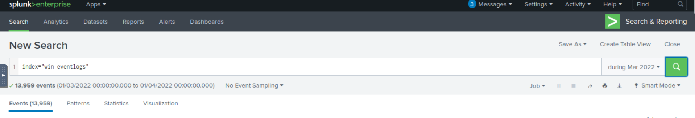
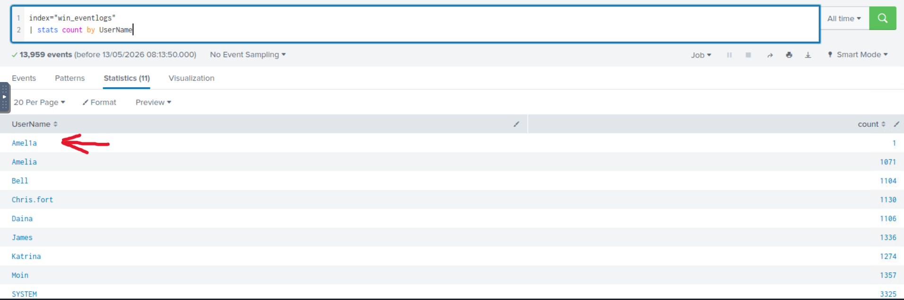
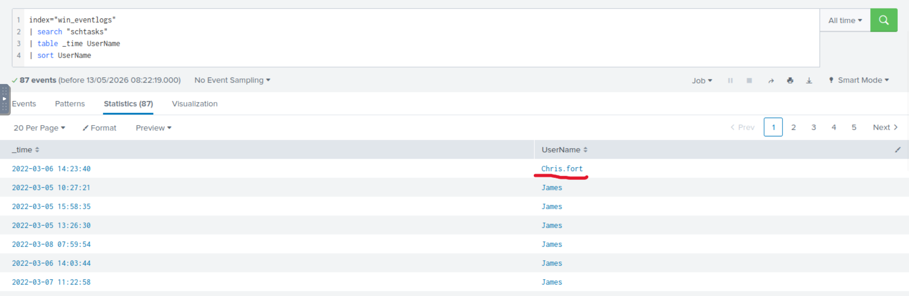
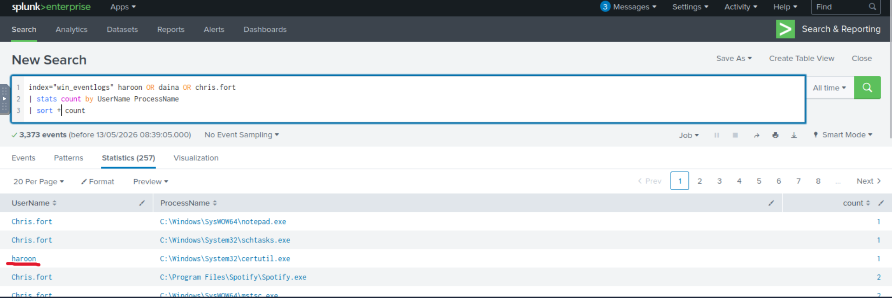
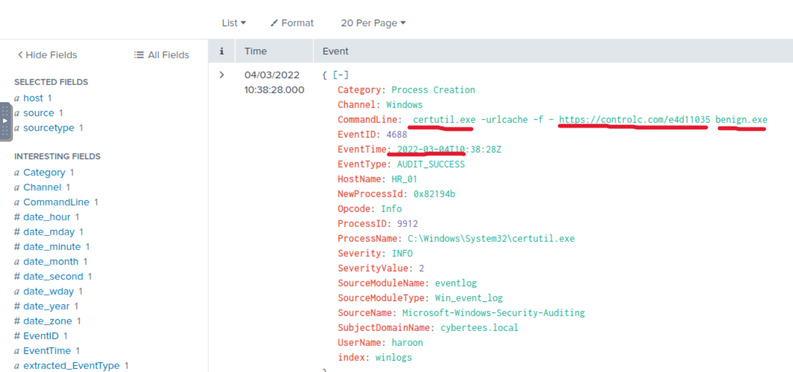
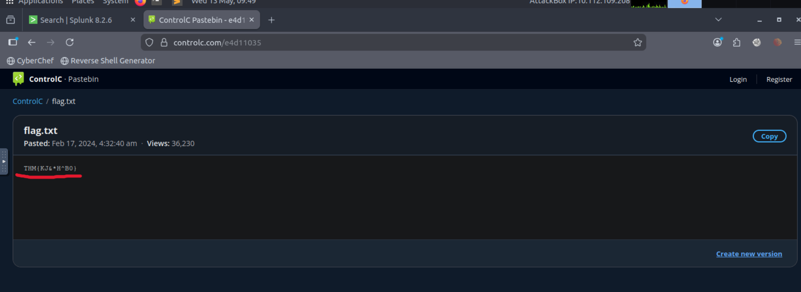

# Benign - TryHackMe

## Overview
One of the client’s IDS systems detected suspicious process execution activity, indicating that a host belonging to the HR department may have been compromised.

Further investigation revealed the execution of tools related to:
- Network information gathering
- Scheduled task creation
- LOLBIN abuse

Due to limited resources, only Windows Process Creation logs (`Event ID: 4688`) were collected and ingested into Splunk under the following index:

```spl
index=win_eventlogs
```

The objective of this investigation was to identify malicious behavior and reconstruct the attack timeline using Splunk searches.

---

# Tools Used

- Splunk
- Windows Event Logs
- TryHackMe Lab Environment

---

# Questions & Answers

## 1. How many logs were ingested from March 2022?

**Answer:** `13959`

### Screenshot


---

## 2. Imposter Alert: There seems to be an imposter account observed in the logs. What is the name of that user?

**Answer:** `Amel1a`

### Screenshot


---

## 3. Which user from the HR department was observed running scheduled tasks?

**Answer:** `Chris.fort`

### Screenshot


---

## 4. Which user from the HR department executed a LOLBIN to download a payload from a file-sharing host?

**Answer:** `haroon`

### Screenshot


---

## 5. Which LOLBIN was used to download the payload?

**Answer:** `certutil.exe`

---

## 6. What was the execution date of the binary on the infected host?

**Format:** `YYYY-MM-DD`

**Answer:** `2022-03-04`

---

## 7. Which third-party site was used to download the malicious payload?

**Answer:** `controlc.com`

---

## 8. What was the name of the file saved on the host machine during post-exploitation?

**Answer:** `benign.exe`

---

## 9. What URL did the infected host connect to?

**Answer:** `https://controlc.com/e4d11035`

### Screenshot


---

## 10. The suspicious file downloaded from the C2 server contained a malicious pattern. What was the flag?

**Answer:** `THM{KJ&*H^B0}`

### Screenshot


---

# Investigation Summary

During the investigation, it was discovered that a compromised HR user leveraged the LOLBIN `certutil.exe` to download a payload from an external file-sharing website.

The attacker used:
- Native Windows binaries (LOLBINs)
- Scheduled tasks
- External payload delivery
- Post-exploitation file downloads

This activity demonstrates how attackers can abuse legitimate Windows tools to evade traditional detection mechanisms.

---

# Key Takeaways

- Windows Event ID `4688` is extremely valuable for detecting malicious process execution.
- LOLBINs such as `certutil.exe` are commonly abused by attackers to bypass security controls.
- Monitoring scheduled task creation can help identify persistence mechanisms.
- External connections to uncommon domains should always be investigated.
- Consistent log ingestion and centralized monitoring with Splunk significantly improve incident response capabilities.

---