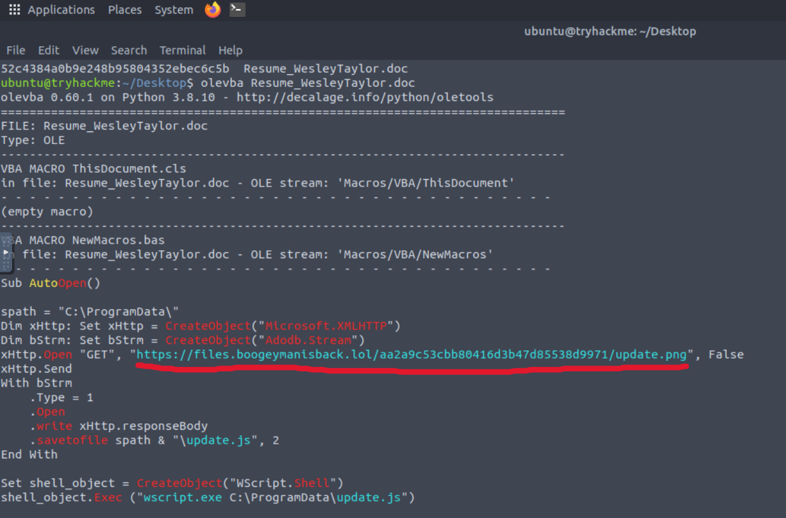
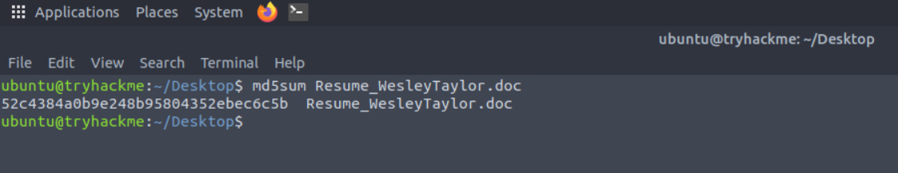
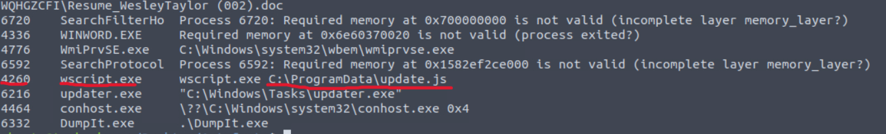
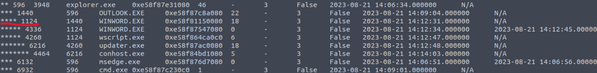
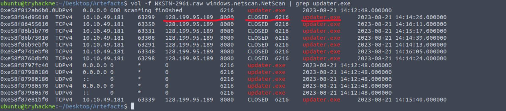
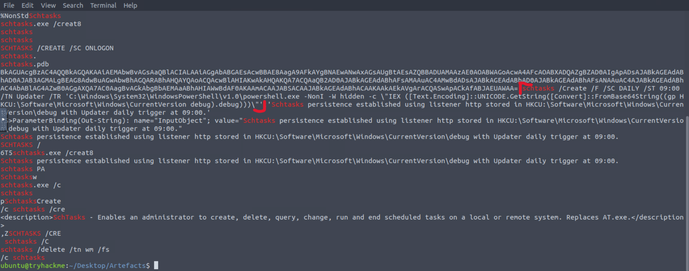

# Boogeyman 2 - TryHackMe

## Overview

Maxine, a Human Resource Specialist working for Quick Logistics LLC, received a phishing email containing a malicious resume attachment related to one of the company's open job positions.  
After opening the document, her workstation became compromised.
The security team detected suspicious activity on the host, prompting a forensic investigation to determine the infection chain, persistence mechanisms, and command-and-control (C2) communication used by the attacker.

---

## Artefacts and Tools Used

### Artefacts
- Copy of the phishing email
- Memory dump of the victim's workstation

### Tools
- Volatility
- Olevba

---

# Questions and answers

## 1. What is the name of the attached malicious document?

**Answer:** `Resume_WesleyTaylor.doc`

---

## 2. What URL is used to download the stage 2 payload based on the document's macro?

**Answer:** `https://files[.]boogeymanisback[.]lol/aa2a9c53cbb80416d3b47d85538d9971/update.png`




---

## 3. What is the MD5 hash of the malicious attachment?


**Answer:** `52c4384a0b9e248b95804352ebec6c5b`




---

## 4. What is the name of the process that executed the newly downloaded stage 2 payload?

**Answer:** `wscript.exe`

---

## 5. What is the full file path of the malicious stage 2 payload?

**Answer:** `C:\ProgramData\update.js`

---

## 6. What is the PID of the process that executed the stage 2 payload?

**Answer:** `4260`




---

## 7. What is the parent PID of the process that executed the stage 2 payload?

**Answer:** `1124`




---

## 8. What is the PID of the malicious process used to establish the C2 connection?

**Answer:** `6216`

---

## 9. What is the full file path of the malicious process used to establish the C2 connection?

**Answer:** `C:\Windows\Tasks\updater.exe`

---

## 10. What is the IP address and port of the C2 connection initiated by the malicious binary?

**Answer:** `128.199.95.189:8080`




---

## 11. What is the full command used by the attacker to maintain persistent access?

**Answer:** `schtasks /Create /F /SC DAILY /ST 09:00 /TN Updater /TR 'C:\Windows\System32\WindowsPowerShell\v1.0\powershell.exe -NonI -W hidden -c \"IEX ([Text.Encoding]::UNICODE.GetString([Convert]::FromBase64String((gp HKCU:\Software\Microsoft\Windows\CurrentVersion debug).debug)))\"'`




---

# Attack Flow Summary

1. Victim received a phishing email with a malicious Word document.
2. The document contained malicious VBA macros.
3. The macro downloaded a second-stage payload (`update.js`).
4. `wscript.exe` executed the JavaScript payload.
5. The malware deployed `updater.exe`.
6. The binary established a C2 connection to:
   ```text
   128.199.95.189:8080
   ```
7. The attacker created a scheduled task for persistence using PowerShell and Base64-encoded commands.

---

# Indicators of Compromise (IOCs)

| Type | Value |
|------|------|
| Malicious Document | `Resume_WesleyTaylor.doc` |
| MD5 | `52c4384a0b9e248b95804352ebec6c5b` |
| Stage 2 Payload | `C:\ProgramData\update.js` |
| Malware Binary | `C:\Windows\Tasks\updater.exe` |
| C2 Address | `128.199.95.189:8080` |
| Scheduled Task | `Updater` |

---

# Conclusion

The investigation confirmed that the compromise originated from a phishing email carrying a malicious Word document with embedded VBA macros.  
The malware executed multiple stages, established outbound communication with a remote C2 server, and implemented persistence through a scheduled task using obfuscated PowerShell commands.

The attack demonstrates a common phishing-to-malware execution chain involving:
- Malicious Office macros
- Script-based payload execution
- Command-and-control communication
- Scheduled task persistence

---