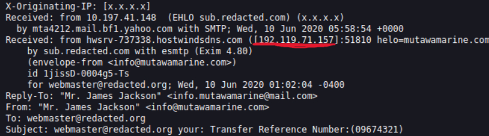
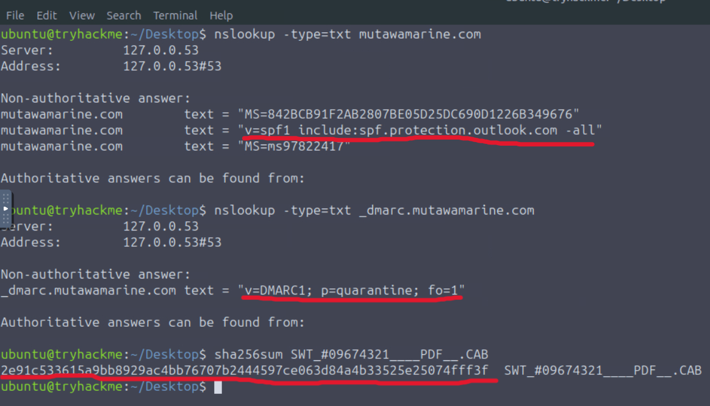
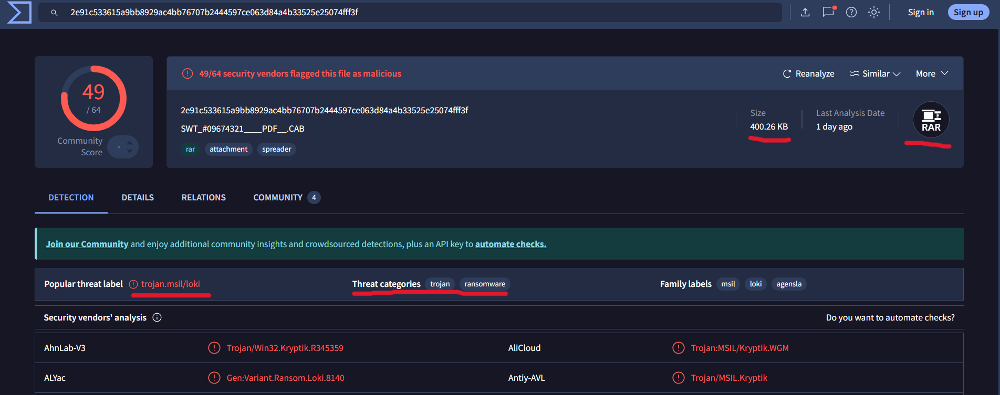
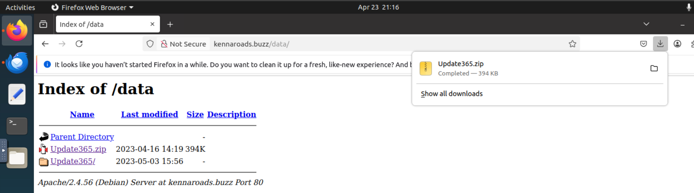
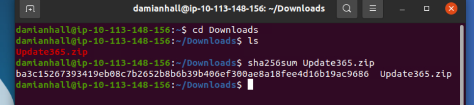
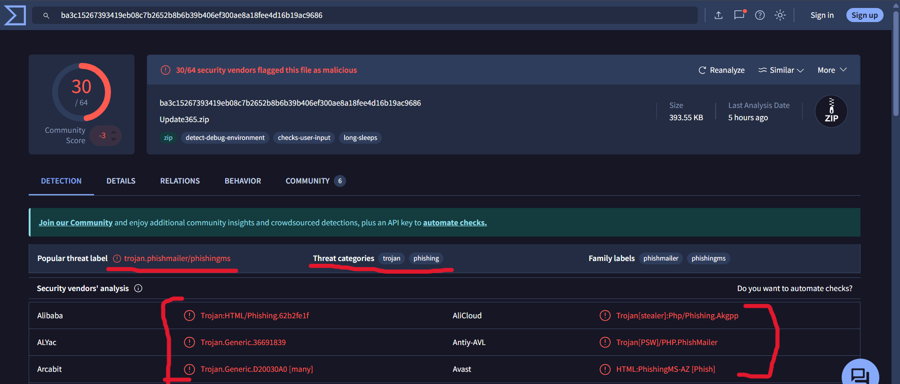
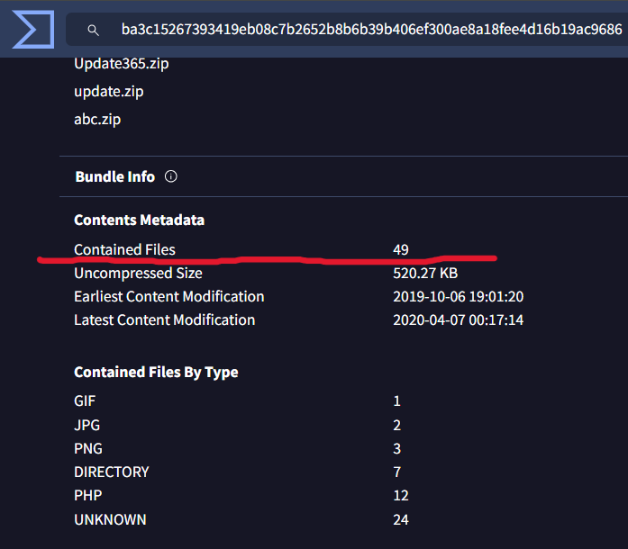
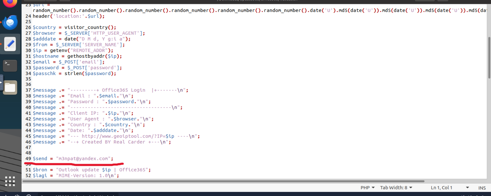

# Phishing Email Analysis

## Overview

This project documents the technical analysis of a phishing email conducted as part of a hands-on challenge.  
The objective is to identify indicators of compromise (IOCs), analyze the email content, and investigate the attacker’s infrastructure.

---

## Analysis Objectives

- Analyze email headers
- Identify the originating IP address and its owner
- Verify SPF and DMARC records
- Analyze a suspicious attachment
- Identify potential phishing infrastructure
- Analyze an exposed phishing kit
- Identify credential harvesting and exfiltration methods

---

## Phishing Email Analysis 1

## Email Header Analysis

The header analysis revealed several anomalies typically associated with phishing attacks.

### Key Findings:
- **Transfer Reference Number:** `09674321`
- **Sender Display Name:** `Mr. James Jackson`
- **Actual Sender Email:** `info@mutawamarine.com`
- **Reply-To Address:** `info.mutawamarine@mail.com`

Evidence:  

### Considerations
- Possible sender spoofing
- Mismatch between `From` and `Reply-To` fields
- Social engineering indicators in the subject line

---

## Originating IP Analysis

The source IP address was extracted from the email headers:

- **Originating IP:** `192.119.71.157`

📸 Evidence:  

### IP Attribution
- **IP Owner:** `Hostwinds LLC`

Evidence:  

---

## DNS Analysis (SPF & DMARC)

Domain authentication records were analyzed:

- **SPF Record:** `v=spf1 include:spf.protection.outlook.com -all`
- **DMARC Record:** `v=DMARC1; p=quarantine; fo=1`

Evidence:  

---

## Attachment Analysis

The email contained a suspicious attachment:

- **File Name:** `SWT_#09674321____PDF__.CAB`
- **SHA256:** `2e91c533615a9bb8929ac4bb76707b2444597ce063d84a4b33525e25074fff3f`

Evidence:  

---

## Malware Analysis

- **File Size:** `400.26` KB  
- **Actual File Type:** `RAR`

Evidence:  

### Considerations
- The actual file type differs from the extension → evasion technique
- Possible presence of:
  - malicious macros
  - hidden redirects

---

## Phishing Email Analysis 2

By analyzing the file content:

- **Redirect Root Domain:** `kennaroads.buzz`
- **Impersonated Brand:** `Microsoft`

Evidence:  

### Techniques Used
- Lookalike domain
- Fake login page replication
- Credential harvesting

---

## Phishing Kit Discovery

While manually browsing the server:

- Accessible directory: `/data`
- **Discovered archive:** `Update365.zip`

Evidence:  

### Considerations
- Misconfigured server (directory listing enabled)
- Significant operational security failure by the attacker

---

## Archive Hash Verification

- **Archive SHA256:** `ba3c15267393419eb08c7b2652b8b6b39b406ef300ae8a18fee4d16b19ac9686`

Evidence:  

---

## VirusTotal Analysis

- **Additional Threat Category:** `Trojan`
- **Number of Files in Archive:** `49`

Evidence:  
  

### Considerations
- Confirms malicious nature
- Multiple threat classifications

---

## Credential Harvesting

By analyzing phishing kit logs:

- **Repeated victim email:** `michael.ascot@swiftspend.finance`

Evidence:  

---

## Attacker Infrastructure

Within the `submit.php` file:

- **Attacker email receiving stolen credentials:** `m3npat@yandex.com`

Evidence:  

### Considerations
- Simple exfiltration method (email-based)

---

## Indicators of Compromise (IOC)

| Type | Value |
|------|--------|
| IP | `192.119.71.157` |
| File SHA256 | `2e91c533615a9bb8929ac4bb76707b2444597ce063d84a4b33525e25074fff3f` |
| Archive SHA256 | `ba3c15267393419eb08c7b2652b8b6b39b406ef300ae8a18fee4d16b19ac9686` |
| Attacker Email | `m3npat@yandex.com` |

---

## Conclusions

The analysis highlights structured phishing attacks leveraging commonly available tools (phishing kits).

### Key Points:
- Use of email spoofing
- Malicious attachment with embedded redirect
- Exposed infrastructure due to attacker misconfiguration
- Credential harvesting via PHP script

---

## Recommendations

- Enforce strict SPF, DKIM, and DMARC policies
- Provide phishing awareness training to users
- Perform sandbox analysis of attachments
- Monitor anomalous access patterns
- Block suspicious domains

---