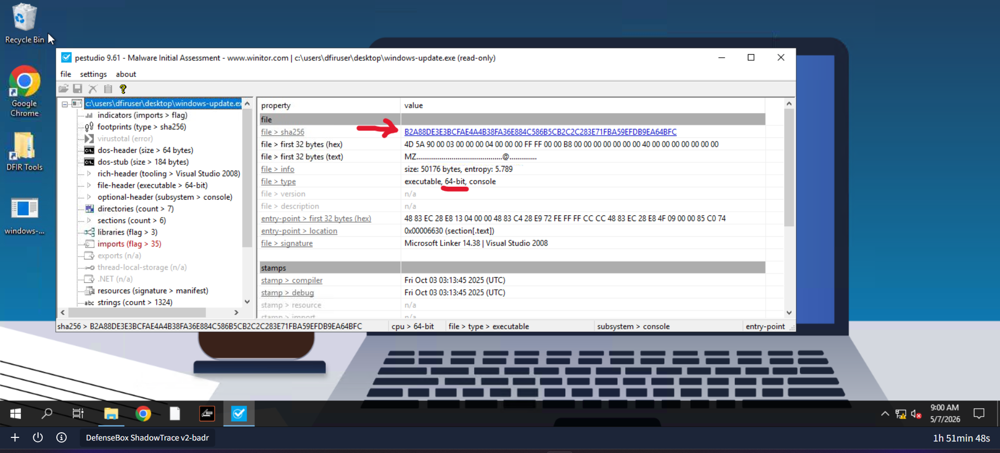
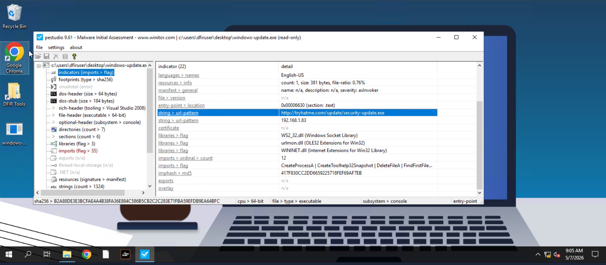
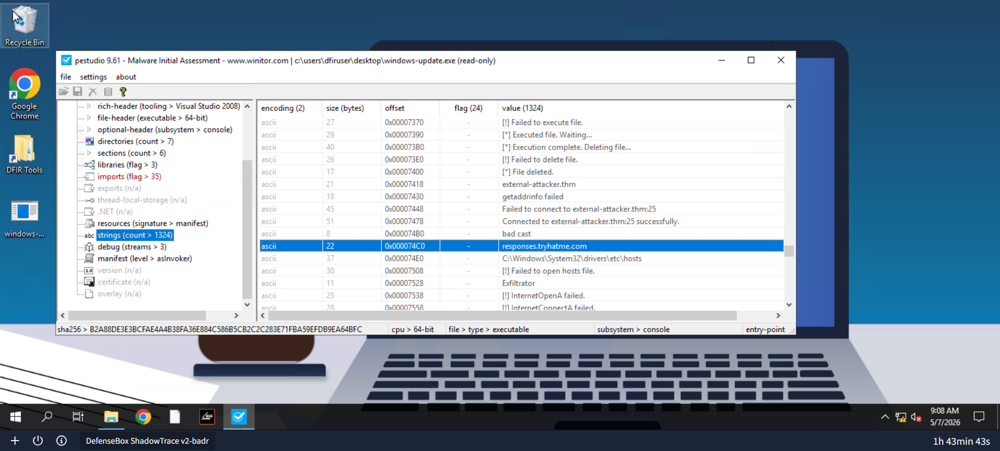
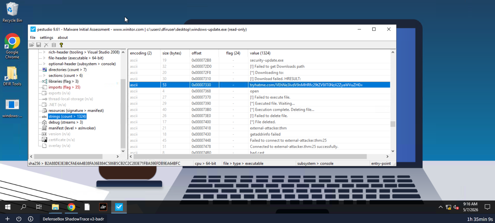
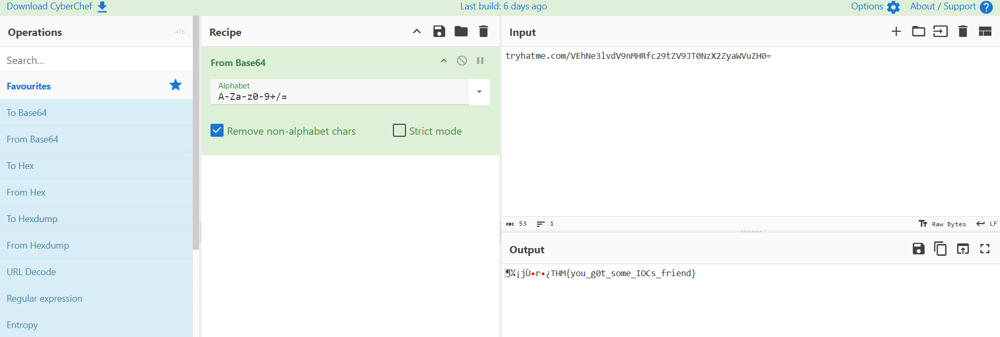
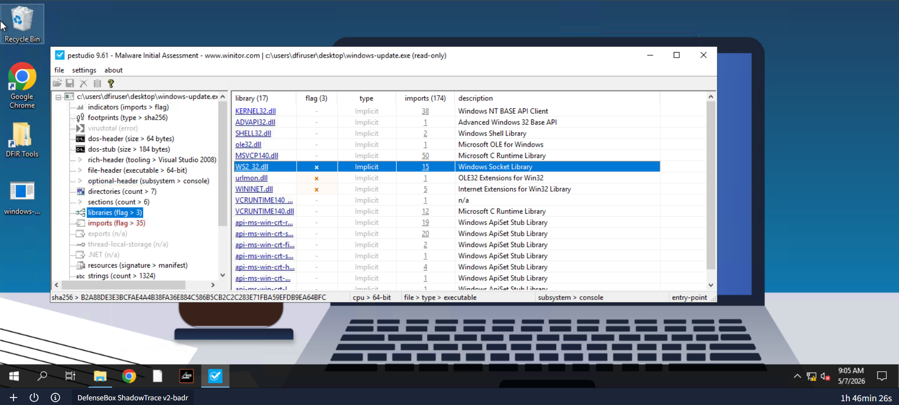
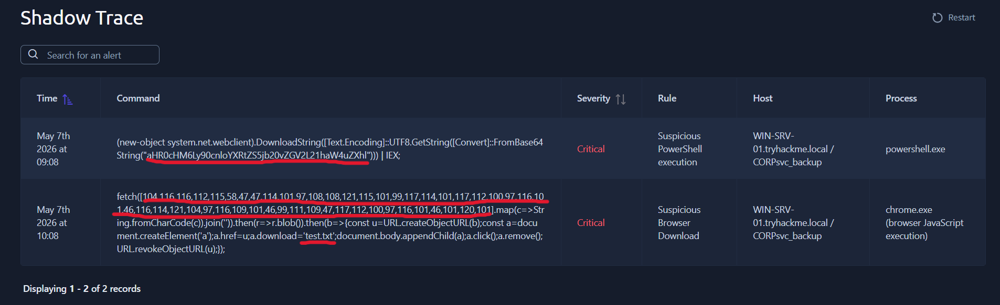
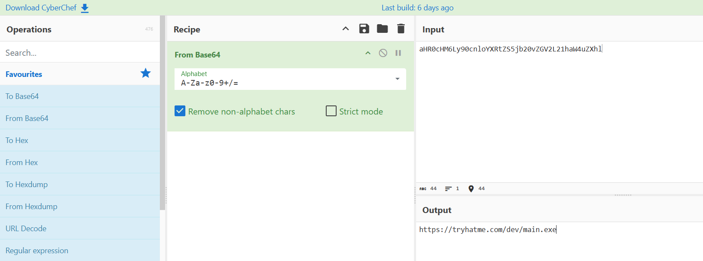
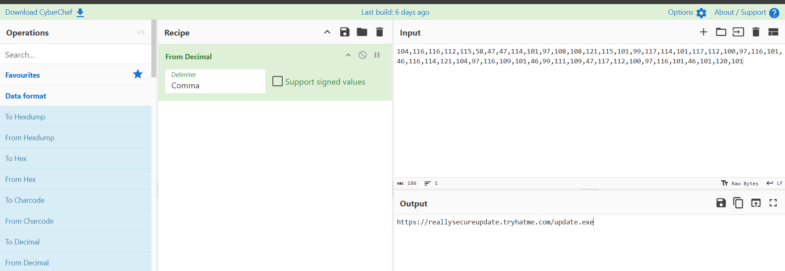

# Shadow Trace - TryHackMe

This project contains the analysis of a malicious binary and related security alerts from a TryHackMe investigation.  
The goal was to extract Indicators of Compromise (IOCs), analyze binary behavior, and correlate endpoint alerts.

---

## Tools used:
- PeStudio
- CyberChef

---

## File Analysis

### D: What is the architecture of the binary file windows-update.exe?
R: 64-bit  

### D: What is the hash (sha-256) of the file windows-update.exe?
R: `b2a88de3e3bcfae4a4b38fa36e884c586b5cb2c2c283e71fba59efdb9ea64bfc` 

---

### D: Identify the URL within the file to use it as an IOC
R: http://tryhatme.com/update/security-update.exe  

---

### D: With the URL identified, can you spot a domain that can be used as an IOC?
R: responses.tryhatme.com  

---

### D: Input the decoded flag from the suspicious domain
R: THM{you_g0t_some_IOCs_friend}  
  
  

---

### D: What library related to socket communication is loaded by the binary?
R: WS2_32.dll  

---

## Alert Analysis

### D: Can you identify the malicious URL from the trigger by the process powershell.exe?
R: https://tryhatme.com/dev/main.exe  

---

### D: Can you identify the malicious URL from the alert triggered by chrome.exe?
R: https://reallysecureupdate.tryhatme.com/update.exe  

### D: What's the name of the file saved in the alert triggered by chrome.exe?
R: test.txt  

---

## Summary

The analysis identified multiple Indicators of Compromise (IOCs), including:

- Malicious executable (`windows-update.exe`)
- Suspicious download URLs and domains
- PowerShell-based execution behavior
- Browser-based download activity (Chrome)
- Network communication capability via `WS2_32.dll`
- Hidden Base64-encoded flag within domain data

These artifacts suggest typical malware behavior involving remote payload delivery and execution.

---

## Key Takeaways

- Always inspect binary metadata (hash, architecture, imports)
- Extract and validate embedded URLs and domains
- Correlate endpoint alerts with process behavior
- Decode encoded strings (Base64, hex, etc.) for hidden data
- Look for networking libraries in suspicious executables

---