# TryHackMe SOC Simulator – Phishing email analysis

This repository contains my first investigation reports from the SOC Simulator lab on TryHackMe.  
I analyzed multiple alerts using SIEM tools and threat intelligence platforms to determine whether each alert was a true or false positive.

---

## Tools Used

- **Splunk** – Log analysis and alert investigation  
- **Elastic Stack (ELK)** – Alternative SIEM analysis and correlation  
- **VirusTotal** – Threat intelligence (IP, domain, URL reputation)  

---

## Alert ID: 8814 / 8818

**Who**  
Julia Garcia (Content Department)  
Email: j[.]garcia@thetrydaily[.]thm  
Host: win-3452  
IP: 10[.]20[.]2[.]8  

**When**  
Apr 25th 2026, 14:21  
Timestamp: 04/25/2026 14:19:41.803  

**Where**  
Inbound email from onboarding@hrconnex[.]thm to j[.]garcia@thetrydaily[.]thm  

**What**  
Inbound email containing one or more external links flagged as potentially suspicious  

**Why**  
Potential phishing email due to the presence of embedded links  

**Result**  
False Positive  

**Additional Notes**  
The email contained a suspicious link, which was analyzed using a web security tool.
The analysis confirmed that the link is legitimate.  
Log analysis also showed internal communication between the sender and recipient accounts.

**Conclusion:** This alert is a false positive.  

### Screenshots

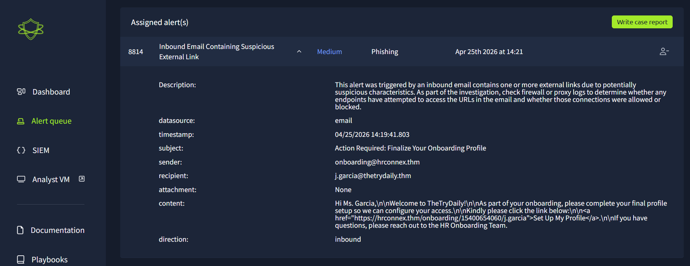  
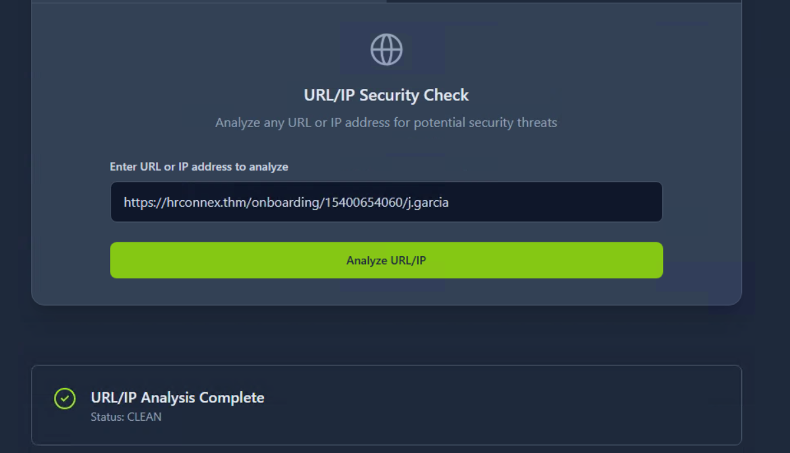  
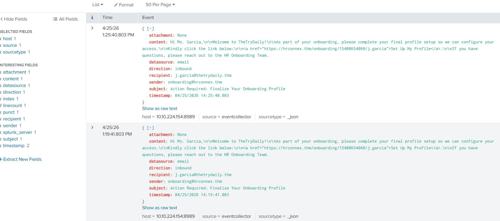  

---

## Alert ID: 8815

**Who**  
Hannah Harris (HR Department)  
Email: h[.]harris@thetrydaily[.]thm  
Host: win-3457  
IP: 10[.]20[.]2[.]17  

**When**  
Apr 25th 2026, 14:24  
Timestamp: 04/25/2026 14:22:54.803  

**Where**  
Inbound email from urgents@amazon[.]biz  

**What**  
Inbound email containing suspicious external links  

**Why**  
- Likely phishing email  
- Brand impersonation (Amazon)  
- Suspicious top-level domain (.biz)  
- Use of shortened URL (bit.ly)  
- Social engineering (urgency/action request)  

**Result**  
True Positive  

**Escalation**  
No  

**Additional Notes**  
The link was analyzed using VirusTotal and confirmed as malicious.  
The URL is already present in the organization’s blacklist.  
No user interaction was observed.  

**Recommendation:**  
Advise the user to delete the email and block the sender.  

### Screenshots

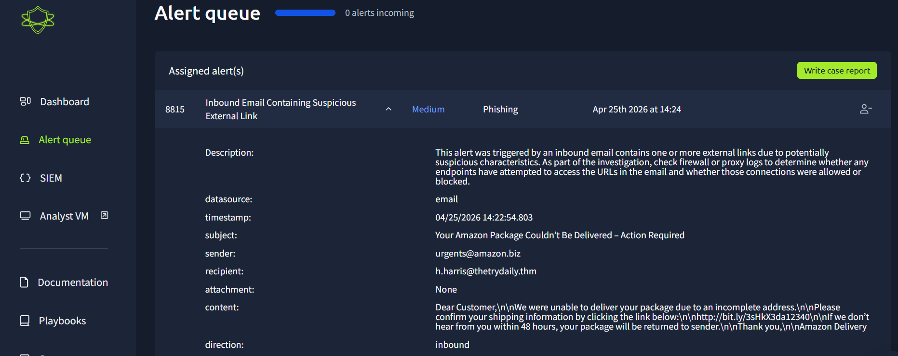  
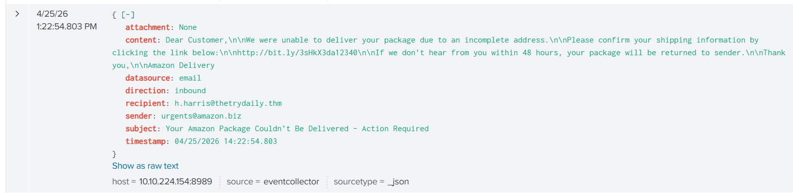  
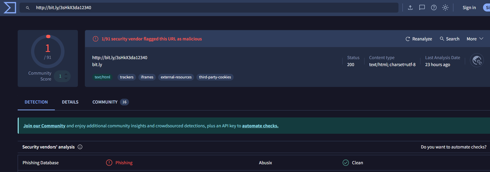  

---

## Alert ID: 8816

**Who**  
Hannah Harris (HR Department)  
Host: win-3457  
IP: 10[.]20[.]2[.]17  

**When**  
Apr 25th 2026, 14:26  
Timestamp: 04/25/2026 14:24:08.803  

**Where**  
Firewall log  
Source: 10[.]20[.]2[.]17:34257  
Destination: 67[.]199[.]248[.]11:80  

**What**  
Attempted connection to a blacklisted external IP  

**Why**  
- Connection to known malicious IP  
- Related to phishing alert (8815)  
- Use of non-standard source port  
- Use of insecure HTTP (port 80)  

**Result**  
True Positive  

**Escalation**  
No  

**Additional Notes**  
The firewall successfully blocked the connection attempt.  
The destination IP was analyzed using VirusTotal and confirmed as malicious.  

**Conclusion:**
No further action required beyond monitoring.  

### Screenshots

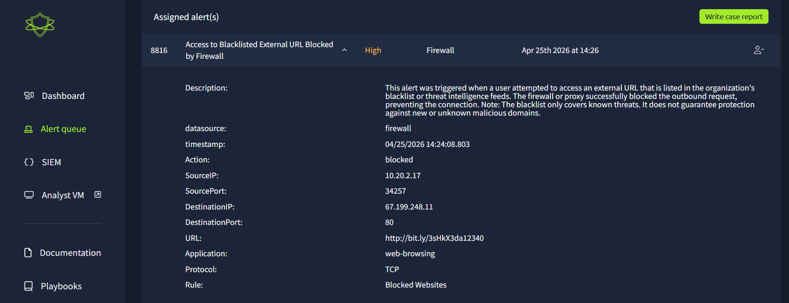  
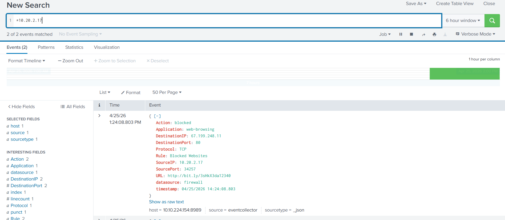  
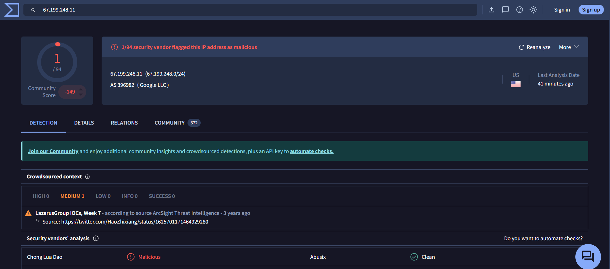  

---

## Alert ID: 8817

**Who**  
Charlotte Allen (Web Development Department)  
Email: c[.]allen@thetrydaily[.]thm  
Host: win-3463  
IP: 10[.]20[.]2[.]25  

**When**  
Apr 25th 2026, 15:10  
Timestamp: 04/25/2026 15:08:21.235  

**Where**  
Inbound email from no-reply@m1crosoftsupport[.]co  

**What**  
Inbound email containing suspicious external links  

**Why**  
- Phishing attempt  
- Brand impersonation (Microsoft)  
- Typosquatting (m1crosoft)  
- Likely credential harvesting  
- Social engineering techniques  

**Result**  
True Positive  

**Escalation**  
Yes  

**Additional Notes**  
The embedded link was analyzed using VirusTotal and confirmed as malicious.  
No user interaction was observed.  

**Recommendation:**  
- Notify the user  
- Block the sender  
- Remove the email  
- Escalate to the security team  

### Screenshots

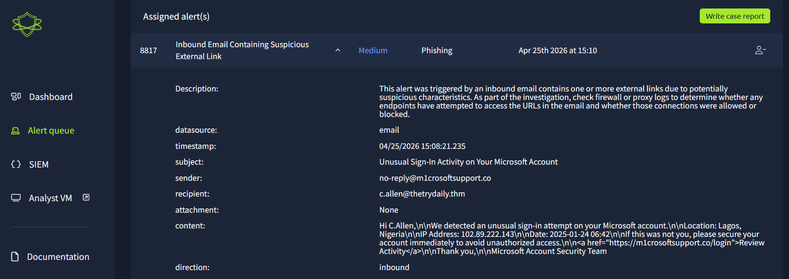  
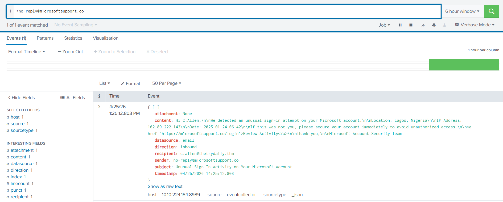  
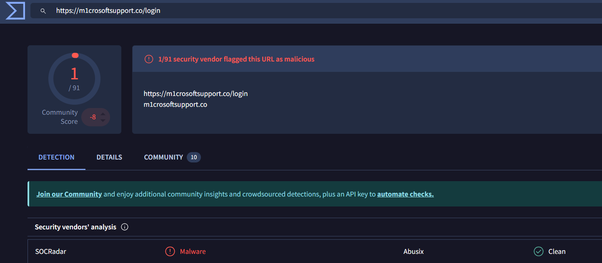  

---

## Takeaways

- Phishing detection often relies on identifying:
  - Brand impersonation  
  - Typosquatting  
  - Suspicious domains and TLDs  
  - URL shorteners  

- Correlating alerts (e.g., email + firewall logs) is crucial to confirm malicious activity  

- Threat intelligence platforms like VirusTotal are essential for quick validation  

- Not all alerts are malicious: validating false positives is a key SOC task  

- User awareness and prompt response can prevent successful attacks  

### Screenshot

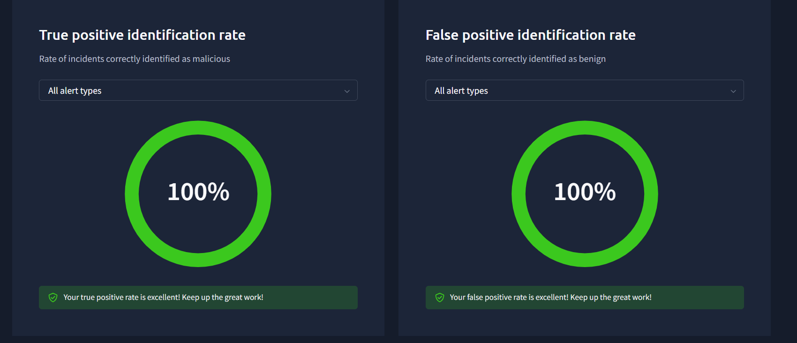

---

## Conclusion

This scenario highlights the importance of combining SIEM analysis with threat intelligence to accurately classify alerts.  
By correlating multiple data sources and validating indicators, it is possible to distinguish between benign activity and real threats.  
The exercise also reinforces the importance of structured investigation, clear reporting, and proper escalation procedures in a SOC environment.